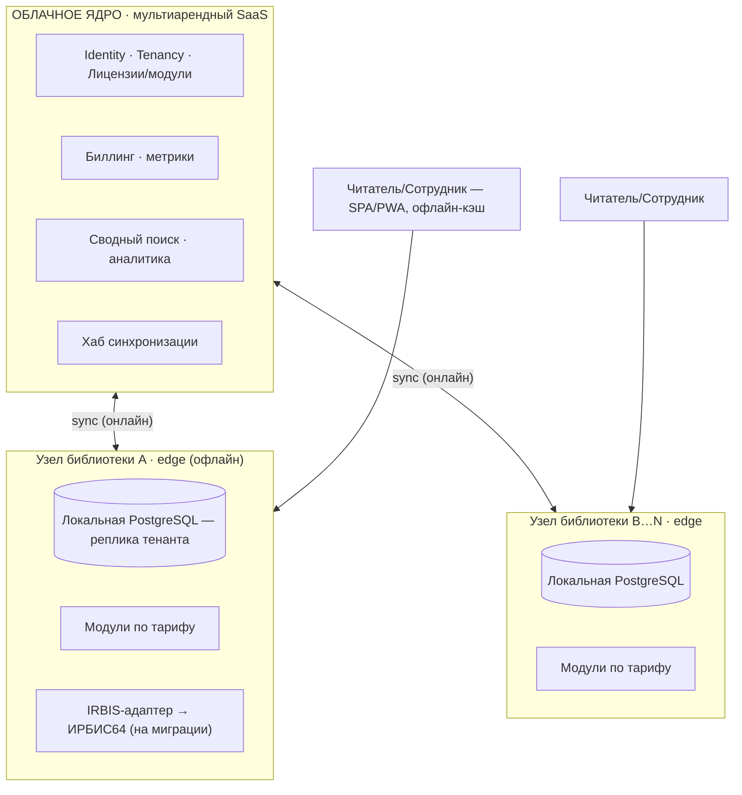
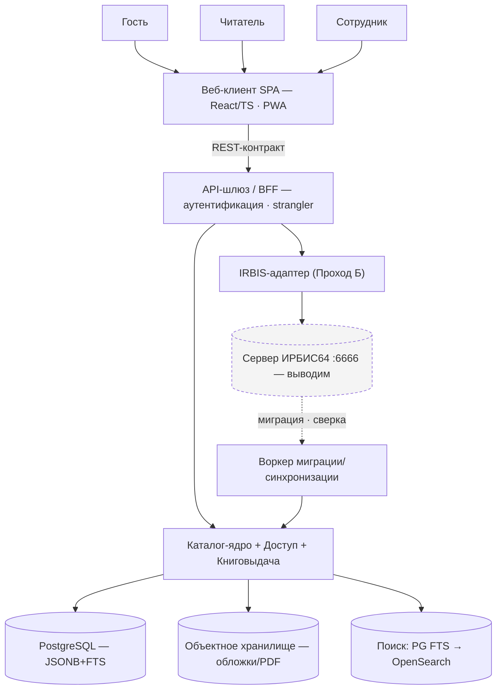

# Архитектурный план системы — мультиарендный SaaS (замена САБ ИРБИС64+)

> Целевая архитектура **коммерческого облачного продукта** для множества библиотек (только в СПб ~200; плюс школьные и вузовские), каждая со своими особенностями. Система: (а) работает поверх существующего ИРБИС64 как замена клиентов, (б) постепенно замещает сервер своим ядром, (в) **мультиарендная**, (г) **работает офлайн на местах** и **синхронизируется** с облаком, (д) **модульная** — функции подключаются по потребности/тарифу. Документ — «карта», обновляется по мере работы. Связан: [API_CONTRACT](../build/API_CONTRACT.md), [OWN_SERVER_ARCHITECTURE](OWN_SERVER_ARCHITECTURE.md), [COVERAGE_MATRIX](COVERAGE_MATRIX.md), [GO_TO_MARKET](GO_TO_MARKET.md), [WIRE_PROTOCOL](../recon/deep/reference/protocol/WIRE_PROTOCOL.md).

## 1. Цели и принципы
**Цель:** живой коммерческий продукт-платформа для библиотек, дешёвый и быстрый во внедрении, лучше ИРБИС по UX/возможностям, с гибким лицензированием.

**Принципы:**
1. **Мультиарендность.** Тенант = библиотека или сеть. Изоляция данных; тарифы и набор модулей — per-tenant.
2. **Облако-ядро + узлы на местах (hybrid edge).** Центральные сервисы в облаке; на адресе библиотеки — локальный **узел** с репликой данных тенанта; **работает офлайн**, **синхронизируется** при появлении сети. Для библиотек без стабильного интернета — обязательно.
3. **Микросервисы + модули.** Сервисы развиваются/обновляются независимо; функции (книговыдача, комплектование, ячейки, аналитика…) — **подключаемые модули** per-tenant (коммерческая ось).
4. **Шов — один REST-контракт + событийная шина.** Клиент не знает, что под ним (адаптер ИРБИС или наше ядро); сервисы общаются событиями.
5. **Strangler-миграция per-library** из ИРБИС, с dual-run и сверкой; откат на каждом шаге.
6. **Доступ по грантам** (функция×база×уровень), не «по АРМам». Секреты в env, не в коде/образах.
7. **Доступность и i18n обязательны** (ГОСТ Р 52872 / WCAG); защищённый контур (без внешних CDN), поддержка Astra Linux на узлах.

## 2. Топология (ключевое отличие)



_Текстовая версия (fallback):_
```
                 ┌──────────────── ОБЛАЧНОЕ ЯДРО (multi-tenant SaaS) ───────────────┐
   админ/        │ Identity·Tenancy·Licensing · Реестр модулей · Биллинг/метрики    │
   аналитик ───▶ │ Сводный каталог/авторитеты(опц.) · Поиск(OpenSearch) · Аналитика │
                 │ Хаб синхронизации (event hub)                                    │
                 └───────▲───────────────────────────────────────────▲─────────────┘
                  sync ↕ (онлайн)                              sync ↕ (онлайн)
        ┌─────────┴──────────┐                       ┌──────────────┴─────────────┐
        │  УЗЕЛ Библиотеки A  │  (edge / on-prem)     │   УЗЕЛ Библиотеки B …N      │
        │ модули по тарифу    │                       │ локальная БД-реплика тенанта│
        │ локальная PostgreSQL│  ← РАБОТАЕТ ОФЛАЙН →   │ адаптер ИРБИС (на миграции) │
        └───────▲─────────────┘                       └──────────────▲─────────────┘
       читатель/сотрудник (SPA/PWA, локально)                 читатель/сотрудник
```
- **Облачное ядро** — мультиарендное, общее для всех: учётки/тенанты/лицензии, реестр и раздача модулей, биллинг, кросс-тенантный поиск/сводный каталог (опц.), аналитика, **хаб синхронизации**.
- **Узел библиотеки (edge)** — на месте (или как изолированный тенант в облаке): локальная PostgreSQL-реплика данных тенанта, включённые модули, **полностью работает офлайн** (особенно книговыдача), при сети — двусторонняя синхронизация с облаком. Тонкие библиотеки могут жить «только в облаке» (без edge).
- **Клиент** — SPA/PWA: ходит на ближайший узел (edge) либо облако; офлайн-кэш для читателя/сотрудника.
- **Адаптер ИРБИС** — на узле конкретной библиотеки, на время её миграции.

## 3. Сервисы (микросервисы + модули)

Логический поток одного узла (контейнеры C4, шов = REST-контракт; пунктир = ИРБИС, который выводим):



| Сервис | Где | Роль | Модуль/ядро |
|---|---|---|---|
| **API-шлюз / BFF** | edge+cloud | контракт, аутентификация, **strangler-маршрутизация** (адаптер↔ядро per-base) | ядро |
| **Identity / Tenancy / Licensing** | cloud | учётки, тенанты, гранты, роли, аудит, тарифы, включённые модули | ядро |
| **Каталог** | edge+cloud | записи (JSONB поля/подполя), каталогизация-запись | ядро |
| **Поиск** | edge: PG FTS · cloud: OpenSearch | индексация и запросы | ядро |
| **Размещение/Холдинги** | edge+cloud | экземпляры, **иерархическое ячеистое хранение**, план помещения | модуль |
| **Книговыдача** | edge | выдача/возврат/очередь/бронеполка/постамат+ячейки (**критично офлайн**) | модуль |
| **Комплектование / Книгообеспеченность** | edge+cloud | заказ→КСУ→списание; дисциплины/ККО | модуль |
| **Файлы/Хранилище** | edge+cloud | обложки, полные тексты/PDF (S3/MinIO), view-only-прокси | модуль |
| **Sync-движок** | edge↔cloud | журнал изменений ↔ хаб, разрешение конфликтов, докачка | ядро |
| **Уведомления / Платежи** | cloud(+edge) | email/SMS; штрафы/подписки | модуль |
| **Device-gateway** | edge | RFID/ТСД (Android) | модуль |
| **Аналитика/BI** | cloud | дашборды, кросс-тенант (анонимизир.) | модуль |
| **IRBIS-адаптер** | edge | поверх живого ИРБИС64 :6666 (Проход Б), на миграции | ядро (врем.) |
| **Plugin-host / Module-registry** | cloud→edge | раздача и включение модулей per-tenant | ядро |
| **Event bus** | edge+cloud | межсервисные события + синхронизация (NATS/Kafka/Rabbit) | инфра |

> Старт прагматичный: не 20 сервисов сразу, а несколько хорошо очерченных (Шлюз, Identity/Tenancy, Каталог+Поиск, Книговыдача, Sync) + событийная шина; остальное — модулями по мере спроса. Каждый сервис — отдельный деплой/релиз.

## 4. Мультиарендность и модульность (коммерческая ось)
- **Тенант** = библиотека/сеть; тип (публичная/школьная/вузовская) задаёт пресет модулей и оформление (бренд/тема).
- **Изоляция:** PostgreSQL **схема-на-тенанта** (на edge — БД-на-тенанта); в облачных общих сервисах — `tenant_id` + RLS.
- **Модули включаются per-tenant/тариф** (книговыдача, комплектование, КО, ячейки/постамат, аналитика, discovery/OAI, RFID/ТСД, оплата, межбибл. обмен). Реестр модулей в облаке; контракт плагина = события + точки расширения UI.
- **Биллинг/метрики** — подписка + использование; «особенности библиотеки» = конфиг тенанта + опц. кастом-модуль. См. [GO_TO_MARKET](GO_TO_MARKET.md).

## 5. Офлайн-first и синхронизация
- Каждая сущность: `tenant_id, updated_at, version, deleted(tombstone), origin(node)`.
- **Владение данными:** каталог/авторитеты — облако-master, на edge — реплика (read-mostly + правки через очередь); **оперативные операции (книговыдача/экземпляры) — edge-master**, облако агрегирует. → корректная офлайн-работа выдачи.
- **Sync-движок:** outbox/журнал событий на edge ↔ хаб облака; идемпотентность, докачка, дедлайны; **конфликты:** LWW + журнал конфликтов; для каталога приоритет облака, для локальных операций — edge.
- Узел переживает обрыв сети неограниченно; при восстановлении — двусторонняя дозагрузка.

## 6. Данные
PostgreSQL (схема-на-тенанта) — записи JSONB поля/подполя + материализованные колонки + `tsvector`; `location`-дерево (здание→…→ячейка) + `holding`; авторитетные файлы/словари; `loan/request/hold/fine`; учётки/гранты/аудит ([ADR-004](../build/ADR-004_access-store-sqlite-postgres.md)). Бинарь — объектное хранилище per-tenant. Поиск — PG FTS (edge) / OpenSearch (cloud, кросс-тенант опц.). Версии записей + `mfn_legacy` для сверки миграции.

## 7. Безопасность, приватность, мультиарендность
Гранты функция×база×уровень + роли + аудит; изоляция тенантов (схема/RLS); **152-ФЗ** (минимизация ПДн, сроки, право на забвение, журнал доступа); сессии (JWT с tenant-claims); файлы через прокси с проверкой прав; секреты в env; без внешних CDN/трекеров; обновления edge-узлов подписаны.

## 8. Технологии (с обоснованием)
React+TS+Vite+дизайн-система (PWA-офлайн) · Python (FastAPI, async) для сервисов · **PostgreSQL** (JSONB+tsvector+pg_trgm, схема-на-тенанта) · OpenSearch (кросс-тенант масштаб) · MinIO (S3 в контуре) · **событийная шина** (NATS/Kafka/RabbitMQ) для sync+интеграции · Redis (кэш/очереди) · Docker+Compose (узлы) / Kubernetes (облако) · подпись/доставка обновлений edge.

## 9. Миграция (strangler) — per-library
На узле библиотеки: адаптер к её ИРБИС → зеркало (read-only) → dual-run + сверка → переключение чтения → записи → вывод ИРБИС. Миграция = часть онбординга тенанта (коммерчески — услуга).

## 10. Текущее состояние → целевое
- ✅ Есть: web-клиент (SPA), IRBIS-адаптер (Проход Б), Каталог-ядро PoC на PostgreSQL, Доступ, единый контракт, ячейки+план, Docker. Покрытие — [COVERAGE_MATRIX](COVERAGE_MATRIX.md).
- ⛏ Нет (новые столпы): **мультиарендность + лицензии**, **edge-узел + офлайн-синхронизация**, **модульная система/реестр**, **биллинг/метрики**, событийная шина, OpenSearch, прод-упаковка ядра.

## 11. Фазовый план
- **Фаза 0 (готово):** клиент + адаптер + ядро-PoC + ячейки/план.
- **Фаза 1 — Фундамент SaaS:** мультиарендность (тенанты/изоляция/гранты), Identity/Tenancy/Licensing, Каталог-ядро на PostgreSQL, API-шлюз со strangler. ([#99](https://github.com/Rivega42/biblio/issues/99))
- **Фаза 2 — Edge + офлайн:** узел библиотеки, **sync-движок**, книговыдача через ячейки/постамат офлайн ([#95](https://github.com/Rivega42/biblio/issues/95)); миграция пилота + сверка ([#94](https://github.com/Rivega42/biblio/issues/94)). Ключевой differentiator.
- **Фаза 3 — Модульность и коммерция:** реестр модулей/плагинов, биллинг/метрики, тарифы; добор модулей (комплектование/КО/админ, [#98](https://github.com/Rivega42/biblio/issues/98)); паритет читателя ([#97](https://github.com/Rivega42/biblio/issues/97)).
- **Фаза 4 — Масштаб:** сотни тенантов/узлов, OpenSearch, HA, наблюдаемость, авто-обновления edge; cutover библиотек.

## 12. Ключевые решения (ADR)
- **Мультиарендный SaaS** (тенант=библиотека, схема-на-тенанта). — принято.
- **Микросервисы + подключаемые модули** (per-tenant/тариф), событийная шина. — принято (старт с нескольких сервисов).
- **Облако-ядро + edge-узлы с офлайн-синхронизацией.** — принято (требование «нет интернета → работает локально»).
- **API-контракт как шов + strangler-миграция** из ИРБИС. — принято.
- PostgreSQL+JSONB+FTS; OpenSearch позже; ADR-003/ADR-004 действуют.

## 13. Риски
Сложность распределённой синхронизации и разрешения конфликтов · эксплуатация и **обновление микросервисов на сотнях edge-узлов** (авто-апдейт, версии) · стоимость инфраструктуры/облака · безопасность мультиарендности (изоляция) · масштаб полнотекста · точность миграции (сверка) · защищённый контур (self-hosted) · организационное (две системы параллельно, обучение). 

## 14. Дальше — политика продаж
После фиксации архитектуры — отдельный документ [GO_TO_MARKET](GO_TO_MARKET.md): сегменты (публичные/школьные/вузовские/сети), тарифы (размер/тип библиотеки), модули à la carte, cloud vs on-prem(edge), миграция как услуга онбординга, поддержка/SLA, ценовые оси и метрики.
