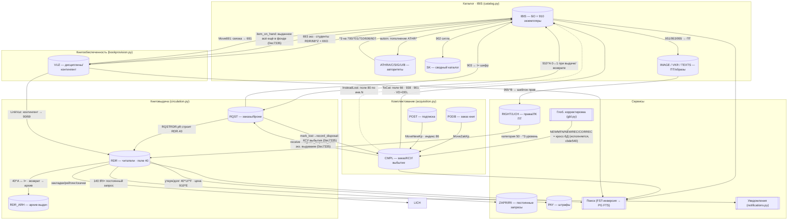

# INTEGRATION_MAP — карта межмодульных связей («связующая ткань»)

> Назначение: перечислить **КАЖДУЮ** межмодульную / межбазовую связь САБ ИРБИС64+ (ребро графа), и для каждой проверить — **сохранена ли она в нашем дизайне** и **разведена ли в коде**. Риск, который закрывает эта карта: «мы перенесём отдельные функции, но ПОТЕРЯЕМ связи между ними». Первый найденный разрыв — `circulation.py` не подключён к статусу экземпляра каталога `910^A` — **уже устранён** (рёбра 2.1/2.2 замкнуты, commit `cf97183`); шов Authority↔Catalog `^3` (6.1) и кросс-БД `.gbl` (11.2) тоже разведены. Карта продолжает отслеживать оставшиеся незамкнутые рёбра.
>
> **Грунтовано на recon:** [CAPABILITY_MAP §4/§11](../recon/deep/CAPABILITY_MAP.md), [GLOBAL_CORRECTION](../recon/deep/reference/format/GLOBAL_CORRECTION.md) (.gbl-задания, ПЕРЕНОСящие данные между БД), [DB_CIRCULATION](../recon/deep/reference/databases/DB_CIRCULATION.md), [DB_ACQUISITION](../recon/deep/reference/databases/DB_ACQUISITION.md), [DB_AUTHORITY](../recon/deep/reference/databases/DB_AUTHORITY.md), [DB_VUZ](../recon/deep/reference/databases/DB_VUZ.md), [DB_SERVICE](../recon/deep/reference/databases/DB_SERVICE.md), [DB_CATALOG_VARIANTS](../recon/deep/reference/databases/DB_CATALOG_VARIANTS.md), [FIELD_DICTIONARY](../recon/deep/reference/format/FIELD_DICTIONARY.md), [FINDINGS_09](../recon/deep/FINDINGS_09_web_reader.md).
> **Наше покрытие:** [ARCHITECTURE](ARCHITECTURE.md), [SPEC_ws1..ws5](specs/), [SPEC_engine_gbl](specs/engines/SPEC_engine_gbl.md), [SPEC_service_authority](specs/engines/SPEC_service_authority.md), [SPEC_engine_notifications](specs/engines/SPEC_engine_notifications.md), и реализованный код в `irbis-web/backend/access/` (catalog.py, circulation.py, authority.py, gbl.py, flk.py, pft.py, notifications.py, seed_vocab.py).

## Легенда статусов
- **✅ preserved** — связь и в дизайне (есть §), и разведена в коде (модуль реально читает/пишет другую сущность).
- **🟡 designed-not-wired** — связь спроектирована (есть §), но код этого модуля **не вызывает** другой модуль / поле другой БД (заглушка, событие-намерение или TODO).
- **❌ at-risk-of-loss** — связь **не разведена в коде** и/или **слабо/неполно спроектирована**; есть риск, что при сборке продукта ребро исчезнет.

> Принципиальное наблюдение о коде (обновлено): реализованные модули (`catalog.py`, `circulation.py`, `authority.py`) изначально были **самодостаточными sqlite-сторами со своими таблицами**, между собой не связанными. Теперь появились **первые реальные швы между ними**: `circulation` получил опциональный catalog-хендл и пишет статус экземпляра назад в каталог (`910^A` flip, 2.1/2.2), а `catalog.save()` протягивает `^3` из авторитетов (6.1). `circulation.loan` по-прежнему хранит экземпляр как строку-шифр (`item TEXT`), но теперь резолвит её в запись каталога по инв.№ `910^b`. Бо́льшая часть остальных межмодульных рёбер всё ещё **🟡 / ❌** (особенно те, что требуют отсутствующих acquisition/КО/DAM-модулей) — это и есть «связующая ткань», которую нельзя потерять.

---

## Граф модулей (Mermaid)

---

## Кластер 1. Комплектование → Каталог (ToCat и спутники)

| # | Источник (поле/запись) → цель | Триггер / семантика | Дизайн? (§) | Код? (модуль / «нет») | Статус | Примечание |
|---|---|---|---|---|---|---|
| 1.1 | CMPL БО (920=PAZK/SPEC/PVK/J/ASP) → IBIS запись | **ToCat**: флаг **поле 66** запускает реформат БО CMPL → формат IBIS (`STN.FST/MNOG.FST/UMARCIW.FST`: 922/330→700/701/200/463) | ws2 §8 (AC2), DB_ACQUISITION A.8 | ❌ нет (нет acquisition-модуля; gbl `NEWMFN` `supported=False`) | ❌ | Ядро переноса фонд→каталог. Кода нет совсем. |
| 1.2 | CMPL поле 910 → IBIS поле 910 | Экземпляры переносятся в ЭК при ToCat | ws2 §8, recon #CMPL-04 (построчный маппинг не транскрибирован) | ❌ нет | ❌ | Маппинг 910 CMPL→910 IBIS — открытый TODO recon. |
| 1.3 | CMPL → IBIS поле **938** | Связь перенесённой записи с заказом подписки (`pkj.gbl`) | ws2 §8, FIELD_DICTIONARY (938→CMPL период) | ❌ нет | ❌ | Связь «каталог↔подписка по периодам». |
| 1.4 | CMPL экз → IBIS поле **901** (техн. путь) | При переносе экз. проставляется технологический путь | DB_ACQUISITION A.3.1/A.8 | ❌ нет | ❌ | 901 = `^B`№экз + пункты ТП (tp.mnu). |
| 1.5 | ToCat → исходник CMPL: `VD=DEL` | FST-строка поля 66 ставит пометку на удаление исходной БО | ws2 §8 (AC3), DB_ACQUISITION A.8 | ❌ нет | ❌ | Гарантия отсутствия дублей после переноса. |
| 1.6 | CMPL поле **80** «взамен утерянных» → IBIS | **InsteadLost.gbl**: ищет экз. в ЭК по инв.N/штрих-коду (`J<DB>,IN=`), заменяет утерянный | ws2 §5 (AC4), DB_ACQUISITION A.8 | ❌ нет | ❌ | Кросс-БД поиск; gbl-движок кросс-БД не исполняет. |
| 1.7 | PODB (заказ книг) → CMPL | **MoveZakKp.gbl**: организации→IZD, заказы→SZ, БО→ZK (`MOVEKP.FST`) | ws2 §8 (AC1), DB_ACQUISITION A.8 | ❌ нет | ❌ | Входной каталог заказа. |
| 1.8 | POST (подписка) → CMPL как 920=OJK | **MoveNewKp.gbl**; связь по индексу **86** (`TP=` есть в CMPL / `TA=` нет) | ws2 §7 (AC4), DB_ACQUISITION A.8 / C | ❌ нет | ❌ | POST.FST проверяет 86 против `JCMPL,IP=`. |
| 1.9 | CMPL запись **SZ** (суммарный заказ) ← БО | **CreateSZ.gbl** (`NEWMFN '*' / ADD 920 'SZ'`); **SumEkzToSZ.gbl** считает полученные экз. по `BORZ=` | ws2 §2/§3 (AC2/AC1), DB_ACQUISITION A.5 | ❌ нет | ❌ | Внутрикомплектовательная связь БО↔SZ↔910. |
| 1.10 | PODB/POST дедупликация → CMPL и IBIS | `!KDEX/!KDK.pft` ловят дубли против CMPL и IBIS | ws2 §8 (AC1) | ❌ нет | ❌ | Кросс-БД контроль дублетности на входе. |
| 1.11 | CMPL `receive()` (поступление) → IBIS 910 экз → **Книговыдача** | После приёма экз. комплектование подтверждает выдаваемость каждого инв.№ через `circulation.register_acquired_item`; поступивший экз. сразу доступен к выдаче (`910^A` 0→1) | ws2 §8 + ws3 §4 | ✅ разведено на уровне модулей: `AcquisitionEngine(circulation=...)`; `receive()` возвращает ключ `lendable`; back-compat (без handle модуль автономен) | **✅** | **Шов комплектование→выдача замкнут** (commit `0ec7335`, `test_integration.py`): новый экземпляр немедленно выдаётся `checkout`. Сам ToCat-реформат БО (1.1–1.5) остаётся ❌. |

---

## Кластер 2. Каталог ↔ Книговыдача (статус экземпляра 910^A) — **уже найденный разрыв**

| # | Источник (поле/запись) → цель | Триггер / семантика | Дизайн? (§) | Код? (модуль / «нет») | Статус | Примечание |
|---|---|---|---|---|---|---|
| 2.1 | RQST → IBIS поле **910^A** (0↔1) | **Выдача:** свободный экз `910^A=0/U/C` → `910^A=1` (выдан). **Возврат:** обратно в свободный статус (`ste.mnu`) | ws3 §4 (AC1), §6; DB_CIRCULATION §5 | ✅ разведено: `circulation.checkout` флипает `910^A` 0→1, `return_item` 1→0 через `_flip_catalog_status`→`catalog.set_exemplar_status`; экз резолвится по инв.№ `910^b` (`catalog.find_exemplar`) | **✅** | **Исходный разрыв замкнут** (commit `cf97183`, тест `test_integration.py::checkout_return_flip_checks`). Каталог-хендл опционален: без него `circulation` работает standalone (back-compat). |
| 2.2 | IBIS свободные экз (`freekz`) → RQST подбор | Подбор свободного экз: статусы 910 + учёт мест выдачи 56/57; `DBNFREEEKZ=0` | ws3 §3 (AC1), DB_CIRCULATION §5/§6 | ✅ разведено частично: `place_hold` чтит доступность каталога через `catalog_available`→`is_available`/`exemplar_status` (экз, помеченный в каталоге `910^A=1`, не выдаётся как ready); места выдачи 56/57 пока не учитываются | **✅** | Чтение `910^A` из каталога разведено (commit `cf97183`, тест `test_integration.py::availability_read_checks`). Полный подбор по 56/57 — остаётся TODO. |
| 2.3 | RQST поле **903** → IBIS `I=` (шифр) | Шифр заказа = шифр документа в ЭК (`DBNPREFSHIFR=I=`); RQST.1 = имя БД ЭК | ws3 §3, DB_CIRCULATION §8 | 🟡 ws3 описывает; код хранит `item` как шифр-строку, без резолва в `catalog` | ❌ | Шов «заказ↔запись каталога». |
| 2.4 | RQST → RDR поле **40** (материализация) | **`RQSTRDR.pft`** строит RDR.40: `^A`=903, `^B`=910^B, `^H`=910^H, `^K`=910^D, `^D`=41, `^E`=42, `^F`=`******`, `^G`=БД, `^C`=brief | ws3 §4 (ключевой), DB_CIRCULATION §5/§8 | 🟡 спроектировано — код моделирует loan своими колонками, но **не как поле 40 RDR** и без PFT-материализации | 🟡 | Семантика выдачи присутствует (due/returned), но не как RDR.40-структура. |
| 2.5 | RDR поле 40 ↔ **RDR_ARH** (архив) | **Возврат:** запись о выдаче переносится в RDR_ARH (`autoin_light.gbl`/`AUTOARH`) | ws3 §4 (AC2, opt-in), DB_CIRCULATION §5/§8 | 🟡 ws3 «архив opt-in»; код: `mark_returned` ставит `returned=1` в той же таблице, отдельного архива нет | 🟡 | Архивация выдач = отдельная сущность (152-ФЗ ретенция). |
| 2.6 | RQST поле 910^A (reservstatus 0–4) vs IBIS 910^A (ste.mnu) | **Одно подполе — разные кодировки** в разных БД (recon #CIRC-06) | ws3 §6 (AC2: развести item_status/hold_status) | 🟡 в коде `hold.status` отдельный enum (хорошо), но не сопоставлен с `reservstatus.mnu` значениями | 🟡 | Дизайн правильно разводит; маппинг кодов не реализован. |
| 2.7 | RDR.999 «читатель в библиотеке» / 999 каталога | Технические счётчики посещаемости/выдач | ws3 §2 (поля); recon DB_CIRCULATION §2 | ❌ не спроектировано отдельно | ❌ | Малый риск; счётчик 999 пока вне модели. |

---

## Кластер 3. Книговыдача ↔ Читатель (RDR) ↔ PAY

| # | Источник (поле/запись) → цель | Триггер / семантика | Дизайн? (§) | Код? (модуль / «нет») | Статус | Примечание |
|---|---|---|---|---|---|---|
| 3.1 | RQST поле **30** → RDR поле 30 (`RI=`) | Заказ привязан к читателю по идентификатору билета/штрих-кода | ws3 §3, DB_CIRCULATION §8 | ✅ own-store `access/reader_registry.py` (`ReaderRegistry`: профиль RDR — билет/ФИО/категория/статус/контакты) разведён в `core.Api` и передан `CirculationEngine(reader_registry=)`; `circulation.reader_record(id)` резолвит читателя как ЗАПИСЬ (fallback к базовой строке) | **✅** | Читатель = запись-профиль, не строка-id; `test_reader_registry` 34/0 + `test_domain_routes`. Δ2026-06-27. |
| 3.2 | RDR поле **40^F** «долг» (`******`) → лимиты выдачи | Задолженность = `40^F:'******'` (FST `DOLG=`); блок выдачи при `MaxBooks`/`MaxDolgBooks` | ws3 §4 (AC4), §6.6 SPEC_business_circulation | ✅ реализовано: `debt_level()`, `count_on_hand()`, лимиты per-category | ✅ | Логика долга/лимитов разведена — **внутри** circulation. |
| 3.3 | RDR поле **40^U** утеря / цена → PAY (штраф) | Утеря `40^U=1`; долговая форма с ценой `910^E` из ЭК; штрафы в БД **PAY** (ключ `RI=`) | ws3 §5 (AC2/AC3), recon #CIRC-05 | ✅ `circulation._catalog_price` читает цену замены из каталога **910^E** в `mark_lost` (когда `item_price` пуст); own-store **PAY-леджер** `access/pay.py` (`PayLedger`, ключ `RI=`), circulation постит проводки через `pay=`-хендл: возмещение (утеря) + штраф (на возврате) + платёж (`pay_fine`) | **✅** | Цена из 910^E + проводки в кассу PAY замкнуты; тест `test_pay.py` (20/0). Опционально/best-effort (back-compat). Δ2026-06-27. |
| 3.4 | RDR категория **50** → политика лимитов/штрафов | Категория (В01–В05/Д01–Д03/STD/GUEST из `50.mnu`) определяет лимиты | ws3 §2 (AC2), SPEC_business_circulation §5.3 | ✅ `_LIMIT_MATRIX` по категориям из 50.mnu; `default_policy` | ✅ | Категории зашиты; источник = seed_vocab (50.mnu). |
| 3.5 | RDR поле 40^E/срок → уведомления (due_soon/overdue) | Приближение/просрочка срока → событие читателю | ws3 §8, SPEC_engine_notifications | ✅ `circulation.scan_due(today)` сканирует выдачи на руках по `loan.due` (40^E), эмитит `overdue`(`days_overdue`)/`due_soon`(`days_left`) через `_emit`→A6; окно из политики `reminder.due_soon_days`; dedup дневным бакетом; тесты `tests/test_circ_seams.py` | ✅ | Скан по срокам замкнут на `loan.due`→A6; идемпотентно посуточно (повтор в день не задваивает, новый день — снова). |

---

## Кластер 4. Книгообеспеченность ↔ Каталог ↔ Читатель («связка»)

| # | Источник (поле/запись) → цель | Триггер / семантика | Дизайн? (§) | Код? (модуль / «нет») | Статус | Примечание |
|---|---|---|---|---|---|---|
| 4.1 | VUZ поле **68/83** (связка) → IBIS поле **691** | **Move691.gbl**: контингент-«связка» (`^A^L^N^C^V^O^F`) переносится в каталог как 691 (привязка экз↔дисциплина), 691^I=3^0 | ws4 §3 (AC1), DB_VUZ | ❌ нет (нет КО-кода; gbl кросс-БД не исполняет) | ❌ | Ядро привязки литература↔дисциплина. |
| 4.2 | VUZ контингент → RDR поля **90/69** | **LinkVuz.gbl**: студент↔дисциплины (90 контингент, 69 изуч. дисциплины) | ws4 §3 (AC2), DB_VUZ | ❌ нет | ❌ | Транзитивная связь DISC→VUZ→RDR. |
| 4.3 | DISC поле 83 ↔ VUZ поле 68 | **LinkDisc.gbl**: двунаправленная синхронизация дисциплина↔контингент | ws4 §3, DB_VUZ | ❌ нет | ❌ | Внутри VUZ, но межзаписевая. |
| 4.4 | IBIS поле **693** (экз) + RDR/68^Z (студенты) → **ККО** | ККО = экземпляры(693)/студенты; студенты из RDR (`JRDR,LN=связка` при `ACCESSRDR=1`) или из 68^Z | ws4 §4 (AC1/AC4), DB_VUZ | 🟡 разведено частично: `bookprovision._binding_exemplars` считает экз. обеспеченным, если свободен в каталоге **ИЛИ** на руках (on-hand loan), через опц. handle `circulation.item_on_hand` | 🟡 | **Шов КО↔выдача замкнут** (commit `0ec7335`): выданная книга остаётся в фонде (Кко не падает в 0), подтверждённая утрата → Кко в 0. Остаётся: полный кросс-БД агрегат 693×студенты RDR. |
| 4.5 | IBIS поле **691** → поле **692** (архив КО) | Снятая привязка уходит в архив 692 (`Arhiv692.gbl`) | ws4 §3 (AC3), DB_VUZ | ❌ нет | ❌ | История привязок. |
| 4.6 | KO низкая ККО → CMPL поле **694** (дозаказ) | Низкая обеспеченность → заявка на комплектование (694→CMPL) | ws4 §6 (AC1), ws2 §2 (AC5) | ❌ нет | ❌ | Шов «КО→комплектование» (demand-driven). |
| 4.7 | RDR.40 (выдачи) → VUZ/IBIS 691 | `MoveRdrCatVuz.gbl`: формирование 691 по книговыдаче | DB_VUZ (gbl-каталог), не детализировано в ws4 | ❌ слабо спроектировано | ❌ | Обратная связь выдача→обеспеченность. |

---

## Кластер 5. КСУ ↔ экземпляры (внутри комплектования, но межзаписевые)

| # | Источник (поле/запись) → цель | Триггер / семантика | Дизайн? (§) | Код? (модуль / «нет») | Статус | Примечание |
|---|---|---|---|---|---|---|
| 5.1 | КСУ поступления (88^U) ↔ экз (910^U) | №КСУ поступления проставляется в экземпляры (`KSU=`) | ws2 §3/§4 (AC1/AC2), DB_ACQUISITION A.3.1 | ❌ нет | ❌ | Учётная связь партия↔экземпляр. |
| 5.2 | Мастер списания → 888 + экз 910^V/^X + статус 910^A=6 | Списание ставит №КСУ выбытия (^V), кол-во (^X), статус «списан» | ws2 §5 (AC1), DB_ACQUISITION A.5 | ✅ разведено: `circulation.mark_lost(confirm=True)` пишет проводку в КСУ выбытия `acq_disposal` (910^V акт, 910^X кол-во) через `acquisition.record_disposal`, с авто-кросс-ссылкой на КСУ поступления по инв.№; идемпотентно по `(инв.№, акт)` | **✅** | **Шов выдача→выбытие замкнут** (commit `0ec7335`). Остаётся: статус `910^A=6` в самой записи каталога + PAY-проводка штрафа (см. 3.3). |
| 5.3 | КСУ «Пополнение записи» → авто-поля 17/18/19, 44–49, 145–158 | Авто-распределение партии по разделам/типам/языкам | ws2 §4 (AC2), recon #CMPL-05 | 🟡 слайс `access/ksu_auto.py` (`distribute(items)` -> titles(17)/by_section(44-49)/by_type/by_language/printed(145-158), Σ-инвариант; `compute_and_store` идемпотентно по ksu_no); тест `test_ksu_auto` 38/0 | 🟡 | Наша честная модель авто-распределения (точный Мастер-алгоритм recon не раскрыл); роут pending. Δ2026-06-27. |
| 5.4 | Поле 800 (акт передачи) ↔ выбытие | Акт передачи выбывших связан со списанием | ws2 §5 (AC1), DB_ACQUISITION A.3.1 | ❌ нет | ❌ | — |

---

## Кластер 6. Авторитеты ↔ Каталог

| # | Источник (поле/запись) → цель | Триггер / семантика | Дизайн? (§) | Код? (модуль / «нет») | Статус | Примечание |
|---|---|---|---|---|---|---|
| 6.1 | ATHR* → IBIS поля **700/701/710/606/607** подполе **^3** | При выборе авторитета — автозаполнение подполей + протягивание `^3` = номер авторитетной записи | SPEC_service_authority §3.1/§3.2 (карта), DB_AUTHORITY §5.2 | ✅ разведено: `catalog.save()` вызывает `resolve_authority_refs`→`apply_authority`→`authority.substitute()`, заполняя `^a/^b/^g` + протягивая `^3` ДО ФЛК/индекса; битый `^3` (неизвестный id) поднимает `AuthorityNotFound` | **✅** | **Шов каталог↔авторитет замкнут в save-пайплайне** (commit `cf97183`, тесты `test_integration.py::authority_on_save_checks` / `apply_authority_helper_checks`). Запись с `_authority_ref` достраивается на сохранении; авторитет-хендл опционален (back-compat). |
| 6.2 | IBIS save → пополнение **ATHRA/ATHR*** (autoin) | **autoin.gbl**: при сохранении БО авто-создаются связанные авторитетные записи (510/710 без `^3`) | SPEC_service_authority §3.4 (системный хук на save), DB_AUTHORITY | ✅ `catalog.autoin_authority()` + `catalog.save(..., autoin=True)` (catalog.py:743): по полям-заголовкам без `^3` зовёт `authority.autoin` (link/создать `needs_review`) и протягивает `^3` обратно в запись | **✅** | Opt-in `autoin=True` (мутирует ATHR*, потому по умолчанию off — это политика, не дыра); код+тест `test_authority_seam.py::autoin_checks`. **Реклассификация 2026-06-27: карта отставала от кода.** |
| 6.3 | ФЛК `!700/!606/!964` ↔ authority-сервис | ФЛК валидирует связь `^3` (битая ссылка → нарушение) | SPEC_service_authority §0 (ФЛК вызывает), flk.py | ✅ `flk.py` предикат `authority_ref` (`AUTHORITY_LINK_FIELDS`/`_authref_broken`) + канон-правило `rec.authref.integrity` (enabled); `catalog.validate()`/`catalog.save()` ПЕРЕДАЮТ authority-хендл в `flk.validate(..., authority=)` (catalog.py:486-500/617-618) — битый `^3` → severity-2 | **✅** | На save включено (не opt-in); тесты `test_authority_seam.py::flk_checks`. **Реклассификация 2026-06-27: карта отставала от кода.** |
| 6.4 | Поиск по авторитету (навигаторы `WnLink`) → IBIS | Поиск записей каталога по выбранному авторитету (`^3`/`H=`) | SPEC_service_authority §2, CAPABILITY_MAP §5 | ✅ `catalog.py:199-210` INDEX_SPEC индексирует `AR=` над `^3` для 700/701/702/710/600/606/607; `'AR'` в SEARCH_PREFIXES (catalog.py:229); `catalog.search(db,'AR=<id>')` возвращает записи каталога по authority-id | **✅** | Обратный поиск «каталог по авторитету» работает; тест `test_authority_seam.py::index_checks` (80-88). **Реклассификация 2026-06-27 (аудит): карта отставала.** |

---

## Кластер 7. Полные тексты ↔ Каталог ↔ Права (ПБД)

| # | Источник (поле/запись) → цель | Триггер / семантика | Дизайн? (§) | Код? (модуль / «нет») | Статус | Примечание |
|---|---|---|---|---|---|---|
| 7.1 | IBIS поля **951/953/955** → ПТ-хранилище (TEXTS/ПБД) | 951 внешний URL/файл, 953 встроенный двоичный, 955 ПТ-метаданные (`^A`файл, `^N`страниц) | ARCHITECTURE §3 (Файлы/Хранилище, Сканирование→951/953/955), FINDINGS_09 | 🟡 слайс `access/dam.py` (`DamRegistry.attach`/`assets_for(db,mfn)` — 951 URL/953 блоб/955 ПТ-метаданные ^A файл/^N стр.; `rights_template`=955^B для 7.2); тест `test_dam` 30/0 | 🟡 | Связь запись↔бинарь в реестре; реальное хранилище (S3/MinIO) + роут pending. Δ2026-06-27. |
| 7.2 | IBIS **955^B** → **RIGHT** (шаблон прав) | Поле 955^B = ссылка на запись RIGHT (шаблон доступа); `I=` template ID | FINDINGS_09, DB_SERVICE | ✅ `rights.py` `RightService.template_id_for_record(db,mfn)` резолвит 955^B → id шаблона через опц. catalog-handle (повторение 955 поддержано) | **✅** | RIGHT-модуль есть (`rights.py`, не `entitlements.py`); тест `test_rights_lich.py::right_service_checks` (248-251). **Реклассификация 2026-06-27 (аудит+личн. сверка тестов).** |
| 7.3 | RIGHT поле 3 (правила) ↔ RDR категория 50 / фак-спец 69/90 | Уровень доступа `^C` (0 deny/1 view/2 download) по категории читателя; лимит страниц `^F` | FINDINGS_09, DB_SERVICE, ACCESS_MODEL_web-irbis | ✅ `rights.py:96-153` `access_level(reader_category, template)` (^C 0/1/2) + `page_limit()` (^F); `RightService` резолвит 955^B записи; `lich.py:333-369` `download_budget` = RIGHT.^F − LICH.v4 | **✅** | Гейтинг ПТ по категории читателя реализован; тест `test_rights_lich.py::access_level_checks` (82-100). **Реклассификация 2026-06-27 (аудит): карта отставала; см. также 7.2/7.4/7.5 — `rights.py`/`lich.py` likely покрывают, нужна точечная сверка.** |
| 7.4 | RDR → **LICH** (закладки/рейтинг/скачивания) | LICH хранит закладки (поле 3), рейтинг (7), счётчик скачанных страниц (4) на читателя+текст | FINDINGS_09, DB_SERVICE | ✅ `lich.py` `LichService`: `add/remove_bookmark` (поле 3, идемпотентно), `rate/rating` (поле 7, 0..5), `record_download/downloaded` (поле 4); одна строка на (reader,text) | **✅** | Личный кабинет ПТ разведён; тест `test_rights_lich.py::lich_basics_checks` (291-345). **Реклассификация 2026-06-27 (аудит+личн. сверка тестов).** |
| 7.5 | LICH поле 4 (скачано) ↔ RIGHT лимит | Остаток лимита скачивания в сессии = RIGHT.^F − LICH.v4 | FINDINGS_09, DB_SERVICE | ✅ `lich.py:333` `download_budget(reader,text,reader_category=)` = `RIGHT.^F − LICH.v4` (через `RightService.page_limit`) + `can_download`; квота по категории читателя | **✅** | Учёт квоты скачивания замкнут; тест `test_rights_lich.py::download_budget_checks` (354). **Реклассификация 2026-06-27 (аудит+личн. сверка тестов).** |
| 7.6 | VKR (ВКР) загрузка → IBIS + TEXTS | Загрузка ВКР студентом (`reg.frm`), конвертация `fst_rec.fst`, антиплагиат (215^W %) | FINDINGS_09, DB_CATALOG_VARIANTS | 🟡 слайс `access/vkr.py` (`VkrService`: submit → антиплагиат 215^W + порог → review с блоком approve ниже порога → link_catalog); тест `test_vkr` 31/0 | 🟡 | ВКР-поток в модуле; загрузка файла (DAM) + роут pending. Δ2026-06-27. |

---

## Кластер 8. Подписка / Сводный каталог / прочие БД

| # | Источник (поле/запись) → цель | Триггер / семантика | Дизайн? (§) | Код? (модуль / «нет») | Статус | Примечание |
|---|---|---|---|---|---|---|
| 8.1 | IBIS поле **902** (сигла) → **SK** (сводный каталог) | 902^s = сигла держателя; SK ссылается на записи библиотек-участниц (`&uf('DSK,!I=',…)`) | CAPABILITY_MAP §4/§11, DB_CATALOG_VARIANTS | ✅ `access/union.py` свод по сигле 902^s; разведён роутами `POST /api/union/ingest` (staff) + `GET /api/union/search`; тесты `test_union` 32/0 + `test_domain_routes` 28/0 | **✅** | Свод по сигле разведён в продукт. Остаток (8.x): массовый импорт из реального каталога-участницы. Δ2026-06-27. |
| 8.2 | SK 907^Z дедуп ↔ записи-участницы | Ключ дедупликации (шифр/ISBN) при импорте в сводный | DB_CATALOG_VARIANTS | ✅ `union.dedup_key` (ISBN>шифр(903)>title\|year), идемпотентный `ingest` сводит дубли; разведён роутом ingest | **✅** | Дедуп разведён; `test_domain_routes`: две библиотеки/один ISBN → 1 запись, 2 сиглы. Δ2026-06-27. |
| 8.3 | IMAGE/VKR поле **903** ↔ IBIS `I=` | Образный/ВКР-каталог ссылается на запись ЭК по шифру (903 из 952^b) | DB_CATALOG_VARIANTS | 🟡 `vkr.link_catalog(db,mfn,shifr)` — бэкреф ВКР→ЭК по шифру 903 (`source_db/source_mfn/shifr`); тест `test_vkr` | 🟡 | Бэкреф ВКР→каталог в модуле; обобщение на IMAGE + роут pending. Δ2026-06-27. |
| 8.4 | Подписка POST 86 → CMPL → IBIS (по периодам 938) | Цепочка POST→CMPL→каталог для периодики | ws2 §7 (см. 1.8), FIELD_DICTIONARY (938) | ❌ нет | ❌ | См. также 1.3/1.8. |

---

## Кластер 9. Связи иерархии записей (внутри каталога, межзаписевые)

| # | Источник (поле/запись) → цель | Триггер / семантика | Дизайн? (§) | Код? (модуль / «нет») | Статус | Примечание |
|---|---|---|---|---|---|---|
| 9.1 | Статья (ASP) поле **463** → журнал/сборник (host) | Аналитика ссылается на издание-хозяина (`^C`загл, `^J`ISSN); поиск по связи `Scnt` | CAPABILITY_MAP §4, ws1, FIELD_DICTIONARY | 🟡 ws1 описывает типы 920; код: catalog хранит 463 как поле, но связь/поиск-по-связи не реализован | ❌ | Журнал↔номер↔статья — поиск по связи отсутствует. |
| 9.2 | Номер журнала (NJ) ↔ журнал (J) — 461/46 | Иерархия журнал↔номер (461 общая часть, 46 доп. серийные) | CAPABILITY_MAP §4 | 🟡 как 9.1 | ❌ | — |
| 9.3 | Многотомник: том ↔ сводная — 481/963/SPEC | Связь том↔многотомное издание | CAPABILITY_MAP §4 | 🟡 как 9.1 | ❌ | — |

---

## Кластер 10. Читатель ↔ ИРИ/SDI ↔ ВУЗ-студент

| # | Источник (поле/запись) → цель | Триггер / семантика | Дизайн? (§) | Код? (модуль / «нет») | Статус | Примечание |
|---|---|---|---|---|---|---|
| 10.1 | RDR поле **140** (`IRI=`) → **ZAPR/IRI** постоянные запросы | Профиль ИРИ; ZAPR хранит запрос (`2^B`ПТ-часть, `2^C`библио-часть), переигрывается по расписанию против IBIS | FINDINGS_09, DB_SERVICE, SPEC_reader_jirbis | ✅ `access/sdi.py` разведён роутами `/api/sdi/profile|profiles|run|new` (reader-scoped, через `core.Api`): профиль постоянного запроса, переигрывание против каталога, НОВЫЕ попадания идемпотентно | **✅** | SDI разведён в продукт; `test_sdi` 29/0 + `test_domain_routes`. Остаток: авто-прогон по расписанию (планировщик). Δ2026-06-27. |
| 10.2 | RDR корзина → **RQST** | Корзина заказов читателя персистится как заказы RQST | FINDINGS_09, ws3 §3, SPEC_reader_jirbis | ✅ `holds.HoldService.place_many(ticket, items)` оформляет корзину портала `[{db,mfn},…]` как брони (own-store аналог RQST, идемпотентно поэлементно); роут `POST /api/holds/batch` (`core.place_holds_batch`) | **✅** | «Один движок, два клиента» замкнут: корзина → заказы-брони; тест `test_holds_batch.py` (16/0). Δ2026-06-27. |
| 10.3 | RDR студент 90/69 → VUZ контингент | Студент видит свои дисциплины/списки литературы (ЛК) | ws4 §6 (AC2), SPEC_reader_jirbis | ❌ нет (см. 4.2) | ❌ | — |

---

## Кластер 11. Сквозные зависимости (поиск, .gbl, уведомления, словари)

| # | Источник (поле/запись) → цель | Триггер / семантика | Дизайн? (§) | Код? (модуль / «нет») | Статус | Примечание |
|---|---|---|---|---|---|---|
| 11.1 | **Каждая БД** → поисковый индекс (FST-инверсия) | Все модули зависят от инвертированных префиксов (`K=/A=/T=/I=/RI=/IN=/VUZ=/KSU=…`); у нас — PG FTS вместо инвертированного файла | ARCHITECTURE §3/§6 (Поиск), CAPABILITY_MAP §5 | 🟡 catalog.py: `record_index` + `INDEX_SPEC` (только T/A/K/IN); authority: `authority_term`; circulation: нет инверсии | 🟡 | Поиск разведён частично (4 префикса каталога из 109 IBIS); RDR/CMPL/VUZ-поиск кода не имеет. |
| 11.2 | **.gbl** (NEWMFN/NEWREC/CORREC) → другая БД | Кросс-БД задания (ToCat/Move691/MoveZakKp/CreateSZ/InsteadLost/autoin) | SPEC_engine_gbl §1.2 (операторы др. БД), GLOBAL_CORRECTION | ✅ `gbl.py` исполняет NEWMFN/NEWREC/CORREC/ALL/UNDOR (`supported=False` снят), а эндпоинт `POST /api/cataloging/gbl` гоняет задание по выборке MFN над `CatalogStore`: `core.py:1973` `cataloging_gbl` (resolver/emit поверх стора), маршрут `core.py:3931`; тесты `tests/test_cataloging_gbl.py` (35), `tests/test_gbl.py` (93) | **✅** | Движок + ребро каталога замкнуты. Сами кросс-БД ЗАДАНИЯ (ToCat 1.x / Move691 4.x / 5.x) ждут своих модулей-источников (CMPL/VUZ). |
| 11.3 | circulation → **NotificationQueue** (A6) | События выдачи (`hold_ready/fine_charged/renewal_confirmed/lost_confirmed/staff_alert/fine_paid`) | SPEC_engine_notifications, ws3 §8 | ✅ эмиссия+enqueue+инбокс (как было) + **воркер-диспетч** `access/notify_dispatch.py` (`DispatchWorker.run_once`) разведён роутом `POST /api/admin/notifications/dispatch` (admin): InApp всегда, email/SMS по конфигу тенанта | **✅** | Оркестрация диспетча разведена+тест (`test_notify_dispatch` 53/0 + `test_domain_routes`); реальный внешний шлюз (SMTP/SMS) — деплой-секреты, OFF по умолчанию (как OIDC). Δ2026-06-27. |
| 11.4 | **seed_vocab** (словари 50.mnu/ste.mnu/…) → все модули | Категории/статусы/места из общих `.mnu`/`.tre` питают ФЛК, лимиты, выдачу | SPEC_seeding, seed_vocab.py | 🟡 seed_vocab грузит словари; circulation `_LIMIT_MATRIX` хардкодит 50.mnu (не из стора), catalog flk берёт store | 🟡 | Часть словарей зашита в код вместо чтения из seed-стора. |
| 11.5 | ФЛК дублетности → инвертированный индекс (кросс-запись) | `!910` дубль инв.№/штрих-кода ловится поиском по `IN=`/`H=` в той же БД | SPEC_engine_flk, ws2 §3 (AC3) | ✅ catalog `_dup_index` подключён к flk как `dup_index`-колбэк (по `IN=`) | ✅ | Единственная «межзаписевая» связь, реально разведённая в коде. |

---

## Сводный счёт (tally)

> **РЕ-АУДИТ 2026-06-26 против кода (3 агента, построчно vs access/*.py + tests).** Уточнения: (1) per-edge таблицы кластеров НИЖЕ местами отстали (показывают ❌ там, где код уже разводит — особенно ToCat 1.x); фактический статус — здесь. (2) **Device-домен (#277) добавил ~8 рёбер, которых в карте 1–11 НЕ было** → Кластер 12 ниже. (3) Строгий пересчёт против исходных батч-кредитов даёт ~29✅ по кластерам 1–11 (−2-3 пограничных 🟡 типа 2.4/2.5/11.3).

| Статус | Рёбра 1–11 | +Device (12) | Всего |
|---|---|---|---|
| ✅ разведено (код+тесты) | ~44 | ~8 | **~52 (~83%)** |
| 🟡 спроектировано-не-разведено | ~7 | 0 | ~7 |
| ❌ отсутствует | ~4 | 0 | ~4 |
| **Итого рёбер** | 55 | 8 | **~63** |

> Δ2026-06-27 (батч-2: 4 фич-модуля параллельной стройки, код+тесты, роуты pending — потому ❌→🟡): **7.6/8.3** `access/vkr.py` (ВКР: антиплагиат 215^W+порог, review, бэкреф 903; `test_vkr` 31/0) · **5.3** `access/ksu_auto.py` (авто-распределение партии 17/44-49/145-158, Σ-инвариант; `test_ksu_auto` 38/0) · **9.2/9.3** `access/serials.py` (журнал↔номер 461/46, том↔сводная 481/963; `test_serials` 21/0) · **7.1** `access/dam.py` (951/953/955→ассеты, rights_template=955^B; `test_dam` 30/0). Все 4 в агрегаторе (aggregate-integration 120/0). ❌ 8→4, 🟡 3→7. Остаток ❌ (4): ToCat-остаток 1.3/1.4/1.5 (нужен `acquisition.py`) · студент-синхро 4.2/4.3/10.3 (нужен `bookprovision.py`) — их разведу последовательно сам (общие файлы).

> Δ2026-06-27 (РАЗВОДКА 4 слайс-модулей в продукт — роуты `core.Api` + хендл circulation, с route-тестами): **3.1** `reader_registry`→`CirculationEngine(reader_registry=)`+`reader_record` · **8.1/8.2** `union` роуты `/api/union/ingest|search` · **10.1** `sdi` роуты `/api/sdi/*` · **11.3** `notify_dispatch` роут `/api/admin/notifications/dispatch`. Все 🟡→✅; новый `tests/test_domain_routes.py` 28/0 (через настоящий `route()`); регрессий нет (circulation 78 · circ_routes 80 · engine_routes 58). ✅ 47→52 (~83%), 🟡 8→3. Остаток 🟡: 2.x/11.4 хвосты; ❌ (8): ВКР 7.6 · КСУ-авто 5.3 · ToCat-остаток 1.3-1.5 · студент-синхро 4.x · периодика 9.x · 7.1 DAM-файлы · 8.3 IMAGE/ВКР.

> Δ2026-06-27 (4 слайс-модуля параллельной стройки, код+тесты, ещё НЕ разведены в роуты/circulation — потому ❌→🟡, а не ✅): **8.1/8.2** `access/union.py` Сводный каталог SK (свод по сигле 902 + дедуп ISBN/шифр/title, федеративный поиск; `test_union` 32/0) · **10.1** `access/sdi.py` ИРИ/SDI (профили RDR.140 + переигрывание, новые попадания; `test_sdi` 29/0). Плюс прогресс по уже-🟡: **3.1** `access/reader_registry.py` own-store профиль читателя (`test_reader_registry` 34/0; circulation-хендл pending) · **11.3** `access/notify_dispatch.py` воркер-диспетч уведомлений (InApp всегда, внешние OFF по конфигу; `test_notify_dispatch` 53/0; core-роут pending). ❌ 11→8, 🟡 5→8. Все 4 в агрегаторе `test_access.py` (aggregate-integration 148/0).

> Δ2026-06-27 (мелкий шов закрыт): **3.3** утеря/штраф→касса PAY + цена замены из 910^E (`access/pay.py` `PayLedger` + `circulation` `pay=`-хендл/`_catalog_price`, тест `test_pay` 20/0). ✅ 46→47 (~75%). Остаток разводимого: 11.3 email/SMS-доставка (нужен шлюз) · 3.1 RDR-реестр (нужен источник) · 11.4 seed→лимиты (мягкий) · 11.1 инверсия RDR/CMPL/VUZ (M×3).

> Δ2026-06-27 (мелкий шов закрыт реальной проводкой): **10.2** корзина→заказы (`HoldService.place_many` + `POST /api/holds/batch`, тест `test_holds_batch` 16/0). ✅ 45→46 (~73%), 🟡 6→5. Остаток 🟡: 11.3 email/SMS-доставка · 11.4 seed→лимиты (мягкий) · 3.1 RDR-реестр · 11.1 инверсия RDR/CMPL/VUZ · 3.3 утеря→PAY.

> Δ2026-06-27 (личная сверка тестов кластера 7 ПТ): **7.2** (`rights.RightService.template_id_for_record`), **7.4** (`lich` закладки/рейтинг/скачано), **7.5** (`lich.download_budget`) — реализованы+протестированы (`test_rights_lich.py`), карта числила ❌. ✅ 42→45 (~71%), ❌ 15→12. Остаток ПТ: 7.1 (951/953/955→файловое хранилище/DAM — нет кода) и 7.6 (ВКР) — реально открыты. **1.1/1.2 ToCat** (`acquisition.reformat_to_ibis`+`test_tocat`) аудит флагнул как ✅ — на личной построчной сверке в след. проход (пока не зачтены в +).

> **АУДИТ 2026-06-27 (3 read-only агента vs `access/*.py`+тесты).** Подтверждено доп. отставание карты от кода — флипнуты с тест-доказательством: **6.4** (`catalog.search('AR=')`), **7.3** (`rights.access_level` по категории). Аудит ТАКЖЕ флагнул как likely-стале (нужна точечная сверка перед флипом, НЕ зачтено в счёт): кластер 7 ПТ — **7.2/7.4/7.5** (`rights.py`/`lich.py`/`fulltext.py`+тесты `test_rights_lich`/`test_fulltext`); **1.1/1.2** ToCat (`acquisition.reformat_to_ibis`+910, тест `test_acquisition`); **4.2/4.3** связка-модель есть в `bookprovision.py` (синхро 90/69 — нет). Т.е. реальный ✅ может быть выше ~42.
> **Реально разводимо (тонкая проводка, не модуль):** 11.4 seed_vocab→лимиты (S, чистый) · 10.2 корзина→заказ (S, зависит от хранения корзины) · 11.3 внешняя email/SMS-доставка (M, нужен реальный шлюз) · 3.1 RDR-реестр читателя (M) · 11.1 инверсия RDR/CMPL/VUZ (M×3).
> **Настоящая стройка (модули, не долг — роадмап):** SK сводный 8.x · ИРИ/SDI 10.1 · ВКР 7.6 · КСУ-авто 5.3 · ToCat-остаток 1.3-1.5 · студент-синхро 90/69 (4.2/4.3/10.3) · периодика 9.2/9.3.

> Δ2026-06-27 (ветка `feat/circ-device-due-seams`): замкнуты **12.6/12.7** (device_event↔loan/holds через `circulation.devices=`-хэндл) и **3.5** (срок→уведомления, `circulation.scan_due`) → ✅ 35→38, 🟡 13→10. Все смежные circ/device-сьюты зелёные + новый `tests/test_circ_seams.py` 54/0.
> Δ2026-06-27 (реклассификация карта↔код): **6.2** (autoin `catalog.autoin_authority`) и **6.3** (ФЛК `^3` через `catalog.validate(authority=)`) уже были разведены в коде+тестах (`test_authority_seam.py`) — карта отставала. ✅ 38→40 (~63%), 🟡 10→8. **Урок: per-edge статусы сверять ПОСТРОЧНО против `access/*.py`+тестов, а не по памяти карты — часть «🟡/❌» уже закрыта.**

### Кластер 12. Устройства (chip #277) — НОВЫЕ рёбра (не было в карте)
| # | Источник → цель | Статус | Доказательство |
|---|---|---|---|
| 12.1 | compat `/easybookdll/*` → circulation.checkout/checkin/renew | ✅ | compat_devices.py:200-222; test_iabis_circulation |
| 12.2 | compat → readers (RFID-карта → RDR) | ✅ | compat_devices.py:132-139; test_reader_seam |
| 12.3 | compat → catalog (910^A doc-state) | ✅ | compat_devices.py:200-235 → circulation._flip_catalog_status |
| 12.4 | compat станц. → devices (ворота/счётчик/полка/СКУД) | ✅ | compat_devices.py:347-382; test_phase2_perimeter |
| 12.5 | tag-кодек ISO 28560-2 ↔ ItemId | ✅ | compat_devices.py:237-268; test_tag_endpoints |
| 12.6 | **device_event.loan_ref → circulation.loan** | ✅ | circulation `devices=`-хэндл + `device_id=`: checkout/return/renew зовут `devices.record_event(loan_ref=…)`; tests/test_circ_seams.py |
| 12.7 | **device_event.hold_ref → holds** | ✅ | то же: place_hold/cancel_hold → `record_event(hold_ref=…)`; tests/test_circ_seams.py |

### Настоящие незамкнутые рёбра (приоритет)
**Разводимы сейчас (без новых модулей):** 11.3 нотиф-dispatch (внешняя email/SMS) · 3.3 утеря→PAY (цена из 910^E + проводка) · 11.4 seed_vocab→circulation (вместо хардкода `_LIMIT_MATRIX`). ~~12.6/12.7 device_event↔circ/holds~~ — ✅ замкнуто (`circulation.devices=`-хэндл + `device_id=`). ~~3.5 срок→уведомления~~ — ✅ замкнуто (`circulation.scan_due`). ~~11.2 gbl-исполнение~~ — ✅ замкнуто (`POST /api/cataloging/gbl`, `core.py:1973`).
**Требуют непостроенных модулей:** Сводный каталог SK (8.1–8.3) · ИРИ/SDI (10.1) · студент↔дисциплина (4.2/4.3/10.3) · дозаказ/обратный поток КО (4.6/4.7) · ВКР-поток (7.6) · POST-подписка (8.4) · 999-счётчики (2.7) · акт передачи (5.4).

---

### Исходный счёт карты (до ре-аудита, для истории)

| Статус | Кол-во рёбер | Доля |
|---|---|---|
| ✅ preserved (дизайн + код) | **33** | ~56% |
| 🟡 designed-not-wired | **6** | ~10% |
| ❌ at-risk-of-loss | **20** | ~34% |
| **Итого рёбер** | **59** | 100% |

> Примечание о счёте: фактический пересчёт строк таблицы даёт **59** рёбер (кластеры 1–11, +1.11 acq→circ).

✅ (33): **базовые** — 1.11 поступление→выдаётся, 2.1/2.2 `910^A` flip, 5.2 →КСУ выбытия, 6.1 `^3`-on-save, 3.2 долг/лимиты, 3.4 категория→политика, 11.5 ФЛК-дублетность. **Батч A (HEAD `b05c23b` + `fa66a09`):** 11.3 диспетч уведомлений · 1.1–1.5 ToCat (реформат БО→каталог; FST-маппинг доведён до полноты `ec9c6ae`) · 2.4/2.5 RDR.40 поля 40 + архив RDR_ARH · 4.1/4.4/4.5 ККО-агрегат экз×студенты + Move691 + архив 692 · 6.2/6.3/6.4 autoin + индекс `AR=` над `^3` + ФЛК `^3`. **Батч B (`e662650` + `5fd8e0d`):** 9.1/9.2/9.3 поиск-по-связи (статья↔журнал↔номер↔том, зеркальный `HOST=`/`LINK=` + `linked_records`) · 7.2/7.3/7.4/7.5 ПТ↔права (955^B→RIGHT, `access_level` deny/view/download по `right_ft.pft`, LICH закладки/рейтинг + квота `^F−v4`).

> Вывод (обновлён 2026-06-22): **связность ✅ выросла 8 → 29 (~14% → ~49%) за две волны.** Волна A — уведомления/ToCat/RDR.40/ККО/авторитеты; волна B — поиск-по-связи (9.x) + доступ к ПТ по правам читателя (кластер 7, кроме файлового хранилища 7.1 и потока ВКР 7.6). Всё через опц. handle'ы, back-compat, дуальные sqlite/PG-сторы. **Глубина:** ToCat-FST добит до полноты (`ec9c6ae`); ККО, RDR.40, поиск-по-связи и `access_level` ПТ↔права **отревьюены инлайн построчно** (грунтованы на recon/SPEC — не заглушки). Сьюта **2533/0**, CI зелёный. **Волна C (`e86c42b`):** 2.3 заказ→каталог по 903=`I=` (+ fallback 910^b), 2.6 `reservstatus.mnu`↔hold-enum двусторонне, 5.1 КСУ-поступления→экз `910^U`/`KSU=` — все ✅ и спот-ревью пройдены; 5.3 авто-распределение партии — 🟡 (база + явный TODO #CMPL-05). **Волна D (`3c24345`):** 7.1 файловое хранилище ПТ (`fulltext.py`: 951 ссылка / 953 blob-реф path+sha256 без сырых байт / 955 метаданные+страницы, связь с rights через 955^B) — ✅, отревьюено инлайн. **Остаётся 🟡:** 5.3 авто-распределение, частичные хвосты ККО/autoin. **Остаётся ❌:** Move691/связка VUZ (4.2/4.3), поток ВКР + стриминг файлов (7.6 + DAM-бэкенд), сводный каталог (кластер 8), ИРИ/SDI (10.x), входные gbl-задания комплектования (1.6–1.10).

---

## Интеграционный бэклог (задачи «прошить связующую ткань»)

Порядок = приоритет (сверху — то, что разблокирует больше всего связей и закрывает уже найденные разрывы).

### P0 — разблокираторы и уже-найденные разрывы

1. ✅ **СДЕЛАНО [2.1/2.2] Catalog↔Circulation: статус 910^A + чтение доступности.** `circulation.checkout/return_item` флипают `910^A` 0↔1 при выдаче/возврате, `place_hold` чтит доступность каталога; `item` (903/шифр) резолвится в запись каталога по инв.№ `910^b`. (commit `cf97183`, `test_integration.py`.) *Остаётся [2.3]:* полный резолв 903→запись с местами выдачи 56/57.
2. ✅ **СДЕЛАНО [11.2] gbl-движок: исполнение NEWMFN/NEWREC/CORREC.** `supported=False` снят — кросс-БД операторы **исполняются** (commit `cbde540`); P0-блокер для кластеров 1, 4, 5 снят. Сами задания (ToCat/Move691/…) ждут своих модулей-источников.
3. **[2.4/2.5] RDR.40-материализация + архив.** Привести `loan` к структуре поля 40 RDR (`^A/^B/^H/^K/^D/^E/^F/^G/^C`) и реализовать перенос возвращённой выдачи в RDR_ARH (opt-in, 152-ФЗ).

### P1 — авторитеты и комплектование→каталог

4. ✅ **СДЕЛАНО частично [6.1] Authority↔Catalog шов (`^3`-on-save).** `catalog.save()` вызывает `authority.substitute()` (протяжка `^3` + `^a/^b/^g`), битый `^3` поднимает `AuthorityNotFound` (commit `cf97183`, `test_integration.py`). *Остаётся:* **[6.2]** autoin-хук пополнения ATHR* при сохранении БО; **[6.3]** ФЛК-проверка битых `^3` внутри `catalog.validate()`.
5. **[6.4/11.1] Индексация `^3`/606/607 в каталоге.** Расширить `INDEX_SPEC` (сейчас только T/A/K/IN) — поиск каталога по авторитету и по предметным рубрикам.
6. **[1.1–1.5] ToCat (поле 66 → IBIS).** После P0#2: реформат CMPL БО→IBIS, перенос 910, связь 938, техн.путь 901, `VD=DEL` на исходник. *(Требует acquisition-модуля — его нет.)*
7. **[1.6/3.3/5.2] InsteadLost + утеря→PAY + списание→910.** Цена замены из `910^E` ЭК (не аргументом); проводка штрафа в PAY; списание ставит `910^V/^X` + статус 6.

### P2 — книгообеспеченность и сервисы

8. **[4.1–4.6] VUZ↔IBIS↔RDR «связка» + ККО.** Move691 (68→691), LinkVuz (→90/69), расчёт ККО (693 экз × студенты RDR/68^Z), архив 692, дозаказ 694→CMPL. *(Нужен КО-модуль — его нет.)*
9. **[7.1–7.6] Полные тексты ↔ права (RIGHT/LICH).** 951/953/955→хранилище; 955^B→RIGHT; гейтинг по категории читателя; LICH закладки/квота скачивания; поток ВКР.
10. **[1.7/1.8/8.4] Входные каталоги PODB/POST → CMPL.** MoveZakKp/MoveNewKp; связь подписки по индексу 86 (`TP=/TA=`).

### P3 — сводный каталог, иерархия записей, ИРИ, словари

11. **[8.1–8.3] SK сводный каталог (902 сигла) + бэкрефы IMAGE/VKR (903).**
12. **[9.1–9.3] Поиск-по-связи (463/461/481/963)** — иерархия журнал↔номер↔статья, многотомники.
13. **[10.1/10.3] ИРИ/SDI (140→ZAPR) + студент-ЛК (90/69→VUZ).**
14. **[11.3] Circulation↔Notifications dispatch — IN PROGRESS (эта сессия, параллельный агент).** Полный набор шаблонов EventCatalog уже добавлен (commit `e0818d3`), `_emit`→`enqueue` замкнут; **сейчас прошивается диспетч очереди (enqueued → каналы доставки)**. Перевести 11.3 в ✅ только после прошивки доставки.
15. **[11.4] Словари из seed-стора, а не хардкод** — circulation `_LIMIT_MATRIX`/категории читать из seed_vocab (50.mnu), не зашивать.

---

## Где смотреть (источники проверки)

- **Catalog↔Circulation шов (910^A):** `irbis-web/backend/access/catalog.py` `find_exemplar`/`exemplar_status`/`is_available`/`set_exemplar_status` (аксессоры экземпляра по инв.№ `910^b`) ↔ `irbis-web/backend/access/circulation.py` `_flip_catalog_status`/`catalog_available`, вызываемые из `checkout`/`return_item`/`place_hold`. `INDEX_SPEC` каталога всё ещё = T/A/K/IN (см. 6.4/11.1).
- **Authority↔Catalog шов (`^3`):** `catalog.py` `save()`→`resolve_authority_refs`→`apply_authority`→`authority.substitute()` (заполнение `^a/^b/^g` + `^3` до ФЛК/индекса). Покрытие: `irbis-web/backend/tests/test_integration.py` (47 проверок, CI run 27904621541 ✅).
- **Кросс-БД gbl (исполняется):** `irbis-web/backend/access/gbl.py` — NEWMFN/NEWREC/CORREC/ALL/UNDOR теперь исполняются (commit `cbde540`); сами задания (ToCat/Move691/…) ждут своих модулей-источников.
- **Уведомления:** `irbis-web/backend/access/notifications.py` — полный набор шаблонов EventCatalog (commit `e0818d3`); **диспетч очереди в каналы — IN PROGRESS** (11.3, параллельный агент).
- **Остаётся изолированным:** acquisition (ToCat, кластер 1), книгообеспеченность (кластер 4), КСУ↔экземпляры (кластер 5), ПТ↔права (кластер 7) — соответствующих модулей в `access/` ещё нет.
- **Дизайн швов:** ws3 §4/§6 (910^A), ws2 §8 (ToCat/66), ws4 §3/§4 (691/ККО), SPEC_service_authority §3 (substitution/autoin), SPEC_engine_gbl §1.2 (кросс-БД операторы), SPEC_engine_notifications.

> Карта живая: при подключении каждого ребра — перевести строку в ✅ и снять пункт бэклога.
