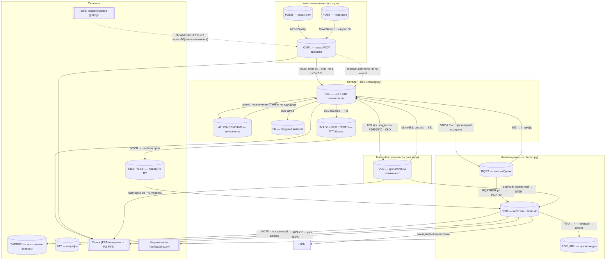

# INTEGRATION_MAP — карта межмодульных связей («связующая ткань»)

> Назначение: перечислить **КАЖДУЮ** межмодульную / межбазовую связь САБ ИРБИС64+ (ребро графа), и для каждой проверить — **сохранена ли она в нашем дизайне** и **разведена ли в коде**. Риск, который закрывает эта карта: «мы перенесём отдельные функции, но ПОТЕРЯЕМ связи между ними». Один такой разрыв уже найден: `circulation.py` не подключён к статусу экземпляра каталога `910^A`.
>
> **Грунтовано на recon:** [CAPABILITY_MAP §4/§11](../recon/deep/CAPABILITY_MAP.md), [GLOBAL_CORRECTION](../recon/deep/reference/format/GLOBAL_CORRECTION.md) (.gbl-задания, ПЕРЕНОСящие данные между БД), [DB_CIRCULATION](../recon/deep/reference/databases/DB_CIRCULATION.md), [DB_ACQUISITION](../recon/deep/reference/databases/DB_ACQUISITION.md), [DB_AUTHORITY](../recon/deep/reference/databases/DB_AUTHORITY.md), [DB_VUZ](../recon/deep/reference/databases/DB_VUZ.md), [DB_SERVICE](../recon/deep/reference/databases/DB_SERVICE.md), [DB_CATALOG_VARIANTS](../recon/deep/reference/databases/DB_CATALOG_VARIANTS.md), [FIELD_DICTIONARY](../recon/deep/reference/format/FIELD_DICTIONARY.md), [FINDINGS_09](../recon/deep/FINDINGS_09_web_reader.md).
> **Наше покрытие:** [ARCHITECTURE](ARCHITECTURE.md), [SPEC_ws1..ws5](specs/), [SPEC_engine_gbl](specs/engines/SPEC_engine_gbl.md), [SPEC_service_authority](specs/engines/SPEC_service_authority.md), [SPEC_engine_notifications](specs/engines/SPEC_engine_notifications.md), и реализованный код в `irbis-web/backend/access/` (catalog.py, circulation.py, authority.py, gbl.py, flk.py, pft.py, notifications.py, seed_vocab.py).

## Легенда статусов
- **✅ preserved** — связь и в дизайне (есть §), и разведена в коде (модуль реально читает/пишет другую сущность).
- **🟡 designed-not-wired** — связь спроектирована (есть §), но код этого модуля **не вызывает** другой модуль / поле другой БД (заглушка, событие-намерение или TODO).
- **❌ at-risk-of-loss** — связь **не разведена в коде** и/или **слабо/неполно спроектирована**; есть риск, что при сборке продукта ребро исчезнет.

> Принципиальное наблюдение о коде: реализованные модули (`catalog.py`, `circulation.py`, `authority.py`) — **самодостаточные sqlite-сторы со своими таблицами**, между собой **не связанные**. `catalog.record` хранит поле 910 как JSON, `circulation.loan` хранит экземпляр как голую строку-шифр (`item TEXT`), и **никакой записи назад в каталог нет**. Поэтому почти все межмодульные рёбра в коде сейчас **🟡 / ❌**, даже когда дизайн их описывает. Это и есть «связующая ткань», которую нельзя потерять.

---

## Граф модулей (Mermaid)

---

## Кластер 1. Комплектование → Каталог (ToCat и спутники)

| # | Источник (поле/запись) → цель | Триггер / семантика | Дизайн? (§) | Код? (модуль / «нет») | Статус | Примечание |
|---|---|---|---|---|---|---|
| 1.1 | CMPL БО (920=PAZK/SPEC/PVK/J/ASP) → IBIS запись | **ToCat**: флаг **поле 66** запускает реформат БО CMPL → формат IBIS (`STN.FST/MNOG.FST/UMARCIW.FST`: 922/330→700/701/200/463) | ws2 §8 (AC2), DB_ACQUISITION A.8 | ❌ нет (нет acquisition-модуля; gbl `NEWMFN` `supported=False`) | ❌ | Ядро переноса фонд→каталог. Кода нет совсем. |
| 1.2 | CMPL поле 910 → IBIS поле 910 | Экземпляры переносятся в ЭК при ToCat | ws2 §8, recon #CMPL-04 (построчный маппинг не транскрибирован) | ❌ нет | ❌ | Маппинг 910 CMPL→910 IBIS — открытый TODO recon. |
| 1.3 | CMPL → IBIS поле **938** | Связь перенесённой записи с заказом подписки (`pkj.gbl`) | ws2 §8, FIELD_DICTIONARY (938→CMPL период) | ❌ нет | ❌ | Связь «каталог↔подписка по периодам». |
| 1.4 | CMPL экз → IBIS поле **901** (техн. путь) | При переносе экз. проставляется технологический путь | DB_ACQUISITION A.3.1/A.8 | ❌ нет | ❌ | 901 = `^B`№экз + пункты ТП (tp.mnu). |
| 1.5 | ToCat → исходник CMPL: `VD=DEL` | FST-строка поля 66 ставит пометку на удаление исходной БО | ws2 §8 (AC3), DB_ACQUISITION A.8 | ❌ нет | ❌ | Гарантия отсутствия дублей после переноса. |
| 1.6 | CMPL поле **80** «взамен утерянных» → IBIS | **InsteadLost.gbl**: ищет экз. в ЭК по инв.N/штрих-коду (`J<DB>,IN=`), заменяет утерянный | ws2 §5 (AC4), DB_ACQUISITION A.8 | ❌ нет | ❌ | Кросс-БД поиск; gbl-движок кросс-БД не исполняет. |
| 1.7 | PODB (заказ книг) → CMPL | **MoveZakKp.gbl**: организации→IZD, заказы→SZ, БО→ZK (`MOVEKP.FST`) | ws2 §8 (AC1), DB_ACQUISITION A.8 | ❌ нет | ❌ | Входной каталог заказа. |
| 1.8 | POST (подписка) → CMPL как 920=OJK | **MoveNewKp.gbl**; связь по индексу **86** (`TP=` есть в CMPL / `TA=` нет) | ws2 §7 (AC4), DB_ACQUISITION A.8 / C | ❌ нет | ❌ | POST.FST проверяет 86 против `JCMPL,IP=`. |
| 1.9 | CMPL запись **SZ** (суммарный заказ) ← БО | **CreateSZ.gbl** (`NEWMFN '*' / ADD 920 'SZ'`); **SumEkzToSZ.gbl** считает полученные экз. по `BORZ=` | ws2 §2/§3 (AC2/AC1), DB_ACQUISITION A.5 | ❌ нет | ❌ | Внутрикомплектовательная связь БО↔SZ↔910. |
| 1.10 | PODB/POST дедупликация → CMPL и IBIS | `!KDEX/!KDK.pft` ловят дубли против CMPL и IBIS | ws2 §8 (AC1) | ❌ нет | ❌ | Кросс-БД контроль дублетности на входе. |

---

## Кластер 2. Каталог ↔ Книговыдача (статус экземпляра 910^A) — **уже найденный разрыв**

| # | Источник (поле/запись) → цель | Триггер / семантика | Дизайн? (§) | Код? (модуль / «нет») | Статус | Примечание |
|---|---|---|---|---|---|---|
| 2.1 | RQST → IBIS поле **910^A** (0↔1) | **Выдача:** свободный экз `910^A=0/U/C` → `910^A=1` (выдан). **Возврат:** обратно в свободный статус (`ste.mnu`) | ws3 §4 (AC1), §6; DB_CIRCULATION §5 | 🟡 спроектировано — **код не пишет в каталог** (`circulation.py` ведёт свой sqlite `loan`, `item TEXT`, нет обращения к `catalog.py`) | **❌** | **Это и есть исходный пример потери связи.** Нужен write-back checkout/return → `catalog` 910^A. |
| 2.2 | IBIS свободные экз (`freekz`) → RQST подбор | Подбор свободного экз: статусы 910 + учёт мест выдачи 56/57; `DBNFREEEKZ=0` | ws3 §3 (AC1), DB_CIRCULATION §5/§6 | 🟡 ws3 описывает; код не читает каталог (нет `free_ekz` запроса к `catalog`) | ❌ | Без этого выдача «вслепую», не зная реальных экз. |
| 2.3 | RQST поле **903** → IBIS `I=` (шифр) | Шифр заказа = шифр документа в ЭК (`DBNPREFSHIFR=I=`); RQST.1 = имя БД ЭК | ws3 §3, DB_CIRCULATION §8 | 🟡 ws3 описывает; код хранит `item` как шифр-строку, без резолва в `catalog` | ❌ | Шов «заказ↔запись каталога». |
| 2.4 | RQST → RDR поле **40** (материализация) | **`RQSTRDR.pft`** строит RDR.40: `^A`=903, `^B`=910^B, `^H`=910^H, `^K`=910^D, `^D`=41, `^E`=42, `^F`=`******`, `^G`=БД, `^C`=brief | ws3 §4 (ключевой), DB_CIRCULATION §5/§8 | 🟡 спроектировано — код моделирует loan своими колонками, но **не как поле 40 RDR** и без PFT-материализации | 🟡 | Семантика выдачи присутствует (due/returned), но не как RDR.40-структура. |
| 2.5 | RDR поле 40 ↔ **RDR_ARH** (архив) | **Возврат:** запись о выдаче переносится в RDR_ARH (`autoin_light.gbl`/`AUTOARH`) | ws3 §4 (AC2, opt-in), DB_CIRCULATION §5/§8 | 🟡 ws3 «архив opt-in»; код: `mark_returned` ставит `returned=1` в той же таблице, отдельного архива нет | 🟡 | Архивация выдач = отдельная сущность (152-ФЗ ретенция). |
| 2.6 | RQST поле 910^A (reservstatus 0–4) vs IBIS 910^A (ste.mnu) | **Одно подполе — разные кодировки** в разных БД (recon #CIRC-06) | ws3 §6 (AC2: развести item_status/hold_status) | 🟡 в коде `hold.status` отдельный enum (хорошо), но не сопоставлен с `reservstatus.mnu` значениями | 🟡 | Дизайн правильно разводит; маппинг кодов не реализован. |
| 2.7 | RDR.999 «читатель в библиотеке» / 999 каталога | Технические счётчики посещаемости/выдач | ws3 §2 (поля); recon DB_CIRCULATION §2 | ❌ не спроектировано отдельно | ❌ | Малый риск; счётчик 999 пока вне модели. |

---

## Кластер 3. Книговыдача ↔ Читатель (RDR) ↔ PAY

| # | Источник (поле/запись) → цель | Триггер / семантика | Дизайн? (§) | Код? (модуль / «нет») | Статус | Примечание |
|---|---|---|---|---|---|---|
| 3.1 | RQST поле **30** → RDR поле 30 (`RI=`) | Заказ привязан к читателю по идентификатору билета/штрих-кода | ws3 §3, DB_CIRCULATION §8 | 🟡 `loan.reader`/`hold.reader` = id строкой; нет RDR-стора (читатель = строка, не запись RDR с 58 полями) | 🟡 | Читатель в circulation — лишь id; регистрация RDR (ws3 §2) кода не имеет. |
| 3.2 | RDR поле **40^F** «долг» (`******`) → лимиты выдачи | Задолженность = `40^F:'******'` (FST `DOLG=`); блок выдачи при `MaxBooks`/`MaxDolgBooks` | ws3 §4 (AC4), §6.6 SPEC_business_circulation | ✅ реализовано: `debt_level()`, `count_on_hand()`, лимиты per-category | ✅ | Логика долга/лимитов разведена — **внутри** circulation. |
| 3.3 | RDR поле **40^U** утеря / цена → PAY (штраф) | Утеря `40^U=1`; долговая форма с ценой `910^E` из ЭК; штрафы в БД **PAY** (ключ `RI=`) | ws3 §5 (AC2/AC3), recon #CIRC-05 | 🟡 `mark_lost` считает replacement, но `item_price` приходит **аргументом**, не читается из каталога 910^E; PAY-интеграция = событие-намерение | ❌ | Цена замены не берётся из 910^E ЭК; нет проводки в PAY. |
| 3.4 | RDR категория **50** → политика лимитов/штрафов | Категория (В01–В05/Д01–Д03/STD/GUEST из `50.mnu`) определяет лимиты | ws3 §2 (AC2), SPEC_business_circulation §5.3 | ✅ `_LIMIT_MATRIX` по категориям из 50.mnu; `default_policy` | ✅ | Категории зашиты; источник = seed_vocab (50.mnu). |
| 3.5 | RDR поле 40^E/срок → уведомления (due_soon/overdue) | Приближение/просрочка срока → событие читателю | ws3 §8, SPEC_engine_notifications | 🟡 circulation `_emit` + EventCatalog есть `due_soon/overdue`; но scan по срокам не связан с реальным RDR.40 | 🟡 | События есть, планировщик/связь с loan.due есть в коде, с RDR — нет. |

---

## Кластер 4. Книгообеспеченность ↔ Каталог ↔ Читатель («связка»)

| # | Источник (поле/запись) → цель | Триггер / семантика | Дизайн? (§) | Код? (модуль / «нет») | Статус | Примечание |
|---|---|---|---|---|---|---|
| 4.1 | VUZ поле **68/83** (связка) → IBIS поле **691** | **Move691.gbl**: контингент-«связка» (`^A^L^N^C^V^O^F`) переносится в каталог как 691 (привязка экз↔дисциплина), 691^I=3^0 | ws4 §3 (AC1), DB_VUZ | ❌ нет (нет КО-кода; gbl кросс-БД не исполняет) | ❌ | Ядро привязки литература↔дисциплина. |
| 4.2 | VUZ контингент → RDR поля **90/69** | **LinkVuz.gbl**: студент↔дисциплины (90 контингент, 69 изуч. дисциплины) | ws4 §3 (AC2), DB_VUZ | ❌ нет | ❌ | Транзитивная связь DISC→VUZ→RDR. |
| 4.3 | DISC поле 83 ↔ VUZ поле 68 | **LinkDisc.gbl**: двунаправленная синхронизация дисциплина↔контингент | ws4 §3, DB_VUZ | ❌ нет | ❌ | Внутри VUZ, но межзаписевая. |
| 4.4 | IBIS поле **693** (экз) + RDR/68^Z (студенты) → **ККО** | ККО = экземпляры(693)/студенты; студенты из RDR (`JRDR,LN=связка` при `ACCESSRDR=1`) или из 68^Z | ws4 §4 (AC1/AC4), DB_VUZ | ❌ нет | ❌ | Расчёт «наполненности» — кросс-БД агрегат IBIS×RDR. |
| 4.5 | IBIS поле **691** → поле **692** (архив КО) | Снятая привязка уходит в архив 692 (`Arhiv692.gbl`) | ws4 §3 (AC3), DB_VUZ | ❌ нет | ❌ | История привязок. |
| 4.6 | KO низкая ККО → CMPL поле **694** (дозаказ) | Низкая обеспеченность → заявка на комплектование (694→CMPL) | ws4 §6 (AC1), ws2 §2 (AC5) | ❌ нет | ❌ | Шов «КО→комплектование» (demand-driven). |
| 4.7 | RDR.40 (выдачи) → VUZ/IBIS 691 | `MoveRdrCatVuz.gbl`: формирование 691 по книговыдаче | DB_VUZ (gbl-каталог), не детализировано в ws4 | ❌ слабо спроектировано | ❌ | Обратная связь выдача→обеспеченность. |

---

## Кластер 5. КСУ ↔ экземпляры (внутри комплектования, но межзаписевые)

| # | Источник (поле/запись) → цель | Триггер / семантика | Дизайн? (§) | Код? (модуль / «нет») | Статус | Примечание |
|---|---|---|---|---|---|---|
| 5.1 | КСУ поступления (88^U) ↔ экз (910^U) | №КСУ поступления проставляется в экземпляры (`KSU=`) | ws2 §3/§4 (AC1/AC2), DB_ACQUISITION A.3.1 | ❌ нет | ❌ | Учётная связь партия↔экземпляр. |
| 5.2 | Мастер списания → 888 + экз 910^V/^X + статус 910^A=6 | Списание ставит №КСУ выбытия (^V), кол-во (^X), статус «списан» | ws2 §5 (AC1), DB_ACQUISITION A.5 | ❌ нет | ❌ | Выбытие = проводка в экземпляр. |
| 5.3 | КСУ «Пополнение записи» → авто-поля 17/18/19, 44–49, 145–158 | Авто-распределение партии по разделам/типам/языкам | ws2 §4 (AC2), recon #CMPL-05 | ❌ нет (алгоритмы во внешнем Мастере, recon-TODO) | ❌ | Сложная авто-логика; в recon не раскрыта. |
| 5.4 | Поле 800 (акт передачи) ↔ выбытие | Акт передачи выбывших связан со списанием | ws2 §5 (AC1), DB_ACQUISITION A.3.1 | ❌ нет | ❌ | — |

---

## Кластер 6. Авторитеты ↔ Каталог

| # | Источник (поле/запись) → цель | Триггер / семантика | Дизайн? (§) | Код? (модуль / «нет») | Статус | Примечание |
|---|---|---|---|---|---|---|
| 6.1 | ATHR* → IBIS поля **700/701/710/606/607** подполе **^3** | При выборе авторитета — автозаполнение подполей + протягивание `^3` = номер авторитетной записи | SPEC_service_authority §3.1/§3.2 (карта), DB_AUTHORITY §5.2 | 🟡 `authority.substitute()` строит патч с `^3`; но **`catalog.save()` его не вызывает** — нет шва каталог↔авторитет в save-пайплайне | 🟡 | Функция есть, **связь в коде не замкнута**: каталог сохраняет ^3 только если клиент сам прислал. |
| 6.2 | IBIS save → пополнение **ATHRA/ATHR*** (autoin) | **autoin.gbl**: при сохранении БО авто-создаются связанные авторитетные записи (510/710 без `^3`) | SPEC_service_authority §3.4 (системный хук на save), DB_AUTHORITY | 🟡 спроектировано как хук; код: ни `catalog.py`, ни `authority.py` не реализуют autoin-хук на сохранение | 🟡 | «Обратное» ребро каталог→авторитеты не разведено. |
| 6.3 | ФЛК `!700/!606/!964` ↔ authority-сервис | ФЛК валидирует связь `^3` (битая ссылка → нарушение) | SPEC_service_authority §0 (ФЛК вызывает), flk.py | 🟡 flk.py есть; но правила проверки `^3` против authority-стора не подключены к `catalog.validate()` | 🟡 | flk вызывается на save, но без authority-проверки `^3`. |
| 6.4 | Поиск по авторитету (навигаторы `WnLink`) → IBIS | Поиск записей каталога по выбранному авторитету (`^3`/`H=`) | SPEC_service_authority §2, CAPABILITY_MAP §5 | 🟡 `authority.search()` ищет авторитеты; обратный поиск «каталог по ^3» в catalog.py не реализован (INDEX_SPEC не индексирует ^3/606/607) | 🟡 | Каталог не findable по авторитетному `^3`. |

---

## Кластер 7. Полные тексты ↔ Каталог ↔ Права (ПБД)

| # | Источник (поле/запись) → цель | Триггер / семантика | Дизайн? (§) | Код? (модуль / «нет») | Статус | Примечание |
|---|---|---|---|---|---|---|
| 7.1 | IBIS поля **951/953/955** → ПТ-хранилище (TEXTS/ПБД) | 951 внешний URL/файл, 953 встроенный двоичный, 955 ПТ-метаданные (`^A`файл, `^N`страниц) | ARCHITECTURE §3 (Файлы/Хранилище, Сканирование→951/953/955), FINDINGS_09 | ❌ нет (нет файлового/DAM-кода в access) | ❌ | Связь записи с бинарём не разведена. |
| 7.2 | IBIS **955^B** → **RIGHT** (шаблон прав) | Поле 955^B = ссылка на запись RIGHT (шаблон доступа); `I=` template ID | FINDINGS_09, DB_SERVICE | ❌ нет (нет RIGHT-модуля; `entitlements.py` — про гранты сотрудников, не про ПТ-права читателя) | ❌ | Модель доступа к ПТ. |
| 7.3 | RIGHT поле 3 (правила) ↔ RDR категория 50 / фак-спец 69/90 | Уровень доступа `^C` (0 deny/1 view/2 download) по категории читателя; лимит страниц `^F` | FINDINGS_09, DB_SERVICE, ACCESS_MODEL_web-irbis | 🟡 ACCESS_MODEL описывает RIGHT/LICH; код не реализует | ❌ | Гейтинг ПТ по правам читателя. |
| 7.4 | RDR → **LICH** (закладки/рейтинг/скачивания) | LICH хранит закладки (поле 3), рейтинг (7), счётчик скачанных страниц (4) на читателя+текст | FINDINGS_09, DB_SERVICE | ❌ нет | ❌ | Личный кабинет ПТ; счётчик бюджета скачивания. |
| 7.5 | LICH поле 4 (скачано) ↔ RIGHT лимит | Остаток лимита скачивания в сессии = RIGHT.^F − LICH.v4 | FINDINGS_09, DB_SERVICE | ❌ нет | ❌ | Учёт квоты. |
| 7.6 | VKR (ВКР) загрузка → IBIS + TEXTS | Загрузка ВКР студентом (`reg.frm`), конвертация `fst_rec.fst`, антиплагиат (215^W %) | FINDINGS_09, DB_CATALOG_VARIANTS | ❌ нет | ❌ | Студенческий поток ВКР. |

---

## Кластер 8. Подписка / Сводный каталог / прочие БД

| # | Источник (поле/запись) → цель | Триггер / семантика | Дизайн? (§) | Код? (модуль / «нет») | Статус | Примечание |
|---|---|---|---|---|---|---|
| 8.1 | IBIS поле **902** (сигла) → **SK** (сводный каталог) | 902^s = сигла держателя; SK ссылается на записи библиотек-участниц (`&uf('DSK,!I=',…)`) | CAPABILITY_MAP §4/§11, DB_CATALOG_VARIANTS | ❌ нет (SK как «сводный поиск» в ARCHITECTURE §облако, но без кода) | ❌ | Федеративная связь. |
| 8.2 | SK 907^Z дедуп ↔ записи-участницы | Ключ дедупликации (шифр/ISBN) при импорте в сводный | DB_CATALOG_VARIANTS | ❌ нет | ❌ | — |
| 8.3 | IMAGE/VKR поле **903** ↔ IBIS `I=` | Образный/ВКР-каталог ссылается на запись ЭК по шифру (903 из 952^b) | DB_CATALOG_VARIANTS | ❌ нет | ❌ | Бэкрефы вариантов каталога. |
| 8.4 | Подписка POST 86 → CMPL → IBIS (по периодам 938) | Цепочка POST→CMPL→каталог для периодики | ws2 §7 (см. 1.8), FIELD_DICTIONARY (938) | ❌ нет | ❌ | См. также 1.3/1.8. |

---

## Кластер 9. Связи иерархии записей (внутри каталога, межзаписевые)

| # | Источник (поле/запись) → цель | Триггер / семантика | Дизайн? (§) | Код? (модуль / «нет») | Статус | Примечание |
|---|---|---|---|---|---|---|
| 9.1 | Статья (ASP) поле **463** → журнал/сборник (host) | Аналитика ссылается на издание-хозяина (`^C`загл, `^J`ISSN); поиск по связи `Scnt` | CAPABILITY_MAP §4, ws1, FIELD_DICTIONARY | 🟡 ws1 описывает типы 920; код: catalog хранит 463 как поле, но связь/поиск-по-связи не реализован | ❌ | Журнал↔номер↔статья — поиск по связи отсутствует. |
| 9.2 | Номер журнала (NJ) ↔ журнал (J) — 461/46 | Иерархия журнал↔номер (461 общая часть, 46 доп. серийные) | CAPABILITY_MAP §4 | 🟡 как 9.1 | ❌ | — |
| 9.3 | Многотомник: том ↔ сводная — 481/963/SPEC | Связь том↔многотомное издание | CAPABILITY_MAP §4 | 🟡 как 9.1 | ❌ | — |

---

## Кластер 10. Читатель ↔ ИРИ/SDI ↔ ВУЗ-студент

| # | Источник (поле/запись) → цель | Триггер / семантика | Дизайн? (§) | Код? (модуль / «нет») | Статус | Примечание |
|---|---|---|---|---|---|---|
| 10.1 | RDR поле **140** (`IRI=`) → **ZAPR/IRI** постоянные запросы | Профиль ИРИ; ZAPR хранит запрос (`2^B`ПТ-часть, `2^C`библио-часть), переигрывается по расписанию против IBIS | FINDINGS_09, DB_SERVICE, SPEC_reader_jirbis | ❌ нет | ❌ | SDI/избирательное распространение. |
| 10.2 | RDR корзина → **RQST** | Корзина заказов читателя персистится как заказы RQST | FINDINGS_09, ws3 §3, SPEC_reader_jirbis | 🟡 ws3/jirbis: «один движок, два клиента»; код hold/request есть, но RDR-корзина не разведена | 🟡 | Шов читательский портал↔книговыдача. |
| 10.3 | RDR студент 90/69 → VUZ контингент | Студент видит свои дисциплины/списки литературы (ЛК) | ws4 §6 (AC2), SPEC_reader_jirbis | ❌ нет (см. 4.2) | ❌ | — |

---

## Кластер 11. Сквозные зависимости (поиск, .gbl, уведомления, словари)

| # | Источник (поле/запись) → цель | Триггер / семантика | Дизайн? (§) | Код? (модуль / «нет») | Статус | Примечание |
|---|---|---|---|---|---|---|
| 11.1 | **Каждая БД** → поисковый индекс (FST-инверсия) | Все модули зависят от инвертированных префиксов (`K=/A=/T=/I=/RI=/IN=/VUZ=/KSU=…`); у нас — PG FTS вместо инвертированного файла | ARCHITECTURE §3/§6 (Поиск), CAPABILITY_MAP §5 | 🟡 catalog.py: `record_index` + `INDEX_SPEC` (только T/A/K/IN); authority: `authority_term`; circulation: нет инверсии | 🟡 | Поиск разведён частично (4 префикса каталога из 109 IBIS); RDR/CMPL/VUZ-поиск кода не имеет. |
| 11.2 | **.gbl** (NEWMFN/NEWREC/CORREC) → другая БД | Кросс-БД задания (ToCat/Move691/MoveZakKp/CreateSZ/InsteadLost/autoin) | SPEC_engine_gbl §1.2 (операторы др. БД), GLOBAL_CORRECTION | 🟡 gbl.py **парсит** NEWMFN/NEWREC/CORREC, но помечает `supported=False` («later A3 slice») — **не исполняет** | **❌** | **Один движок блокирует ВСЕ кросс-БД задания** (1.1–1.10, 4.1–4.7, 5.x). Высший приоритет бэклога. |
| 11.3 | circulation → **NotificationQueue** (A6) | События выдачи (`hold_ready/fine_charged/renewal_confirmed/lost_confirmed/staff_alert/fine_paid`) | SPEC_engine_notifications, ws3 §8 | 🟡 `circulation._emit` вызывает `notifier.enqueue`; но EventCatalog имеет только 6 шаблонов (`hold_ready/due_soon/overdue/fine_charged/hold_cancelled/account_blocked`) | 🟡 | Эмитятся события **без шаблона**: `renewal_confirmed/lost_confirmed/staff_alert/fine_paid` → пройдут вхолостую (нет template). |
| 11.4 | **seed_vocab** (словари 50.mnu/ste.mnu/…) → все модули | Категории/статусы/места из общих `.mnu`/`.tre` питают ФЛК, лимиты, выдачу | SPEC_seeding, seed_vocab.py | 🟡 seed_vocab грузит словари; circulation `_LIMIT_MATRIX` хардкодит 50.mnu (не из стора), catalog flk берёт store | 🟡 | Часть словарей зашита в код вместо чтения из seed-стора. |
| 11.5 | ФЛК дублетности → инвертированный индекс (кросс-запись) | `!910` дубль инв.№/штрих-кода ловится поиском по `IN=`/`H=` в той же БД | SPEC_engine_flk, ws2 §3 (AC3) | ✅ catalog `_dup_index` подключён к flk как `dup_index`-колбэк (по `IN=`) | ✅ | Единственная «межзаписевая» связь, реально разведённая в коде. |

---

## Сводный счёт (tally)

| Статус | Кол-во рёбер | Доля |
|---|---|---|
| ✅ preserved (дизайн + код) | **4** | ~9% |
| 🟡 designed-not-wired | **16** | ~36% |
| ❌ at-risk-of-loss | **24** | ~55% |
| **Итого рёбер** | **44** | 100% |

✅ (4): 3.2 долг/лимиты · 3.4 категория→политика · 11.5 ФЛК-дублетность→индекс · (и единственная «положительная» межзаписевая) — все **внутри** одного модуля circulation/catalog, не межмодульные.

> Вывод: **ни одно подлинно межмодульное ребро (между разными модулями/БД) сейчас не замкнуто в коде полностью.** Реализованные модули — изолированные сторы. Это в точности тот риск, ради которого делалась карта.

---

## Интеграционный бэклог (задачи «прошить связующую ткань»)

Порядок = приоритет (сверху — то, что разблокирует больше всего связей и закрывает уже найденные разрывы).

### P0 — разблокираторы и уже-найденные разрывы

1. **[2.1/2.2/2.3] Catalog↔Circulation: статус 910^A + свободные экз + резолв 903→запись.** `circulation.checkout/return_item` должны (а) читать свободные экземпляры из `catalog` по статусам `ste.mnu`, (б) флипать `910^A` 0↔1 при выдаче/возврате, (в) резолвить `item` (903/шифр) в запись каталога. — *исходный разрыв, ❌→✅.*
2. **[11.2] gbl-движок: исполнение NEWMFN/NEWREC/CORREC.** Снять `supported=False`; это **единственный блокер** для всех кросс-БД заданий кластеров 1, 4, 5. Без него ToCat/Move691/MoveZakKp/CreateSZ/InsteadLost/autoin неисполнимы.
3. **[2.4/2.5] RDR.40-материализация + архив.** Привести `loan` к структуре поля 40 RDR (`^A/^B/^H/^K/^D/^E/^F/^G/^C`) и реализовать перенос возвращённой выдачи в RDR_ARH (opt-in, 152-ФЗ).

### P1 — авторитеты и комплектование→каталог

4. **[6.1/6.2/6.3] Authority↔Catalog шов.** Вызвать `authority.substitute()` из `catalog.save()` (протяжка `^3`); реализовать autoin-хук пополнения ATHR* при сохранении БО; подключить ФЛК-проверку битых `^3`.
5. **[6.4/11.1] Индексация `^3`/606/607 в каталоге.** Расширить `INDEX_SPEC` (сейчас только T/A/K/IN) — поиск каталога по авторитету и по предметным рубрикам.
6. **[1.1–1.5] ToCat (поле 66 → IBIS).** После P0#2: реформат CMPL БО→IBIS, перенос 910, связь 938, техн.путь 901, `VD=DEL` на исходник. *(Требует acquisition-модуля — его нет.)*
7. **[1.6/3.3/5.2] InsteadLost + утеря→PAY + списание→910.** Цена замены из `910^E` ЭК (не аргументом); проводка штрафа в PAY; списание ставит `910^V/^X` + статус 6.

### P2 — книгообеспеченность и сервисы

8. **[4.1–4.6] VUZ↔IBIS↔RDR «связка» + ККО.** Move691 (68→691), LinkVuz (→90/69), расчёт ККО (693 экз × студенты RDR/68^Z), архив 692, дозаказ 694→CMPL. *(Нужен КО-модуль — его нет.)*
9. **[7.1–7.6] Полные тексты ↔ права (RIGHT/LICH).** 951/953/955→хранилище; 955^B→RIGHT; гейтинг по категории читателя; LICH закладки/квота скачивания; поток ВКР.
10. **[1.7/1.8/8.4] Входные каталоги PODB/POST → CMPL.** MoveZakKp/MoveNewKp; связь подписки по индексу 86 (`TP=/TA=`).

### P3 — сводный каталог, иерархия записей, ИРИ, словари

11. **[8.1–8.3] SK сводный каталог (902 сигла) + бэкрефы IMAGE/VKR (903).**
12. **[9.1–9.3] Поиск-по-связи (463/461/481/963)** — иерархия журнал↔номер↔статья, многотомники.
13. **[10.1/10.3] ИРИ/SDI (140→ZAPR) + студент-ЛК (90/69→VUZ).**
14. **[11.3] EventCatalog: добавить недостающие шаблоны** — `renewal_confirmed/lost_confirmed/staff_alert/fine_paid/payment_received` (сейчас circulation их эмитит вхолостую).
15. **[11.4] Словари из seed-стора, а не хардкод** — circulation `_LIMIT_MATRIX`/категории читать из seed_vocab (50.mnu), не зашивать.

---

## Где смотреть (источники проверки)

- **Каталог-стор и его границы:** `irbis-web/backend/access/catalog.py` (нет API статуса 910^A, нет holdings-аксессора, `INDEX_SPEC` = T/A/K/IN).
- **Изолированность книговыдачи:** `irbis-web/backend/access/circulation.py` (свой sqlite `reader/loan/hold/fine`, `item TEXT`, ни одного обращения к catalog).
- **Кросс-БД заглушка gbl:** `irbis-web/backend/access/gbl.py:405` `_parse_other_record` — `supported=False`, «execution … is a later A3 slice».
- **Authority `^3` не замкнут:** `irbis-web/backend/access/authority.py:267` `substitute()` строит патч, но не вызывается из `catalog.save()`.
- **EventCatalog без полного набора:** `irbis-web/backend/access/notifications.py:185` `DEFAULTS` (6 событий) vs события, эмитируемые circulation.
- **Дизайн швов:** ws3 §4/§6 (910^A), ws2 §8 (ToCat/66), ws4 §3/§4 (691/ККО), SPEC_service_authority §3 (substitution/autoin), SPEC_engine_gbl §1.2 (кросс-БД операторы), SPEC_engine_notifications.

> Карта живая: при подключении каждого ребра — перевести строку в ✅ и снять пункт бэклога.
