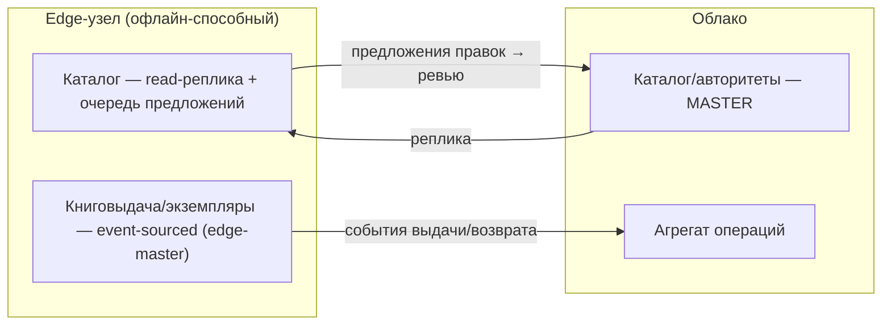

# ADR-005 — Офлайн-синхронизация edge ↔ облако

> Самое рисковое решение архитектуры ([ARCHITECTURE §5](ARCHITECTURE.md), [BEST_PRACTICES §2](BEST_PRACTICES.md)). Узлы библиотек работают офлайн и синхронизируются с облаком. Здесь — выбранная модель: владение данными, событийный журнал, разрешение конфликтов, часы, дельты, отказы. Статус: предложено.

## Контекст
- Edge-узел библиотеки работает **неограниченно офлайн** (особенно **книговыдача**) и синхронизируется при появлении сети.
- Мультиарендность: синхронизируются только данные **этого тенанта** и **включённых модулей**.
- Домен неоднороден: **каталог** — преимущественно чтение (правят централизованно/по ревью); **книговыдача/экземпляры** — интенсивная локальная запись, должна работать без сети.

## Решение (кратко)
**Событийный журнал + явное владение по доменам + доменные политики конфликтов.** НЕ глобальный «last-write-wins по wall-clock».

### 1. Владение данными (data ownership)

| Домен | Master | На edge | Конфликты |
|---|---|---|---|
| Каталог / авторитетные файлы / словари | **облако** | read-реплика + **очередь предложений** (правки edge = proposal) | облако — истина; правка edge → очередь ревью |
| Книговыдача / экземпляры / **перемещения по ячейкам** | **edge** | авторитетно локально | **event-sourced** (факты выдачи/возврата) → почти бесконфликтно |
| Конфигурация тенанта / лицензии / тарифы | **облако** | read | облако — истина |
| Читатели (RDR) | edge (на месте) ↔ облако (агрегат) | локально | LWW по HLC + журнал |

Итог: каталог един и консистентен (облако-master), а оперативная работа (выдача) корректна офлайн (edge-master, события).

### 2. Захват изменений — transactional outbox
- В одной транзакции с изменением данных пишем **событие** в `outbox`: `{event_id(uuid), tenant_id, entity, entity_id, op(create/update/delete), payload, base_version, origin_node, hlc}`.
- Это исключает потерю/раздвоение (без распределённых транзакций/2PC). CDC — как альтернатива outbox.

### 3. Часы — Hybrid Logical Clock (HLC)
- **Не доверяем wall-clock на edge.** HLC = (физическое время, логический счётчик) → даёт **причинный порядок** и человекочитаемую метку; устойчив к перекосу часов и переупорядочиванию.

### 4. Транспорт и дельты
- Pull/push через sync-эндпоинт (или событийную шину): курсор = последний подтверждённый `seq` на пир; **идемпотентное применение** (дедуп по `event_id`).
- **Дельта-синхронизация** «since cursor»; **tombstone** для удалений; компакция журнала; батч+сжатие; **частичная** (только тенант + включённые модули). Bootstrap = полный снапшот, далее дельты.

### 5. Разрешение конфликтов (по доменам)
- **Книговыдача (edge-master, event-sourced):** выдача/возврат/перемещение — это **факты-события**, а не перезапись состояния → складываются без конфликта; состояние = свёртка событий. Инвариант «ячейка занята одним экземпляром» гарантирует edge как владелец локации; межузловой конфликт (один экземпляр на двух узлах) — редкий, решается **авторитетом локации**.
- **Каталог (облако-master):** правки edge — **предложения**; при расхождении облако побеждает, предложение уходит в **очередь ревью** (видна каталогизатору).
- **Прочее (поля-状态):** крайний случай — **LWW по HLC** + запись в **журнал конфликтов** для ручного разбора в UI.

### 6. Идемпотентность и надёжность
- Каждое событие — `event_id`; на приёмнике — множество обработанных id; операции несут idempotency-ключ. Повторная доставка безопасна. Дедлайны, экспоненциальный backoff, докачка прерванной передачи.

### 7. Безопасность
- Канал sync — аутентифицирован (mTLS), per-tenant; облако **проверяет лицензию/entitlement** тенанта до приёма; полезная нагрузка шифруется at-rest/in-transit.

### 8. Отказы и тестирование (обязательно «на хаосе»)
Длинный офлайн (недели) · переупорядочивание · дубликаты · перекос часов · частичная/прерванная передача · повторное подключение узла · split-brain по книговыдаче. → автоматические **хаос-тесты** конвергенции и инвариантов.

## Рассмотренные альтернативы
- **Глобальный LWW по wall-clock** — отвергнут: теряет корректность книговыдачи и данные при перекосе часов.
- **Чистый CRDT на всё** — отвергнут как избыточно сложный для домена; точечно (счётчики/множества) — допустимо.
- **Готовые движки** (ElectricSQL / PowerSync / Couchbase Lite / CouchDB-репликация) — **рассмотреть как ускорители** реализации (особенно Postgres-ориентированные ElectricSQL/PowerSync), не изобретать транспорт/дельты с нуля.

## Последствия
Сложнее LWW, но: книговыдача корректна офлайн; event-sourcing даёт **аудит бесплатно**; каталог-облако = чистый сводный каталог; модель ложится на мультиарендность и масштаб. Требует дисциплины (outbox/HLC/идемпотентность) и хаос-тестов.

## Реализация (вехи) → эпик BP4
1. Outbox + модель события + HLC. 2. Доменные владения (catalog cloud-master / circulation edge-master). 3. Sync-эндпоинт (курсор/дельты/идемпотентность/tombstones). 4. Очередь ревью каталога + журнал конфликтов в UI. 5. Хаос-тесты конвергенции. (Оценить ElectricSQL/PowerSync на шаге 3.)
