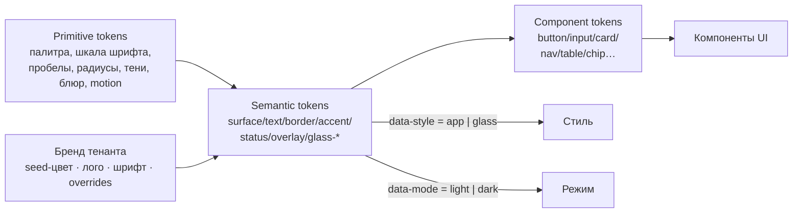

# ТЗ для ClaudeDesign — полноформатная дизайн-система продукта

> Задание на создание **полной дизайн-системы** библиотечной платформы (мультиарендный SaaS — замена САБ ИРБИС64+). Расширяет ранний [`TZ_ClaudeDesign_UI.md`](TZ_ClaudeDesign_UI.md). Контекст продукта: [ARCHITECTURE](ARCHITECTURE.md), [ROADMAP](ROADMAP.md), [PRODUCT_PRACTICES](PRODUCT_PRACTICES.md), [COVERAGE_MATRIX](COVERAGE_MATRIX.md), [SCREENMAP_web-reader](SCREENMAP_web-reader.md), [SCREENMAP_web-staff](SCREENMAP_web-staff.md). Соглашения — [`CONVENTIONS.md`](../CONVENTIONS.md).

## 0. Краткая постановка
Нужна **одна дизайн-система** с общим фундаментом токенов и **тремя осями тем**:
1. **Стиль** — два визуальных языка: **A. «Claude-like» приложение** (как в приложении/на сайте Claude; светлая+тёмная) — для самого продукта: читательский веб, личные кабинеты, инструменты сотрудника/АРМ, админка; **B. Apple Glassmorphism** — для маркетингового сайта проекта.
2. **Режим** — light / dark (минимум для стиля A; для стиля B — оба варианта).
3. **Бренд (тенант)** — каждая библиотека может кастомизировать оформление под себя (самостоятельно через редактор тем или силами нашей команды) — мультиарендный white-label.

Ключевой принцип: **приложение = чистый, читаемый, content-first (Claude-стиль); сайт = «вау», глубина, стекло (Apple Glass)**. Не путать: стекло — только маркетинг, рабочие экраны остаются спокойными и плотными.

## 1. Цели и принципы
- **Доступность с нуля** — WCAG 2.2 AA + ГОСТ Р 52872 (клавиатура, скринридеры, контраст ≥4.5:1 для текста, видимый фокус, `prefers-reduced-motion`, **`prefers-reduced-transparency` → отключение блюра** в стиле B). Доступность — фича, а не довесок.
- **Content-first и плотность** — рабочие экраны сотрудника поддерживают **режимы плотности** (comfortable / compact) для таблиц и каталогизации.
- **Производительность и защищённый контур** — без внешних CDN/трекеров/шрифтовых хостингов; шрифты и ассеты самохостинг; `backdrop-filter` с фолбэком; работает офлайн (PWA).
- **Мультиарендность и кастомизация** — токен-архитектура, позволяющая безопасно перекрашивать/ребрендить под тенанта, **не ломая контраст и доступность** (contrast-guards).
- **Адаптивность** — mobile-first, PWA, плюс **kiosk-режим** (терминал самообслуживания) и large-touch для постаматов.
- **i18n** — основной язык русский, заложить английский; длинные строки, числа/даты по локали.
- **Преемственность** — расширяет существующую вендорную систему (`irbis-web/frontend/`: токены, темы «Рабочая/Театр/a11y», компоненты `SearchBar/ResultCard/StatusBadge/PftBlock/Pagination/DynamicField/FilterChip/TreeNav/FileViewer`, SVG-`RoomPlan`). Подход CSS-переменных сохраняем.

## 2. Архитектура токенов и тем (theming)
Трёхслойная модель токенов (как Style-Dictionary): **primitive → semantic → component**.

- Применение через атрибуты на корне: `data-style="app|glass"` × `data-mode="light|dark"` × `data-tenant="<slug>"` (или CSS-класс). Все значения — **CSS custom properties**; переключение темы = смена набора переменных без пересборки.
- **Категории токенов:** color (primitive ramp + semantic roles), typography (families/size/line-height/weight/letter-spacing), spacing (4-pt сетка), radius, elevation/shadow, **blur/opacity (для стекла)**, motion (duration/easing), z-index, breakpoints, border, focus-ring.
- **Семантические роли (примеры):** `--surface-1/2/3`, `--surface-overlay`, `--text-primary/secondary/subtle/inverse`, `--border-default/strong`, `--accent` (бренд), `--accent-contrast`, статусы домена: `--status-available` (в ячейке), `--status-issued` (на руках), `--status-hold` (в постамате), `--status-returned` (книгоприём), плюс `success/warning/error/info`. Для стиля B добавить `--glass-tint`, `--glass-blur`, `--glass-border`, `--glass-highlight`, `--gradient-*`.

## 3. Мультиарендная кастомизация (требование 1)
- **Уровни кастомизации:**
  1. **Пресет по типу библиотеки** (публичная / школьная / вузовская / ведомственная) — стартовая тема и плотность.
  2. **Бренд тенанта**: логотип, **seed-цвет** (из него генерируется доступная палитра accent + состояния), выбор шрифта из самохостинг-набора, фон/обои логина, фавикон, название.
  3. **Тонкая настройка**: ограниченный набор overrides семантических токенов (радиусы, плотность, отдельные роли) — **без произвольного CSS**, чтобы не ломать систему.
  4. **Managed white-label** (наша команда): полный кастом-скин/кастом-домен под крупного клиента.
- **Редактор тем (self-serve)** — экран в админке тенанта: live-превью на реальных компонентах, выбор seed-цвета с **автоматической проверкой контраста** (если не проходит AA — предупреждение/автокоррекция), загрузка лого, переключение light/dark, сохранение → CSS-переменные тенанта.
- **Contrast-guards:** система гарантирует AA даже после кастомизации (генерация accent-contrast, блокировка недоступных сочетаний). Брендируется **accent/поверхности/лого**, но не трогаются паттерны доступности и статус-семантика (цвет статуса + иконка + текст — не только цвет).
- **Изоляция:** тема — часть конфигурации тенанта (мультиарендность, см. ARCHITECTURE §4); применяется per-tenant в рантайме.

## 4. Два стиля (требование 2)
### Стиль A — «Claude-like» приложение (light + dark) — для продукта/ЛК/инструментов
Эмулируем **дизайн-язык и ощущение** приложения/сайта Claude (НЕ копируем бренд/лого Claude — используем нашу/тенантскую айдентику):
- **Палитра:** тёплый нейтральный холст (light — тёплый off-white/кремовый; dark — тёплый около-чёрный), сдержанный фон, мягкие 1px-границы, минимальные тени; акцент — **брендовый** (проектный по умолчанию, перекрываемый тенантом).
- **Типографика:** **серифный дисплейный** шрифт для заголовков/акцентов + **чистый гротеск-sans** для интерфейса и текста (пара «сериф+санс», как у Claude); крупный читаемый базовый размер, спокойная иерархия.
- **Тон:** content-first, много воздуха, фокус на чтении и задаче, без тяжёлого «хрома», спокойные микровзаимодействия. Скругления средние (~8–12px). Light/dark — через `data-mode`.
- **Назначение:** читательский веб, личные кабинеты (читатель/сотрудник), каталогизация и АРМ-инструменты, админка, дашборды. Поддержка **плотности** (compact для таблиц/каталогизации).

### Стиль B — Apple Glassmorphism (light + dark) — для сайта проекта
- **Визуальный язык:** матовое стекло (`backdrop-filter: blur + saturate`), полупрозрачные слои-карточки, **яркие градиентные/mesh-фоны**, глубина и мягкие тени, спекулярные блики, тонкие светлые границы (white/10%), крупная типографика (SF-Pro-подобная), плавный параллакс/motion.
- **Назначение:** лендинг, страницы фич/тарифов/кейсов, маркетинг. Hero-секции, glass-FeatureCard, pricing, CTA, отзывы.
- **A11y-фолбэк:** при `prefers-reduced-transparency`/`reduced-motion` — непрозрачные поверхности и отключённый блюр/параллакс; контраст текста гарантирован поверх стекла (затемняющий слой под текстом).
- **Связь со стилем A:** общий фундамент токенов и компонентов; стиль B — отдельный «скин» поверх (glass-токены), применяется только на сайте (`data-style="glass"`).

## 5. Типографика, цвет, сетка
- **Type scale:** дисплей/H1–H6/body-lg/body/caption/overline; адаптивный (clamp). Семейства: стиль A — сериф (дисплей) + санс (UI); стиль B — крупный санс + опц. акцидентный. Все шрифты самохостинг (защищённый контур).
- **Цвет:** полные light/dark рампы; семантические роли (см. §2); доменные статусы с иконкой+текстом; брендовые палитры из seed; glass-токены для стиля B. Все пары проверены на контраст.
- **Сетка/spacing:** 4-pt база; контейнеры/колонки; брейкпоинты (mobile/tablet/desktop/wide); зоны для kiosk/large-touch.

## 6. Библиотека компонентов (полный инвентарь)
**Примитивы:** Button (варианты/размеры/состояния), IconButton, Input, Textarea, Select/Combobox, Checkbox/Radio/Switch, Slider, Chip/Tag, Badge, Avatar, Tooltip, Link, Divider, Icon-set (единый набор), Spinner/Progress.
**Формы:** **DynamicField** (тип поля→контрол: text/menu/dict/tree/authority/date/bool, подполя, **ФЛК-валидация**), FilterChip, DatePicker, AuthorityPicker, TreeSelect, FormLayout, ValidationMessage, FieldArray (повторяющиеся поля).
**Навигация:** AppShell (Header/SideNav/Content), TopNav, Breadcrumbs, Tabs, Pagination, **CommandPalette/typeahead**, **TreeNav** (классификатор ГРНТИ/УДК/ББК), Menu/Dropdown, контекст «Читатель/Сотрудник», селектор баз/тенанта, переключатель темы/режима/языка/плотности.
**Отображение данных:** **ResultCard** (заглавие/автор/год/вид/доступность/обложка), **RecordCard** (курированная карточка: авторы/выходные/объём/ISBN/язык/УДК/примечание + рубрики-чипы + raw-MARC под тоглом), **DataTable/Grid** (списки сотрудника, сортировка/фильтры/плотность/выбор), **StatusBadge** (доменные статусы), HoldingsList (полный адрес хранения), CoverImage, **IIIF/PDF-viewer**, **PftBlock** (серверный формат), KeyValue, FacetRail.
**Обратная связь:** Toast, Modal/Dialog, Drawer/Sheet, EmptyState, Skeleton, Banner/Alert, ConfirmDialog, **OfflineIndicator** (edge-режим), SyncStatus.
**Читательские:** SearchBar (простой/расширенный), фасеты+чипы, BookCard, **Полки/Списки чтения**, Reviews/Rating, **ReadingChallenge** (геймификация), QueueStatus (очередь брони), Cabinet/Formular, CitationExport, «Найти на полке/в зале».
**Сотрудник/АРМ:** CatalogingWorksheet (DynamicField), **GrantDesktop** (плитки по грантам), AcquisitionForms (КСУ/заказ), CirculationDesk (выдача/возврат/постамат), **CellMap + RoomPlan** (SVG-план помещения, занятость, drill-down), **Postamat/LockerUI**, BI-Charts/Dashboard, BatchCorrection (глоб. корректировка с превью), InventoryScan (RFID/ТСД).
**Админ/тенант:** **ThemeEditor** (live-превью + contrast-guard), **ModuleMarketplace** (включение модулей), TenantOnboarding, User/GrantManagement, AuditLog, SettingsForms.
**Маркетинг (стиль B, glass):** Hero, FeatureCard (стекло), PricingTable, Testimonial, LogoWall, CTASection, MarketingNav, Footer, StatBlock.

## 7. Паттерны и шаблоны страниц
Читатель: поиск+результаты+фасеты · карточка записи · полки/списки · ЛК-формуляр · очередь/заказ.
Сотрудник: рабочий стол по грантам · каталогизация · книговыдача/постамат · **ячеистое хранение + план помещения** · комплектование/КСУ · дашборды.
Админ/тенант: онбординг · редактор тем · маркетплейс модулей · пользователи/гранты · аудит.
Маркетинг (glass): лендинг · фичи · тарифы · кейсы · контакты.
Системные: вход (читатель по билету/ЕСИА, сотрудник), пустые/ошибки/офлайн, 404/403.

## 8. Состояния, motion, офлайн
Все компоненты — со состояниями: default/hover/active/focus/disabled/loading/empty/error/selected. Микровзаимодействия: спокойные в стиле A, более выразительные (параллакс/блики) в стиле B — с уважением к `reduced-motion`. **Офлайн-индикатор и статус синхронизации** (edge) — первоклассные элементы (продукт работает без сети).

## 9. Технические требования к поставке
- **Токены** в формате, пригодном для генерации (JSON/Style-Dictionary) → **CSS custom properties**; темы как наборы переменных, переключаемые атрибутом; пакет тем: app-light, app-dark, glass-light, glass-dark, + механизм tenant-overrides.
- **Компоненты** — фреймворк-агностичные ES-модули с самоинъекцией CSS на CSS-переменных (как текущая система), tree-shakeable; без CDN/Babel в проде; сборка Vite/TS-типы.
- **`backdrop-filter`** для стекла с фолбэком (непрозрачная поверхность) и фичефлагом.
- **Документация/галерея** компонентов (Storybook-подобная) с превью во всех темах/режимах + a11y-аннотации (роли/клавиатура/контраст) + гайдлайны использования. Версионирование semver.
- **Интеграция:** расширить существующую вендорную систему (`irbis-web/frontend/`), не ломая текущие компоненты; единый icon-set; токены-мост со старыми темами.

## 10. Deliverables
1. Токен-система (primitive/semantic/component) + пакеты тем (app light/dark, glass light/dark) + спека tenant-overrides.
2. Полная библиотека компонентов (§6) с состояниями, в коде + спеки.
3. **Два стиль-кита**: A «Claude-like» (приложение) и B «Apple Glass» (сайт).
4. Спека и UI **редактора тем** (мультиарендная кастомизация) с contrast-guards.
5. Шаблоны ключевых страниц (§7) — макеты во всех темах.
6. A11y-гайд (WCAG 2.2 AA / ГОСТ) + чек-листы.
7. Галерея/документация дизайн-системы + гайдлайны бренда (проект vs тенант).

## 11. Этапы
1. **Фундамент:** токены + темы (app light/dark) + core-примитивы.
2. **Приложение:** компоненты читателя + сотрудника (включая DynamicField, CellMap/RoomPlan, фасеты) в стиле A.
3. **Кастомизация:** редактор тем + tenant-overrides + contrast-guards + пресеты по типам библиотек.
4. **Сайт:** стиль B (Apple Glass) + маркетинговые шаблоны.
5. **Документация/галерея** + a11y-аудит + версионирование.

## 12. Ограничения и заметки
- Эмулировать **дизайн-язык** Claude (чистота, тепло, сериф+санс, light/dark), но **не использовать бренд/логотип/фирменные ассеты Claude** — айдентика наша (проект) и тенанта.
- Стекло (стиль B) — только маркетинг; рабочие экраны остаются плотными/читаемыми (стиль A).
- Статус и важная информация — не только цветом (иконка+текст), ради доступности и дальтонизма.
- Всё — в защищённом контуре (self-host шрифтов/ассетов), офлайн-способно (PWA).
