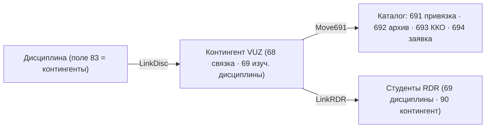

# SPEC · ws4 — Книгообеспеченность (полевой уровень)

> Детализация задачи **ws4** ([#186](https://github.com/Rivega42/biblio/issues/186), эпик #98) до уровня полей/связей — веб-замена десктоп-«Книгообеспеченности» (КО), самая низкая зона покрытия (3%). Грунтовано на recon: [DB_VUZ](../../recon/deep/reference/databases/DB_VUZ.md) (БД VUZ, «связка», ККО), [ARM_BOOKPROVISION](../../recon/deep/reference/arms/ARM_BOOKPROVISION.md). Родитель — [SPEC_I5](SPEC_I5_staff_arm_parity.md); смежно — **ER #182** (er3 курсовые резервы), комплектование (ws2), книговыдача/RDR (ws3).

## 1. Доменная модель (БД VUZ → наши сущности)
Тип записи — поле **920** (10 типов): `DISC` дисциплина · `VUZ` контингент-«связка» · `UPL` учебный план · `WPD` рабочая программа · `FAK` факультет-кафедры · `NAPR`/`SPEC`/`GOS`/`DUNIK`/`VK` справочные/служебные.
**Ядро механизма — «связка»** = `Фак(^A)–Филиал(^L)–Институт(^T)–Направление(^N)–Спец(^C)–Вид(^V)–Форма(^O)–Семестр(^F)[–Группа ^E, Вып.каф ^H]`. Одна и та же структура в полях **83** (контингенты дисциплины), **68** (запись VUZ), **691** (каталог IBIS), **90** (студент RDR).
**У нас:** нормализованная модель (одна сущность «контингент» + связи), а не 4 дублирующие копии связки в разных полях — **упрощение относительно ИРБИС** при сохранении семантики.

## 2. Ввод, рабочие листы, ФЛК
**Подход:** РЛ по 920 (DISC.WS/VUZ.WS/UPL.WS/WPD.ws/fak.ws/…); справочники-деревья **SPEC.TRE** (~471 спец.), **CIKOD.TRE** (циклы ГСЭ/ЕН/ОПД/СД), факультеты/кафедры/направления/формы/виды обучения. **ФЛК** (`!NNN`): `!3` дубль идентификатора дисциплины (3^0), `!83` структура семестра (83^F, перечисление через `/`), `!91` дубль № учебного плана, `!95` дубль НУП-семестр.
**AC:** AC1 ввод дисциплины (3 наимен.+id, 4 цикл, 5 каф, 6 уровень, 83 контингенты) с ФЛК; AC2 контингент (68 связка) и учебный план (UPL) вводятся по справочникам; AC3 дубли id/НУП ловятся.

## 3. Связывание литература ↔ дисциплина (ключевое)
**Подход:** дисциплина (DISC, контингенты 83) → **создание/поиск контингента VUZ** (LinkDisc) → перенос «связки» в **каталог как поле 691** (id дисциплины 691^I=3^0, наимен./кафедра/цикл/уровень + связка ^A^N^C^V^O^F) — экземпляр каталога привязывается к дисциплине+контингенту; архив снятых привязок — **692**; заявка на комплектование — **694**. Студенты — через **LinkVuz → RDR** (поле 69 изучаемые дисциплины, 90 контингент).
**AC:** AC1 привязка записи каталога к дисциплине (поле 691) с полной связкой; AC2 контингент синхронизируется с RDR (студенты); AC3 снятая привязка уходит в архив (692); AC4 счётчики связей (Дисциплина↔УНД/UPL/VUZ).

## 4. Расчёт ККО / КМИ (ядро «наполненности»)
**Подход (из `irbisk_user.ini`, `KoDiscFull.tbg`, `lncRDRVuz.pft`):**
- **Кол-во наименований** — книги каталога, привязанные к дисциплине (поиск `?DISC=<назв>?` → счёт MFN).
- **Кол-во экземпляров** — сумма экземпляров (поле 910 / 693) найденных книг.
- **Кол-во студентов** — из **RDR** по связке (`JRDR,LN=<связка>`, при `ACCESSRDR=1`), иначе из **68^Z**; деление чёт/нечёт семестра (осенний/весенний).
- **ККО** = экземпляры / студенты; **средняя ККО** = Σ(ККО)/N(наименований); опц. нормировка к 1. **КЭИ** (электронные) — доля дисциплин с достаточным числом ЭУ. Способ подсчёта по полю **693** (`GetKkoBook=1`); доп. БД каталога (ЭБС/картотека КО) через `DbNameForKKO`.
**AC:** AC1 расчёт ККО по дисциплине/контингенту (экз/студенты) с разбивкой по семестрам; AC2 средняя ККО и КЭИ; AC3 учёт электронных ресурсов (ЭУ → ККО=1); AC4 источник студентов RDR или 68^Z по режиму.

## 5. Отчёты, таблицы, лицензирование
**Подход:** табличные отчёты ККО (`KoDiscFull`/`DiscVuz-Cat` — дисциплина↔каталог: кафедра/цикл/уровень/наимен./экз.), сводки по факультетам/формам/семестрам, **таблицы лицензирования** (`LicenDisc`); экспорт (RTF/наш — PDF/XLSX).
**AC:** AC1 отчёт ККО по дисциплинам/контингентам формируется; AC2 сводки по факультету/форме обучения; AC3 лицензионная таблица; AC4 экспорт.

## 6. Связь с комплектованием и читателем
- **Дозаказ под обеспеченность:** низкая ККО → заявка (поле **694** → CMPL, **ws2**/ER); demand-driven по дефициту.
- **Курсовые резервы (ER er3):** списки литературы к дисциплинам = переиспользование связки дисциплина↔литература.
- **Студент (RDR):** изучаемые дисциплины (69) и контингент (90) → в читательском портале студент видит свои дисциплины/списки.
**AC:** AC1 сигнал и заявка на дозаказ при ККО ниже норматива; AC2 список литературы к дисциплине доступен студенту (ЛК).

## Критический путь ws4
1. **Справочники** (специальности/направления/циклы/кафедры/факультеты) + **ввод дисциплин/контингентов/учебных планов** (DISC/VUZ/UPL) с ФЛК →
2. **связывание литература↔дисциплина** (691) + синхронизация с RDR (студенты) →
3. **расчёт ККО/КМИ/КЭИ** (наименования/экз./студенты, по семестрам) →
4. **отчёты/таблицы/лицензирование** + экспорт →
5. **дозаказ под ККО** (694→комплектование) + **курсовые резервы** (ER) + студенческий ЛК.
**Выходной критерий ws4:** библиотекарь вуза ведёт книгообеспеченность в вебе — дисциплины/контингенты/учебные планы, привязка литературы, **расчёт ККО/КЭИ по семестрам**, отчёты и лицензионные таблицы, сигнал на дозаказ — без десктоп-модуля.

> Открытые вопросы (recon TODO): точный состав подполей 693/691 каталога — воркшиты в БД каталога, не в VUZ (#VUZ-01/02); формулы `KoStatEkzKmi/KoKmiEkz/KoElectro` (#VUZ-03); архив 692/удаление 691 (#VUZ-04); поле 90 RDR (#VUZ-07) — уточнить на боевых конфигах тенанта.
