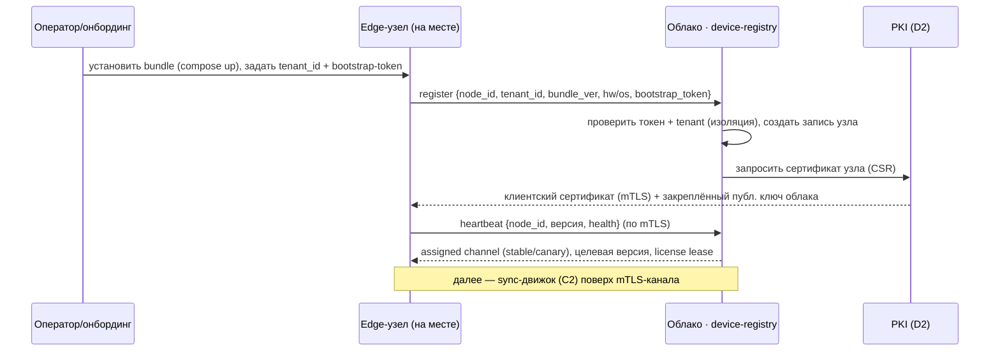
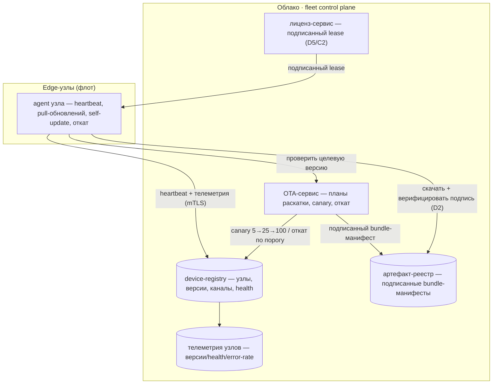
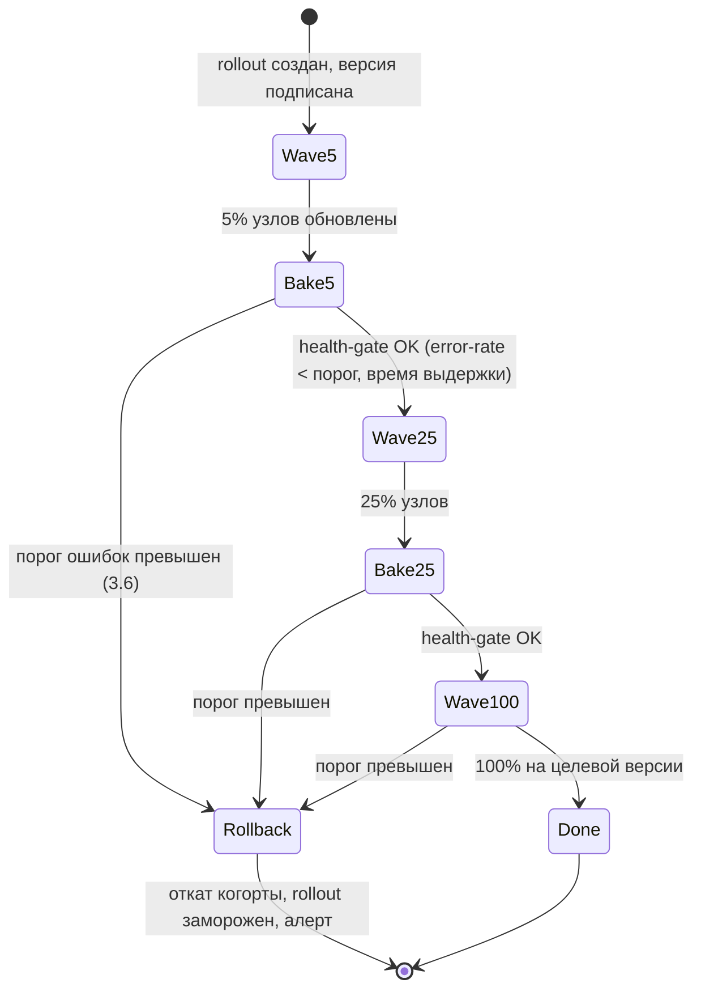

# SPEC · Infrastructure-as-Code + флот edge-узлов / OTA (D3)

> Закрытие сквозного пробела **D3** из [DESIGN_COVERAGE §D](../../DESIGN_COVERAGE.md) (эпик [#188](https://github.com/Rivega42/biblio/issues/188)): «**IaC/Terraform + edge-флот/OTA ([#120](https://github.com/Rivega42/biblio/issues/120)) + мульти-регион**. ❌ → I1/I6». D3 был зафиксирован как `❌ отсутствует`: облако упоминается ([ARCHITECTURE §2/§8](../../ARCHITECTURE.md): Kubernetes, MinIO, «подпись/доставка обновлений edge»), прод-упаковка одного узла описана ([SPEC_I1 §#99 «Прод-упаковка»](../SPEC_I1_foundation.md): `docker-compose.prod.yml`), fleet/OTA назван ([SPEC_I4 §E](../SPEC_I4_edge_offline.md), [SPEC_I6 §C](../SPEC_I6_security_compliance.md)) — но **нет ни модулей IaC, ни device-registry, ни механики canary/автооткат/skew, ни мульти-регион/DR-инфры**. Этот спек превращает «облако есть, обновления подписаны» в реализуемую инфру: декларативный провижининг (Terraform), упаковку и регистрацию edge-узла, флот-сервис управления раскаткой обновлений.
>
> **Грунтовано (читать как ground truth):**
> [SPEC_I1_foundation §#99](../SPEC_I1_foundation.md) — прод-инфра: многоступенчатый Dockerfile, `docker-compose.prod.yml` (app + PostgreSQL + PgBouncer + MinIO), секреты только через env, `/healthz`+`/readyz`, бэкап/restore PG; §#100 (схема-на-тенанта/RLS, провижининг схемы тенанта), §#101 (Identity/Tenancy/Licensing, entitlements), §#117 (OTel наблюдаемость), §#118 (CI/CD, подписанный образ, preview).
> [ARCHITECTURE §2/§5/§8](../../ARCHITECTURE.md) — топология облако-ядро + edge-узлы; §8 технологии (K8s облако / Docker+Compose узлы, MinIO, событийная шина); §13 риск «**обновление микросервисов на сотнях edge-узлов**».
> [SPEC_I6_security_compliance §B/§C/§D](../SPEC_I6_security_compliance.md) — supply-chain ([#119](https://github.com/Rivega42/biblio/issues/119): SBOM, cosign-подпись образов + верификация — **критично для edge-OTA**, Trivy, Vault/SOPS), edge-OTA ([#120](https://github.com/Rivega42/biblio/issues/120)) §C, SRE/DR §D (бэкапы + restore-учения, RPO/RTO).
> [SPEC_I4_edge_offline §A/§E](../SPEC_I4_edge_offline.md) — §A упаковка узла (Docker-стек + локальная PG-реплика тенанта, Astra Linux, офлайн), §E fleet/OTA (canary, автооткат, skew-политика, офлайн-валидация лицензии grace, телеметрия).
> [SPEC_sync_engine](../diff/SPEC_sync_engine.md) §7 — grace-лицензия офлайн (подписанный lease, skew-окно версий схемы), §5.2 события `sync.peer.degraded/recovered`, `sync.clock.skew` — флот **потребляет** телеметрию синка.
>
> **Связь с сёстринскими спеками платформы (пишутся параллельно, ссылки — устойчивые имена):**
> **D2 PKI/ключи** ([DESIGN_COVERAGE §D2](../../DESIGN_COVERAGE.md), ADR-006, файл `platform/SPEC_pki_keys.md`) — корень доверия для подписи артефактов OTA и сертификатов узлов; верификация подписи на узле (см. также C5 [SPEC_module_security](../diff/SPEC_module_security.md): подпись/ротация/отзыв).
> **D4 SRE** ([DESIGN_COVERAGE §D4](../../DESIGN_COVERAGE.md), файл `platform/SPEC_sre.md`) — SLO/RPO/RTO/runbooks/DR-учения **потребляют** инфру этого спека (мульти-регион, бэкапы); граница: D3 даёт инфру и механику, D4 — целевые числа и операционные процедуры.
> **D5 биллинг** ([SPEC_I7_commercialization](../SPEC_I7_commercialization.md)) — лестница деградации по истечении grace и enforcement entitlements (флот лишь доставляет lease).
> **C2 sync** ([SPEC_sync_engine](../diff/SPEC_sync_engine.md)) — skew-окно версий и офлайн-лицензия определены там; D3 их **реализует на стороне флота** (раскатка совместимых версий, доставка lease), не дублирует модель.

**DoD-гейт (как в I1/I6 + инфра-специфика):** код IaC (`terraform validate` + `tflint` + `checkov`/`tfsec` зелёные) + план без неожиданных destroy + **тест изоляции тенанта** (провижининг тенанта не пересекает чужие данные/секреты) + наблюдаемость (метрики флота: версии узлов, статус раскатки, error-rate canary, drift) + **верификация подписи артефакта обязательна** (неподписанный/непроверенный артефакт OTA не применяется — связь D2/[#119](https://github.com/Rivega42/biblio/issues/119)) + **152-ФЗ-гейт** (телеметрия узлов не содержит ПДн RDR; только операционные метрики) + обновление доков/runbook. Размеры S/M/L (как в I1: S ≤2 дн, M 3–5 дн, L 1–2 нед).

---

## 0. Принципы и границы

- **Вся инфра — декларативна и версионируема (IaC).** Ни одного «ручного» ресурса в облаке: сеть, БД, хранилище, секреты, окружения — Terraform-модули в git, ревью через PR, `plan` в CI, `apply` через защищённый пайплайн ([SPEC_I1 §#118](../SPEC_I1_foundation.md)). Ручная правка прода — инцидент (drift-детект, разд. 1.5).
- **Окружения идентичны по форме, различны по размеру.** `dev/stage/prod` — один набор модулей, разные `tfvars` (размер инстансов, число AZ, ретеншены). Stage ≈ уменьшенный prod (репрезентативность DR-учений D4). Нет «снежинок».
- **Edge-узел — иммутабельный, воспроизводимый артефакт.** Узел = версионированный Docker-стек (compose-bundle) + локальная PG-реплика, разворачиваемый одной командой/скриптом; обновление — замена артефакта целиком (image digest), не «правка на месте». Astra Linux / защищённый контур без внешних CDN ([ARCHITECTURE §1/§7](../../ARCHITECTURE.md), [SPEC_I4 §A](../SPEC_I4_edge_offline.md)).
- **Ни один артефакт не применяется без проверенной подписи.** Образы (cosign, [#119](../SPEC_I6_security_compliance.md)) и OTA-бандлы подписаны корнем доверия (D2 PKI); узел **верифицирует подпись офлайн** (закреплённый публичный ключ) до применения. Это инвариант OTA (разд. 3.4), без него обновление = вектор атаки на сотни узлов.
- **Раскатка — поэтапная и обратимая по умолчанию.** Любое обновление флота идёт через **canary 5%→25%→100%** (разд. 3.5) с **автооткатом** по порогу ошибок (разд. 3.6). «Раскатать всем сразу» возможно только как явный аварийный override с двойным подтверждением.
- **Edge переживает облако.** Флот-плоскость управления (control plane) может быть недоступна — узел продолжает обслуживать читателя офлайн (книговыдача edge-master, [SPEC_I4 §C](../SPEC_I4_edge_offline.md)); OTA и лицензия работают через grace ([SPEC_sync_engine §7](../diff/SPEC_sync_engine.md)). Флот **не** на критическом пути обслуживания.
- **Изоляция тенанта — инвариант и в инфре.** Провижининг тенанта (схема/секреты/хранилище) не даёт доступа к ресурсам другого тенанта; per-tenant envelope-ключи (D2). Негатив-тест в CI (DoD).
- **Границы.** Этот спек: (а) **IaC облака** (модули, окружения, провижининг тенанта в инфре); (б) **упаковка/регистрация edge-узла**; (в) **device-registry + OTA-механика** (canary/откат/skew/телеметрия); (г) **мульти-регион/DR-инфра**; (д) опц. **ephemeral preview envs**. Он **не**: определяет SLO/RPO/RTO-числа и runbooks (D4), модель PKI/ротации ключей (D2), модель синхронизации данных и конфликтов (C2 — он лишь доставляет совместимые версии и lease), бизнес-логику деградации по тарифу (D5), CI-пайплайн приложения целиком (I1 [#118] — он расширяется фазой деплоя/раскатки).

---

## 1. IaC облака (Terraform)

> Цель: весь облачный контур ([ARCHITECTURE §2](../../ARCHITECTURE.md): Identity/Tenancy/Licensing, Биллинг, Сводный поиск, Хаб синхронизации) поднимается из кода, мульти-AZ/HA, с провижинингом тенанта как декларативной операцией.

### 1.1 Структура репозитория IaC

```
infra/
  modules/                  # переиспользуемые модули (без среды внутри)
    network/                # VPC/подсети/маршруты, мульти-AZ, security groups, private subnets
    kubernetes/             # управляемый/самоуправляемый K8s-кластер (облако-ядро, §8 ARCHITECTURE)
    postgres/               # PostgreSQL HA (primary+реплики, мульти-AZ), PgBouncer, бэкап/PITR
    object_store/           # объектное хранилище per-tenant (S3-совместимое/MinIO в контуре)
    secrets/                # Vault/SOPS-бэкенд, KMS/envelope-ключи (связь D2), политики доступа
    observability/          # OTLP-коллектор, Prometheus/хранилище метрик, логи, алерты (связь #117/D4)
    fleet_control/          # инфра device-registry + OTA-сервиса (разд. 3) + артефакт-реестр
    dns_cdn/                # внутренний DNS, реверс-прокси/ingress (без внешних CDN — §7 ARCHITECTURE)
  envs/
    dev/    { main.tf, dev.tfvars,    backend.tf }   # 1 AZ, малые инстансы, короткие ретеншены
    stage/  { main.tf, stage.tfvars,  backend.tf }   # ≈ уменьшенный prod (репрезентативность DR)
    prod/   { main.tf, prod.tfvars,   backend.tf }   # мульти-AZ HA, полные ретеншены, мульти-регион
  regions/                  # оверлеи мульти-регион (разд. 4): primary / dr
  tenant/                   # провижининг тенанта в инфре (разд. 1.4)
```

- **State — удалённый, заблокированный, per-env.** Backend (S3-совместимый + DynamoDB-lock-эквивалент или Postgres-backend) с шифрованием; раздельный state на `dev/stage/prod` и на регион → ошибка в одном окружении не трогает другое. State-доступ — через пайплайн, не с лэптопов.
- **Версии запинены.** `required_version` Terraform + версии провайдеров (`.terraform.lock.hcl` в git); воспроизводимый `plan`.
- **Без секретов в state/коде.** Секреты — в Vault/SOPS (I6 §B); Terraform читает их через data-source/провайдер, не хардкодит; чувствительные выводы помечены `sensitive`.

### 1.2 Модули — что разворачивают (мульти-AZ / HA)

| Модуль | Разворачивает | HA / отказоустойчивость |
|---|---|---|
| `network` | VPC, публичные/приватные подсети по AZ, NAT, security groups, network ACL | подсети ≥2 AZ (prod ≥3); приватные подсети для БД/хранилища |
| `kubernetes` | кластер облако-ядра (control-plane + воркер-пулы), автоскейл, namespaces per-сервис | воркеры разнесены по AZ; PDB; control-plane managed/HA |
| `postgres` | PostgreSQL primary + синхронная/асинхронная реплика(и), PgBouncer, параметры, роли | мульти-AZ (primary в одной AZ, standby в другой); авто-failover; PITR (WAL-архив в object-store) |
| `object_store` | бакеты per-tenant (или префиксы с политиками), versioning, lifecycle | репликация в DR-регион (разд. 4); серверное шифрование |
| `secrets` | Vault/SOPS-бэкенд, KMS-ключи, per-tenant envelope (связь D2), политики/роли доступа | HA-Vault; ротация ключей (D2 владеет моделью ротации) |
| `observability` | OTLP-коллектор, хранилище метрик/логов/трейсов, дашборды, алерт-менеджер | независимо от прод-кластера (наблюдаемость переживает инцидент) |
| `fleet_control` | device-registry (БД), OTA-сервис, артефакт-реестр (подписанные бандлы) | в облако-ядре; реплицируется; недоступность не блокирует edge |
| `dns_cdn` | внутренний DNS, ingress/реверс-прокси, TLS-терминация (внутренние CA, D2) | без внешних CDN/трекеров ([ARCHITECTURE §1/§7](../../ARCHITECTURE.md)) |

### 1.3 Окружения dev/stage/prod

- **Параметризация через `tfvars`**, не форки кода: размер инстансов, число AZ, число реплик PG, ретеншены бэкапов, включённость мульти-регион (`dr_enabled = false` в dev/stage primary-only, `true` в prod).
- **Промоушн dev→stage→prod** — одни и те же модули, апрув-гейт на `apply` prod (защита, как `protected main` в [#118](../SPEC_I1_foundation.md)).
- **Stage репрезентативен** для DR-учений D4 (восстановление из бэкапа проверяется на stage до prod).

### 1.4 Провижининг тенанта в инфре

> Дополняет онбординг тенанта [SPEC_I1 §#102](../SPEC_I1_foundation.md) (там — мастер: схема→миграции→seed) **инфраструктурной частью**: ресурсы тенанта в облаке. Прикладной онбординг вызывает инфра-провижининг как шаг.

- **Декларативно:** тенант = запись + Terraform-workspace/модуль `tenant/` (или динамический провайдер), создающий: бакет(ы) object-store тенанта + lifecycle/политики; per-tenant envelope-ключ (через `secrets`/D2); namespace/квоты ресурсов (анти-noisy-neighbor, [SPEC_I6 §A](../SPEC_I6_security_compliance.md)); запись в device-registry для будущих edge-узлов тенанта.
- **Схема PostgreSQL** тенанта (`t_<slug>`) — провижинит прикладной оркестратор ([SPEC_I1 §#100](../SPEC_I1_foundation.md), идемпотентно), **не** Terraform (динамика приложения, не инфра); инфра даёт сам кластер PG и доступ.
- **Идемпотентность + откат:** повторный провижининг безопасен; удаление тенанта (off-boarding) каскадно чистит бакеты/ключи/квоты/registry-записи (связь право на забвение [SPEC_I6 §E](../SPEC_I6_security_compliance.md)).
- **Изоляция (DoD-гейт):** ресурсы тенанта A недоступны из контекста тенанта B (политики бакетов, envelope-ключи, квоты per-namespace); негатив-тест.

### 1.5 Drift-детекция и compliance-сканы

- **Drift:** периодический `terraform plan` (read-only) в CI → расхождение факт↔код = алерт (ручная правка прода обнаружена). Цель — ноль дрейфа.
- **Policy-as-code:** `checkov`/`tfsec`/OPA в пайплайне (открытые порты, незашифрованные бакеты, public-доступ, отсутствие тегов тенанта) — блокирующий гейт.
- **Стоимость:** `infracost` в PR (D3-риск «стоимость инфры», [ARCHITECTURE §13](../../ARCHITECTURE.md)) — видимость дельты затрат на ревью.

---

## 2. Упаковка и регистрация edge-узла (provisioning)

> Реализует [SPEC_I4 §A](../SPEC_I4_edge_offline.md) (узел = Docker-стек + локальная PG-реплика, офлайн, Astra Linux) на уровне воспроизводимого артефакта и его регистрации во флоте.

### 2.1 Артефакт узла (node bundle)

- **Состав:** версионированный `compose`-бандл (образы сервисов узла по digest: API-шлюз/BFF, Каталог-ядро, Книговыдача, Sync-агент, включённые модули per-тариф) + локальная **PostgreSQL** (реплика тенанта) + локальный объектный кэш + конфиг-шаблон (env, без секретов в образе — [SPEC_I1 §#99](../SPEC_I1_foundation.md)).
- **Версия бандла** = `node_bundle_version` (semver) ⇒ маппится на набор image-digest + версию схемы данных (`schema_ver`, [SPEC_sync_engine §1.6](../diff/SPEC_sync_engine.md)) → основа skew-политики (разд. 3.7).
- **Подпись:** бандл-манифест (список digest + версия схемы + min/max совместимая версия облака) подписан корнем доверия (D2); узел верифицирует офлайн до установки.
- **Astra Linux / защищённый контур:** базовые образы из внутреннего registry (зеркало, без pull с внешних реестров на проде); поддержка офлайн-установки (бандл переносим на носителе для библиотек без сети на старте).

### 2.2 Bootstrap и регистрация



- **Bootstrap-token** — одноразовый, per-тенант, с TTL; привязывает узел к тенанту при регистрации (изоляция). Скомпрометированный токен отзывается в registry.
- **Сертификаты (связь D2):** при регистрации узел получает клиентский сертификат для **mTLS** (канал синка/телеметрии — [SPEC_sync_engine §7](../diff/SPEC_sync_engine.md), [SPEC_I6 §E](../SPEC_I6_security_compliance.md) zero-trust/mTLS) и закрепляет публичный ключ облака (верификация подписей OTA/lease офлайн). Ротация/отзыв сертификатов — модель D2; флот лишь инициирует выдачу и применяет отзыв.
- **Идемпотентность:** повторная регистрация того же `node_id` не создаёт дубль; смена железа/переустановка → re-bootstrap с новым токеном, старая запись `decommissioned`.

---

## 3. Флот и OTA ([#120](https://github.com/Rivega42/biblio/issues/120))

> Реализует [SPEC_I4 §E](../SPEC_I4_edge_offline.md) и [SPEC_I6 §C](../SPEC_I6_security_compliance.md): реестр узлов, подписанные обновления, canary, автооткат, skew-политика, офлайн-валидация лицензии, телеметрия. Это control plane управления сотнями узлов ([ARCHITECTURE §13](../../ARCHITECTURE.md) риск).

### 3.1 Архитектура флота



- **Pull-модель.** Узел (agent) **сам тянет** целевую версию по heartbeat (узел может быть за NAT/офлайн; не требует входящих соединений в библиотеку). Облако лишь назначает целевую версию/канал в registry.
- **Control plane не критичен.** Его недоступность → узел остаётся на текущей версии, работает офлайн; обновление откладывается, не падает.

### 3.2 Device-registry (модель данных)

| Поле `device` | Назначение |
|---|---|
| `node_id` (PK) | стабильный id узла (`edge:<tenant>:node-NN`) |
| `tenant_id` | арендатор (изоляция; узел тенанта A не виден B — RLS/scope) |
| `current_version` | установленная `node_bundle_version` (из heartbeat) |
| `target_version` | назначенная OTA-сервисом цель |
| `channel` | `stable \| canary \| pinned` (узел в когорте раскатки) |
| `health` | `ok \| degraded \| updating \| rolled_back \| offline` |
| `last_heartbeat`, `last_sync` | живость; offline = нет heartbeat > порога |
| `cert_fingerprint` | привязка mTLS-сертификата (D2); отзыв → блок |
| `license_state` | кэш статуса lease + grace (отражает [SPEC_sync_engine §7](../diff/SPEC_sync_engine.md)) |
| `hw/os` | Astra-версия, ресурсы (для совместимости артефакта) |
| `update_history` | журнал: версия, время, результат (applied/rolled_back), причина |

- **Изоляция (DoD):** запросы к registry scoped по `tenant_id` (RLS); оператор сети видит только свои узлы; «суперадмин платформы» — отдельный грант с аудитом.

### 3.3 Артефакт-реестр и план раскатки

- **Артефакт-реестр** хранит подписанные `bundle-манифесты` (версия → digest-список + схема + окно совместимости + cosign/D2-подпись). Иммутабельны; новая версия = новый манифест.
- **План раскатки (`rollout`)**: `{ target_version, tenant_scope (все/сеть/выбранные), waves:[5%,25%,100%], health_gate (порог error-rate/время «запекания»), auto_rollback:true }`. Создаётся оператором/CI после прохождения supply-chain-гейтов ([#119](../SPEC_I6_security_compliance.md)).

### 3.4 Подписанное обновление (верификация — связь D2/C5)

Инвариант OTA: **узел не применяет неподписанный/непроверенный артефакт**.

1. OTA-сервис назначает узлу `target_version` (через heartbeat-ответ).
2. Agent скачивает `bundle-манифест` + образы (по digest) из артефакт-реестра (через mTLS / офлайн-носитель).
3. Agent **верифицирует подпись манифеста** закреплённым публичным ключом облака (D2) **офлайн**; сверяет digest каждого образа (защита от подмены); проверяет окно совместимости (skew, разд. 3.7).
4. Подпись/digest не сходятся **или** ключ отозван (D2 revocation) → **отказ применения**, `health:degraded`, алерт; узел остаётся на текущей версии.
5. Только при успехе — атомарная установка (разд. 3.5).

> Это та же дисциплина, что подпись/верификация образов в supply-chain ([SPEC_I6 §B](../SPEC_I6_security_compliance.md), cosign) и подпись/отзыв плагинов маркетплейса (C5 [SPEC_module_security](../diff/SPEC_module_security.md)) — единый корень доверия D2.

### 3.5 Canary-раскатка (5% → 25% → 100%)



- **Когорты:** узлы детерминированно распределены по волнам (хеш `node_id`, стабильно между запусками); первая волна (5%) — предпочтительно «терпимые» узлы (внутренние/пилот СПб ГТБ), не критичные библиотеки.
- **Bake-time:** между волнами — окно «запекания» (узлы поработали под нагрузкой, телеметрия собрана) до health-gate.
- **Health-gate:** переход к следующей волне только если метрики обновлённой когорты в норме (error-rate, crash-loop, sync-lag, рост конфликтов — телеметрия 3.8) относительно базовой линии необновлённых узлов.
- **Per-tenant / сетевой scope:** раскатка может ограничиваться сетью/ЦБС или конкретными узлами (совместимость со skew, разд. 3.7).
- **Установка на узле — атомарна и обратима:** новый стек поднимается рядом, health-check проходит → переключение; иначе — остаётся старый (blue/green на узле). Версия схемы данных мигрируется только в совместимом окне (разд. 3.7), миграции PG — идемпотентны и с откатом.

### 3.6 Автооткат по порогу ошибок

- **Триггеры отката (любой):** error-rate когорты > `threshold` за bake-window; crash-loop/`/readyz` красный после установки; всплеск `sync.conflict`/`sync.peer.degraded` ([SPEC_sync_engine §5.2](../diff/SPEC_sync_engine.md)) на обновлённых узлах сверх базовой линии; миграция схемы упала.
- **Действие:** обновлённая когорта откатывается на предыдущий bundle (blue/green-переключение назад, миграция-down если применялась); `rollout` замораживается (дальнейшие волны не идут); `health:rolled_back`; алерт оператору + запись в `update_history` с причиной.
- **Локальный self-heal:** если узел после установки не поднимается и связи нет, agent сам откатывается на предыдущий рабочий bundle по локальному health-таймауту (узел не должен «окирпичиться» офлайн).
- **Аварийный override:** «раскатать всем сразу» / «принудительный откат всех» — явный оператор-экшен с двойным подтверждением и аудитом (для security-хотфикса).

### 3.7 Skew-политика edge↔облако (совместимость версий)

> Реализует skew-окно из [SPEC_sync_engine §7](../diff/SPEC_sync_engine.md) и §1.6 (эволюция схемы события) на стороне флота.

- **Окно совместимости:** каждый bundle-манифест несёт `min_cloud_version` / `max_cloud_version` и `schema_ver` (версия схемы события/данных). Облако объявляет поддерживаемое окно версий узла (`min_node_version`).
- **Правило N/N-1:** облако совместимо с текущей и предыдущей мажорной версией узла (окно ≥1 поколение) → раскатка не обязана быть мгновенной; узлы мигрируют постепенно.
- **Выход за окно:** узел старше `min_node_version` облака → **форс OTA-апгрейда** (приоритетный target_version) ИЛИ деградация синка несовместимых схем (sync дропает/буферизует события несовместимой `schema_ver`, §1.6) до апгрейда — но **офлайн-книговыдача не блокируется** (edge-master).
- **Порядок при breaking-изменении схемы:** облако обновляется на версию, читающую и старую и новую схему (forward-compat, §1.6), → затем флот мигрирует узлы canary-раскаткой → затем (опц.) облако прекращает поддержку старой схемы. Никогда не наоборот.

### 3.8 Телеметрия с узлов

- **Что собирается (heartbeat + метрики):** `node_id`, `current_version`, health/readyz, ресурсы (CPU/диск/память узла), статус синка (lag, queue-depth, conflict-rate, clock-skew — из [SPEC_sync_engine §5.1](../diff/SPEC_sync_engine.md) `/sync/status`), error-rate сервисов, статус OTA (updating/ok/rolled_back), license/grace-статус, drift конфига.
- **152-ФЗ-гейт (инвариант):** телеметрия — **только операционные метрики, без ПДн RDR** и без содержимого записей. Агрегаты/счётчики, не данные читателей. Шифрование in-transit (mTLS).
- **Хранение/визуализация:** в `observability`-стеке (связь [SPEC_I1 §#117](../SPEC_I1_foundation.md) OTel, D4 SLO-дашборды); алерты: узел offline > порога, версия-drift (узел не на target долго), рост error-rate когорты, skew-alert, grace-лицензия истекает.
- **Офлайн-буфер:** при отсутствии связи телеметрия буферизуется на узле и досылается при реконнекте (как outbox синка), не теряется.

### 3.9 Офлайн-валидация лицензии (grace — связь C2/D5)

> Механика определена в [SPEC_sync_engine §7](../diff/SPEC_sync_engine.md) (подписанный lease, офлайн-верификация, grace-окно, мягкая деградация). Здесь — **роль флота**: доставка lease и отражение статуса.

- **Доставка lease:** лиценз-сервис облака выдаёт узлу подписанный (per-tenant ключ D2) lease `{tenant_id, modules[], not_after, grace_days, sig}` при heartbeat/sync; узел кэширует (`license_state`) и **валидирует подпись офлайн**.
- **Grace:** при потере связи узел работает по последнему lease до `not_after` + `grace_days`; флот отражает статус в registry/телеметрии; баннер на узле (`sync.license.grace`).
- **Граница:** **лестница деградации по истечении grace — параметр тарифа (D5), не флота**; флот гарантирует, что **офлайн-книговыдача не отключается** (критичная функция edge-master), ограничиваются лишь коммерческие/немодульные функции ([SPEC_sync_engine §7](../diff/SPEC_sync_engine.md)). Флот не «запирает» библиотеку.

---

## 4. Мульти-регион / DR-инфра (связь D4)

> D3 даёт **инфру** мульти-региона и DR; D4 (SRE) задаёт **числа** (RPO/RTO) и **процедуры** (runbooks, график учений). Граница: здесь — как развёрнуто и как переключается; там — за сколько и по какому регламенту.

- **Топология:** `primary` регион (активный) + `dr` регион (тёплый резерв). Оба — одни и те же Terraform-модули (разд. 1.2), оверлей `regions/` различает роль.
- **Репликация данных:** PostgreSQL — асинхронная потоковая репликация primary→dr (+ WAL-архив/PITR в object-store обоих регионов); object-store — кросс-региональная репликация бакетов; секреты/ключи (D2) — реплицированы (Vault).
- **Failover:** управляемое переключение primary→dr (промоушн PG-реплики, переключение DNS/ingress на dr); RTO/RPO-цели и runbook — D4. DR-учения проводятся на stage/dr регулярно (D4 график).
- **Edge при региональном сбое:** узлы продолжают офлайн (edge-master книговыдача); синк переподключается к dr после failover (адрес хаба — через DNS, не хардкод). Grace-лицензия покрывает окно переключения.
- **Backup/restore:** автоматические бэкапы PG (PITR) + периодические **restore-учения** ([SPEC_I6 §D AC2](../SPEC_I6_security_compliance.md), детали — D4); бэкап object-store через versioning + кросс-регион.

---

## 5. Ephemeral preview envs (опц., связь [#118](https://github.com/Rivega42/biblio/issues/118) CI)

> Дополняет [SPEC_I1 §#118](../SPEC_I1_foundation.md) AC2 («preview-URL на PR»). Опционально — за фичефлагом инфры.

- **На PR:** пайплайн поднимает эфемерное окружение (namespace в dev-кластере или короткоживущий Terraform-workspace) с образом ветки + временной PG (seed демо-тенанта) + временным object-store-префиксом.
- **Изоляция/TTL:** preview — отдельный namespace/схема, **демо-данные, не ПДн**; авто-снос по мержу/закрытию PR или по TTL (нет «забытых» сред — стоимость).
- **Edge-preview (опц.):** для изменений узла — поднять единичный edge-узел против preview-облака (smoke OTA/синка) в CI.
- **Гейт:** обоснованный пропуск допустим (как в [#118] AC2); не блокирует мерж, если preview неприменим.

---

## 6. API / конфиг

> Все эндпоинты флота tenant-scoped (mTLS узла + JWT оператора с `tenant_id`+грант), фиксируются в `openapi.yaml` (contract-test, связь A7 [SPEC_api_contracts](../engines/SPEC_api_contracts.md) / [#116](https://github.com/Rivega42/biblio/issues/116)). Грант — нотация `функция:область:уровень`.

### 6.1 Heartbeat / OTA (узел ↔ облако, mTLS)

| Метод | Путь | Назначение | Запрос | Ответ | Auth |
|---|---|---|---|---|---|
| POST | `/fleet/register` | Bootstrap-регистрация узла | `{node_id, tenant_id, bootstrap_token, bundle_ver, hw/os}` | `{cert, cloud_pubkey, channel, target_version}` | bootstrap-token (одноразовый) |
| POST | `/fleet/heartbeat` | Живость + телеметрия + запрос цели | `{node_id, current_version, health, metrics, license_state}` | `{target_version, channel, license_lease?, actions[]}` | mTLS (cert узла) |
| GET | `/fleet/artifact/{version}` | Скачать подписанный bundle-манифест | — | `{manifest, digests[], signature, compat_window}` | mTLS |
| POST | `/fleet/update-status` | Результат применения/отката | `{node_id, version, result:applied\|rolled_back, reason?}` | `{ok}` | mTLS |

### 6.2 Управление флотом (оператор)

| Метод | Путь | Назначение | Грант |
|---|---|---|---|
| GET | `/api/fleet/nodes` | Список узлов тенанта/сети (версии, health, channel) | `fleet.read:*:read` |
| GET | `/api/fleet/nodes/{id}` | Детализация узла + `update_history` | `fleet.read:*:read` |
| POST | `/api/fleet/rollouts` | Создать план раскатки `{target_version, scope, waves, health_gate, auto_rollback}` | `fleet.deploy:*:admin` |
| GET | `/api/fleet/rollouts/{id}` | Статус раскатки (волна, % обновлённых, health-gate) | `fleet.read:*:read` |
| POST | `/api/fleet/rollouts/{id}/{pause\|resume\|rollback}` | Управление раскаткой (откат = аварийный override) | `fleet.deploy:*:admin` |
| GET | `/api/fleet/telemetry` | Метрики флота (версии/health/error-rate/skew) | `fleet.read:*:read` |

> Доступ — двойной гейт (как [SPEC_api_contracts §0](../engines/SPEC_api_contracts.md)): грант **И** энтайтлмент; «суперадмин платформы» (кросс-тенант) — отдельный грант с обязательным аудитом. `/fleet/*` (узел) и `/api/fleet/*` (оператор) — разные auth-контуры.

### 6.3 Конфиг (env / tfvars)

- **Облако (tfvars):** `region`, `dr_enabled`, `az_count`, `pg_replica_count`, `backup_retention_days`, `vault_addr`, `object_store_endpoint`, ретеншены телеметрии.
- **Узел (env, без секретов в образе — [SPEC_I1 §#99](../SPEC_I1_foundation.md)):** `TENANT_ID`, `CLOUD_HUB_URL` (через DNS, не IP), `BOOTSTRAP_TOKEN` (одноразово), путь к закреплённому `CLOUD_PUBKEY`, `OTA_CHANNEL`, лимиты ресурсов; секреты — из локального Vault-агента/SOPS, не в compose.

---

## 7. Критерии приёмки (AC)

- **AC1 (IaC облака мульти-AZ/HA).** `terraform apply` поднимает облако-ядро в ≥2 AZ (prod ≥3) из кода; PostgreSQL HA с авто-failover и PITR; повторный `apply` — без неожиданных изменений (идемпотентность/ноль дрейфа). `validate`+`tflint`+`tfsec`/`checkov` зелёные в CI.
- **AC2 (окружения).** `dev/stage/prod` разворачиваются из одних модулей разными `tfvars`; stage репрезентативен prod; `apply` prod — за апрув-гейтом; раздельный заблокированный state per-env/регион.
- **AC3 (провижининг тенанта в инфре).** Создание тенанта декларативно создаёт его бакет(ы)+envelope-ключ+квоты+registry-запись; идемпотентно; off-boarding каскадно чистит; **ресурсы тенанта A недоступны из контекста B** (негатив-тест, DoD-гейт).
- **AC4 (упаковка/регистрация узла).** Узел поднимается из подписанного bundle одной командой/офлайн-носителем (Astra Linux, защищённый контур); регистрируется по bootstrap-token (привязка к тенанту); получает mTLS-сертификат (D2) и закреплённый публичный ключ; повторная регистрация идемпотентна.
- **AC5 (подписанное OTA + верификация).** Узел **отказывается применять** артефакт с неверной/отсутствующей подписью или несовпадающим digest, либо при отозванном ключе (D2); остаётся на текущей версии; алерт. Только верифицированный артефакт устанавливается атомарно (blue/green).
- **AC6 (canary 5/25/100 + health-gate).** Раскатка идёт волнами 5%→25%→100% с bake-time; переход к следующей волне только при health-gate OK; когорты детерминированы по `node_id`.
- **AC7 (автооткат).** Превышение порога ошибок/crash-loop/всплеск конфликтов на обновлённой когорте → автооткат когорты на предыдущий bundle, заморозка раскатки, алерт, запись причины; узел без связи откатывается локально по health-таймауту (не «окирпичивается»).
- **AC8 (skew-политика).** Облако совместимо с N/N-1 версией узла; узел старше окна → форс-апгрейд или деградация несовместимого синка, **но офлайн-книговыдача не блокируется**; breaking-схема катится в порядке «облако forward-compat → узлы → отказ от старой схемы».
- **AC9 (телеметрия без ПДн).** Флот собирает версии/health/error-rate/sync-статус/skew/license-статус; **ни ПДн RDR, ни содержимого записей** (152-ФЗ-гейт); офлайн-буфер досылается без потерь; алерты на offline/drift/error-rate/skew.
- **AC10 (офлайн-лицензия grace).** Узел валидирует подписанный lease офлайн; работает в grace по истечении связи; флот отражает статус; **книговыдача не отключается** (лестница деградации — D5); восстановление при первом sync.
- **AC11 (мульти-регион/DR-инфра).** Primary+dr из одних модулей; PG/object-store/секреты реплицированы; управляемый failover primary→dr (промоушн реплики + переключение DNS); edge переподключается к dr; restore из бэкапа проверяемо (числа/runbook — D4).
- **AC12 (preview env, опц.).** PR поднимает изолированное эфемерное окружение с демо-данными (не ПДн), авто-снос по мержу/TTL; обоснованный пропуск допустим.
- **AC13 (изоляция тенанта — сквозной).** device-registry/телеметрия/раскатки scoped по `tenant_id` (RLS); оператор сети видит только свои узлы; кросс-тенант — отдельный грант с аудитом.
- **AC14 (наблюдаемость инфры).** Метрики флота (версии узлов, % на target, статус раскаток, error-rate canary, drift) экспонируются в observability-стек; алерты настроены; drift-детект IaC активен.

---

## 8. Критический путь

1. **IaC-каркас:** структура репо, remote-state, модули `network`+`kubernetes`+`postgres`(HA)+`object_store`+`secrets` для `dev` → облако-ядро поднимается из кода (AC1). →
2. **Окружения dev/stage/prod** (tfvars, апрув-гейт, policy-as-code, drift-детект) → воспроизводимость + compliance (AC2, AC14). →
3. **Провижининг тенанта в инфре** (бакет/ключ/квоты/registry + изоляция-тест) — стыкуется с онбордингом [SPEC_I1 §#102] (AC3). →
4. **Упаковка edge-узла** (подписанный bundle, локальная PG-реплика, Astra) + **регистрация** (bootstrap-token, mTLS-сертификат D2) (AC4). →
5. **device-registry + heartbeat + телеметрия** (без ПДн) → видимость флота (AC9, AC13, AC14). →
6. **Подписанное OTA + верификация на узле** (артефакт-реестр, cosign/D2, digest-сверка, атомарная blue/green-установка) (AC5). →
7. **Canary-раскатка (5/25/100) + health-gate + автооткат** (AC6, AC7). →
8. **Skew-политика версий** (окно совместимости, форс-апгрейд/деградация, порядок миграции схемы) + **офлайн-grace lease** (доставка, AC8, AC10). →
9. **Мульти-регион/DR-инфра** (dr-регион, репликация, failover) — стыкуется с D4 (AC11). →
10. **Ephemeral preview envs** (опц., AC12) — параллельно, не на критпути.

**Выходной критерий D3:** весь облачный контур поднимается из версионируемого Terraform (мульти-AZ/HA, PostgreSQL с failover/PITR, секреты, мульти-регион/DR), новый тенант провижинится в инфре декларативно и изолированно, edge-узел упакован как подписанный воспроизводимый артефакт и регистрируется во флоте по mTLS (D2), а **сотни узлов обновляются безопасно**: подписанные OTA-бандлы с офлайн-верификацией, **canary 5→25→100 с health-gate и автооткатом** по порогу ошибок, skew-политика N/N-1 (офлайн-книговыдача никогда не блокируется), телеметрия без ПДн и офлайн-grace лицензии — закрывая `❌`-пробел D3 ([DESIGN_COVERAGE §D3](../../DESIGN_COVERAGE.md)) и снимая ключевой операционный риск архитектуры «обновление микросервисов на сотнях edge-узлов» ([ARCHITECTURE §13](../../ARCHITECTURE.md)).

---

## 9. Тест-матрица

| Сценарий | Источник/ground truth | Проверяет | Этап КП |
|---|---|---|---|
| `apply` мульти-AZ HA | разд. 1.2 | облако-ядро ≥2 AZ, PG failover, PITR | 1 |
| Повторный `apply` (idempotency) | разд. 0/1.5 | ноль дрейфа, нет неожиданных destroy | 1,2 |
| Policy-скан (tfsec/checkov) | разд. 1.5 | блок на public-бакет/открытый порт | 2 |
| Провижининг тенанта | разд. 1.4 | бакет/ключ/квоты/registry создаются | 3 |
| Изоляция тенанта в инфре | DoD-гейт | A не достаёт ресурсы B (негатив) | 3, сквозной |
| Off-boarding тенанта | разд. 1.4 | каскадная чистка, право на забвение | 3 |
| Регистрация узла | разд. 2.2 | bootstrap-token → mTLS-cert + pubkey | 4 |
| OTA с битой подписью | разд. 3.4 | отказ применения, остаётся на текущей | 6 |
| OTA с отозванным ключом | разд. 3.4 (D2) | отказ, алерт | 6 |
| Canary health-gate OK | разд. 3.5 | 5→25→100, переход по gate | 7 |
| Canary порог превышен | разд. 3.6 | автооткат когорты, заморозка, алерт | 7 |
| Узел не поднялся офлайн | разд. 3.6 | локальный self-heal откат | 7 |
| Skew: узел < min_node_ver | разд. 3.7 | форс-апгрейд/деградация, выдача не блок. | 8 |
| Breaking-схема порядок | разд. 3.7 | облако forward-compat → узлы → отказ старой | 8 |
| Lease офлайн + grace | разд. 3.9 (C2 §7) | офлайн-валидация, книговыдача не отключ. | 8 |
| Телеметрия без ПДн | разд. 3.8 | только метрики, 152-ФЗ-гейт | 5 |
| Failover primary→dr | разд. 4 | промоушн реплики, DNS, edge переподключ. | 9 |
| Restore из бэкапа | разд. 4 (D4) | PITR восстановление проверяемо | 9 |
| Preview env TTL-снос | разд. 5 | авто-снос, нет ПДн, нет «забытых» сред | 10 |

---

## 10. Риски

| Риск | Митигация |
|---|---|
| **Обновление сотен edge-узлов** (главный ops-риск, [ARCHITECTURE §13](../../ARCHITECTURE.md)) | Pull-модель + canary 5/25/100 + health-gate + автооткат + skew N/N-1; control plane не критичен (узел переживает) |
| **Скомпрометированный OTA = атака на весь флот** | Подпись D2 + офлайн-верификация + digest-сверка + отзыв ключа блокирует; неподписанное не применяется (инвариант) |
| **«Окирпичивание» узла обновлением офлайн** | blue/green на узле + локальный self-heal откат по health-таймауту; миграции схемы с down |
| **Skew edge↔облако ломает синк** | Окно совместимости N/N-1 в манифесте; порядок «облако forward-compat → узлы»; деградация несовместимой схемы, но не книговыдачи (C2 §1.6/§7) |
| **Стоимость инфры** ([ARCHITECTURE §13](../../ARCHITECTURE.md)) | `infracost` в PR; TTL/авто-снос preview; dr тёплый (не горячий) резерв; right-sizing через tfvars |
| **Дрейф (ручная правка прода)** | drift-детект (`plan` в CI) → алерт; доступ к prod-state только через пайплайн; ручная правка = инцидент |
| **Секреты в state/образах** | Vault/SOPS (I6 §B), `sensitive`-выводы, секреты узла из локального агента, не в compose; gitleaks в CI |
| **ПДн RDR в телеметрии (152-ФЗ)** | Телеметрия = только операционные метрики/агрегаты; mTLS in-transit; гейт в DoD |
| **Astra Linux / защищённый контур (без внешних реестров/CDN)** | Внутреннее зеркало образов; офлайн-установка бандла с носителя; внутренние CA (D2) |
| **Зависимость от D2 (PKI) и D4 (SRE), пишутся параллельно** | За интерфейсами: флот *использует* подпись/сертификаты/ротацию (модель D2) и *даёт* инфру для SLO/DR (числа D4); устойчивые имена ссылок, не дублируем модели |
| **Региональный failover теряет данные (RPO)** | Синхронная/асинхронная репликация + PITR; RPO/RTO-цели и runbook — D4; restore-учения на stage |

---

## 11. Открытые вопросы (top-3 + прочие)

- **OQ-1 (целевая облачная платформа / managed vs self-hosted K8s).** Terraform-модули написаны абстрактно, но провайдер не зафиксирован: российское облако (Yandex Cloud / VK Cloud / Selectel) для гос-сегмента vs self-hosted в контуре заказчика (вуз/ведомство со своим ЦОД). Это влияет на `kubernetes`/`postgres`/`object_store`-модули (managed-сервис vs самоуправляемый) и на сертификацию (ФСТЭК-аттестованное облако). Решить per-сегмент: гос — аттестованное РФ-облако/on-prem; коммерческие — управляемое. Гейт перед детализацией модулей.
- **OQ-2 (агент обновления узла: self-update механизм).** Как именно agent заменяет compose-стек на Astra Linux: системный сервис (systemd) + docker-compose vs k3s/minikube на узле vs готовый fleet-инструмент (Balena/Mender/Fleet) как ускоритель (аналогично оценке ElectricSQL/PowerSync для синка). Готовый инструмент сократит объём, но может навязать модель (и тянуть внешние зависимости в защищённый контур). Требует PoC-оценки совместимости с офлайн/Astra/без-внешних-реестров.
- **OQ-3 (пороги canary/автоотката + размер первой волны).** Конкретные числа: error-rate-порог отката, длительность bake-time между волнами, что входит в первую 5%-когорту (как выбрать «терпимые» узлы, чтобы не задеть критичные библиотеки), за сколько откатывать. Координация с D4 (SLO/error-budget определяют пороги) — числа задаёт D4, механику — D3. Сейчас задана механика, не пороги.
- Прочее: где живёт device-registry относительно мульти-региона (глобальный vs per-регион); формат bundle-манифеста (OCI-артефакт vs собственный) и его подпись (cosign/OCI vs кастом — координация D2); нужно ли GitOps (ArgoCD/Flux) для облако-ядра поверх Terraform (Terraform — инфра, GitOps — приложения в K8s); политика хранения телеметрии (ретеншен vs стоимость); граница «единичный edge-preview в CI» (разд. 5) vs стоимость.

---

## Сводка

**IaC + fleet/OTA-модель.** **IaC (облако):** весь контур — декларативные Terraform-модули (`network`/`kubernetes`/`postgres`-HA/`object_store`/`secrets`/`observability`/`fleet_control`/`dns_cdn`), окружения `dev/stage/prod` одними модулями + `tfvars` (мульти-AZ/HA, PG-failover/PITR, мульти-регион), remote-locked state per-env/регион, policy-as-code + drift-детект; **провижининг тенанта** в инфре (бакет/envelope-ключ/квоты/registry) декларативен, идемпотентен, изолирован. **Edge-провижининг:** узел = подписанный воспроизводимый bundle (Docker-стек + локальная PG-реплика, Astra/защищённый контур), bootstrap по одноразовому токену → mTLS-сертификат (D2) + закреплённый публичный ключ. **Fleet/OTA ([#120]):** device-registry (узлы/версии/каналы/health, изоляция per-tenant) + артефакт-реестр подписанных bundle-манифестов; pull-модель (agent тянет цель по heartbeat); **подписанное OTA с офлайн-верификацией** (D2, digest-сверка) → атомарная blue/green-установка; **canary 5%→25%→100% с bake-time/health-gate** и **автооткатом** по порогу ошибок (+ локальный self-heal); **skew-политика N/N-1** (форс-апгрейд/деградация несовместимой схемы, но офлайн-книговыдача никогда не блокируется); **телеметрия без ПДн** (152-ФЗ) с офлайн-буфером; **офлайн-grace lease** (доставка, отражение статуса; лестница деградации — D5). **Мульти-регион/DR:** primary+dr из одних модулей, репликация PG/object-store/секретов, управляемый failover (числа/runbook — D4). **Preview envs** (опц.) — эфемерные на PR с TTL/демо-данными.

**Файл:** `C:\IRBIS64\_recon\docs\design\specs\platform\SPEC_iac_fleet.md`

**Top-3 открытых вопроса:**
1. **Целевая облачная платформа** — аттестованное РФ-облако (гос-сегмент, ФСТЭК) vs self-hosted K8s в контуре заказчика vs управляемое коммерческое; определяет реализацию `kubernetes`/`postgres`/`object_store`-модулей (managed vs self-managed). Решить per-сегмент.
2. **Self-update механизм агента узла** на Astra Linux/в защищённом контуре — systemd+compose vs k3s vs готовый fleet-инструмент (Mender/Balena) как ускоритель; PoC-оценка совместимости с офлайн/без-внешних-реестров (по аналогии с оценкой ElectricSQL/PowerSync в синке).
3. **Пороги canary/автоотката + первая 5%-волна** — error-rate-порог, bake-time, состав «терпимой» когорты (не задеть критичные библиотеки); числа задаёт D4 (SLO/error-budget), механику — D3.
