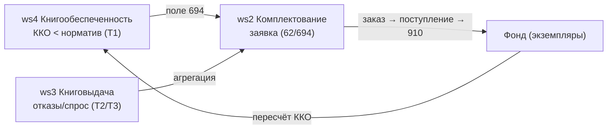

# SPEC · Бизнес-правила КОМПЛЕКТОВАНИЯ — КСУ-распределение, ККО, дозаказ, замена утерянных

> Закрытие пробела **E1** ([DESIGN_COVERAGE §E](../../DESIGN_COVERAGE.md): «demand-driven дозаказ + агрегация отказов; **алгоритмы КСУ-распределения** (поля 44–49/145–158); **формулы ККО** (деление на 0, нормировка, порог дозаказа)»), эпик [#188](https://github.com/Rivega42/biblio/issues/188) «Доглубление дизайна до реализуемости». Здесь определяется **доменная логика**, которая в ИРБИС была спрятана во внешних «Мастерах» и `.pft`/`.gbl`-форматах и была помечена как **undefined** (recon `TODO #CMPL-05/06`, `#VUZ-03`).
>
> **Грунтовано на recon (авторитетные источники):**
> - [DB_ACQUISITION](../../../recon/deep/reference/databases/DB_ACQUISITION.md) — КСУ 88/888/889, поля распределения 44–49/145–158, поле 80 «взамен утерянных», цены 62^n/p/s/r, экземпляры 910, заявка 694, цикл комплектования §A.5.
> - [GLOBAL_CORRECTION](../../../recon/deep/reference/format/GLOBAL_CORRECTION.md) — реальные `.gbl`: `StatKsu.gbl`/`Staks2.gbl` (статистика КСУ 44/744), `SumEkzToSZ.gbl`, `CreateSZ.gbl`, `InsteadLost.gbl`, счётчики `&uf('++C…')`, переменные `&uf('+7…')`.
> - [DB_VUZ §6](../../../recon/deep/reference/databases/DB_VUZ.md) — формулы ККО/КМИ/КЭИ, `KoStatEkzKmi`/`KoKmiEkz`/`KoElectro`, поля каталога 691/693/694, источник студентов RDR vs 68^Z.
> - Спеки-соседи: [SPEC_ws2 §4/§9](../SPEC_ws2_acquisition.md) (КСУ-ядро, demand-driven), [SPEC_ws4 §4/§6](../SPEC_ws4_bookprovision.md) (ККО, заявка 694).
>
> **Переиспользование движков:** все пакетные расчёты (КСУ-распределение, накопление статистики, агрегация отказов, замена утерянных) исполняются **движком A3 `.gbl`** ([SPEC_engine_gbl](../engines/SPEC_engine_gbl.md)) — этот документ **не вводит свой исполнитель**, а задаёт *алгоритмы* как декларативные правила + эталонные задания. Форматные вычисления (ККО-формулы, цены) — через **движок A1 PFT** ([SPEC_engine_pft](../engines/SPEC_engine_pft.md)). Печать бланков КСУ — A1/печать (вне рамок).
>
> **DoD-гейт (как в I5/A3):** код + автотест на каждое правило (позитив+негатив, числовые примеры) + golden-тест на реальном `.gbl`/`.pft` + контракт-тест (openapi) + изоляция тенанта + наблюдаемость (`tenant_id`/`job_id`). Родитель — [SPEC_I5](../SPEC_I5_staff_arm_parity.md). Сосед — `SPEC_business_circulation.md` (E2, пишется параллельно).

---

## 0. Границы и принципы

- **Что определяет этот документ:** пять групп бизнес-правил комплектования, ранее «undefined»:
  1. **КСУ-распределение** — авто-разнесение наименований/экземпляров партии по типу/языку/УДК-ББК/фонду/каналу/ВУЗ (поля 44–49, 145–158).
  2. **Формулы ККО** — книгообеспеченность = экземпляры/студенты, с обработкой деления на 0, источником студентов, КЭИ, нормировкой, порогом дозаказа.
  3. **Demand-driven дозаказ** — триггеры, агрегация отказов → заявка, пороги, дедуп, feedback-петля ws4→ws2.
  4. **Замена утерянных** — `InsteadLost.gbl`/поле 80: поиск кандидата, «новый заказ vs дубль».
  5. **Семантика цен** — 62^n/p/s/r.
- **Что НЕ делает (делегирует):**
  - *исполнение* пакетных правил → **A3 `.gbl`** (превью/откат/журнал/изоляция уже определены там);
  - *вычисление* любых форматов/`&uf()` → **A1 PFT**;
  - *валидацию* записи КСУ при сохранении (`!88.pft`/`!888.pft` — дублетность №, структура суммы) → **A2 ФЛК** ([SPEC_engine_flk](../engines/SPEC_engine_flk.md)); здесь — только бизнес-расчёты, не ФЛК;
  - печать RTF-бланков КСУ (`KSUN1SH/2SH/3SH`) → A1/печать.
- **Принцип паритета.** Каждая формула сверена с реальным `.gbl`/`.pft`/`.ini` дистрибутива; расхождения с буквальной семантикой ИРБИС (например, деление на 0, дедуп заявок) фиксируются явно в AC и в §11.
- **Принцип «правило = данные».** КСУ-распределение и пороги дозаказа описываются **декларативной таблицей разнесения** (§1.2) и **конфигом нормативов** (§2.6, §3.4), настраиваемыми per-tenant, а не зашиты в код. Исполнитель — A3.
- **Модель.** Запись CMPL/IBIS/VUZ — JSONB поля/подполя ядра I1 (как в A3 §0); счётчики разнесения — регистры/счётчики A3 (`&uf('+7…')`/`&uf('++C…')`).

---

## 1. КСУ-распределение (Мастер «Пополнение записи КСУ», поля 44–49 + 145–158)

### 1.1 Что это и откуда

Запись **КСУ поступления** (`920=KSU`, поле **88**) фиксирует партию: число наименований (88^E), число экземпляров (88^F), сумму (88^G). Помимо итогов, ИРБИС хранит **разнесение партии по аналитическим осям** — сколько наименований и экземпляров пришлось на каждый тип документа, язык, раздел УДК/ББК, фонд, канал поступления, контингент ВУЗ. Это и есть «КСУ-распределение». В десктопе оно заполнялось внешним **«Мастером пополнения записи КСУ»** — алгоритм во внешнем коде, отмечен как `TODO(recon #CMPL-05)` (DB_ACQUISITION §A.3.1, §A.4).

**Поля разнесения** ([DB_ACQUISITION §A.3.1](../../../recon/deep/reference/databases/DB_ACQUISITION.md)):

| Поле(я) | Ось разнесения | Источник классификации (на запись экземпляра) |
|---|---|---|
| 17 / 18 / 19 | числа наименований (разные срезы: всего / новых / по виду) | агрегат по БО партии |
| 44 / 744 | **направления** (тематические разделы статистики КСУ) | формат раздела (`StatKsu.gbl` ключ 44/744) |
| 45 | по **типу / языку** документа | 920 (вид) + 101/102 (язык) БО |
| 47 | вспомогательное разнесение (характер/назначение) | 910^T (`naznac.mnu`) |
| 48 | по **УДК** | 675 БО |
| 49 | по **ББК** | 621 БО |
| 145 | печатные | признак носителя (вид 920/тип 110) |
| 146 | непечатные (электронные/аудио-видео/картограф.) | признак носителя |
| 147 | по **характеру** документа (учебн./науч./худож. …) | классификатор характера |
| 148 | **отечественные / иностранные** | 101/102 язык + страна |
| 149 | по **фондам** (местам хранения) | 910^D (`mhr.mnu`) |
| 150 | по **каналам** поступления | 910^F (`KP.mnu`) |
| 151 | по **разделам** (рубрикатор/УДК-ББК свод) | свод 48/49 |
| 155 | **периодика** (отдельный срез) | вид 920 = OJK/J |
| 158 / 248 / 249 | **ВУЗ-разрез** (контингент/учебная литература) | связь 691 / поле 694 (ws4) |

> `47` помечен в DB_ACQUISITION как «и др.» среди 44/45/47/48/49 — точная ось во внешнем Мастере (`TODO #CMPL-05`); реконструируем как «характер/назначение» по `naznac.mnu` и оставляем как открытый вопрос §11.

### 1.2 Декларативная таблица разнесения (ядро алгоритма)

Разнесение — это **GROUP BY по экземплярам партии**. Вместо «зашитого Мастера» вводим конфиг-таблицу `ksu_distribution` (per-tenant, дефолт из дистрибутива): каждая строка = одна ось = (целевое поле КСУ, ключ группировки, что считаем).

```jsonc
// ksu_distribution[] — одна запись на ось разнесения
{
  "field": "45",                 // целевое поле записи КСУ
  "axis": "type_lang",           // имя оси (для отчёта/протокола)
  "key": "s(v920, '/', v101)",   // выражение-ключ группировки (PFT/A1), напр. вид + язык
  "count": ["titles", "copies"], // что агрегировать: наименования и/или экземпляры
  "bucketMnu": "vid.mnu",        // справочник допустимых корзин (нормировка ключа)
  "scope": "batch"               // partition: все экз. данной записи КСУ (88^A)
}
```

- **`key`** — выражение A1 на записи **экземпляра** (или БО). Примеры реальных ключей: `45` → вид+язык (`v920` + `v101`); `48` → старший раздел УДК `v675`; `49` → ББК `v621`; `149` → МХР `v910^D`; `150` → канал `v910^F`; `148` → отеч/иностр по `v101`/стране.
- **`count`** — `titles` (число **уникальных БО**, попавших в корзину) и/или `copies` (сумма экземпляров; для группового безынвентарного учёта ВУЗ — `v910^1` число экз., иначе 1 на экземпляр).
- **`bucketMnu`** — нормировка значения ключа к допустимому набору корзин (значения вне справочника → корзина «прочее»/`X`).

### 1.3 Пошаговый алгоритм авто-распределения

Вход: запись КСУ (88^A = год+№), множество экземпляров партии (910), отобранных по `^U`=№КСУ (индекс `KSU=`) — то есть «все 910, у которых 910^U = текущая КСУ».

```text
ALGO ksuDistribute(ksuRec):
  1. selection := все экземпляры (записи/повторения 910), где 910^U == ksuRec.88^A   // ключ KSU=
                 ∪ их родительские БО (для titles)
  2. для каждой оси ax в ksu_distribution:               // декларативная таблица §1.2
       buckets := {}                                     // bucket → {titles:set<BO>, copies:int}
       для каждого экземпляра e в selection:
          k := normalize( A1.eval(ax.key, e), ax.bucketMnu )   // ключ корзины
          buckets[k].titles.add( e.parentBO )
          buckets[k].copies += copiesOf(e)               // v910^1 || 1
       // запись результата в поле КСУ ax.field, по повторению на корзину:
       для каждого (k, agg) в buckets:
          REP ax.field^k_subfields :=
              titles = |agg.titles|, copies = agg.copies
  3. контроль свёрток (инварианты §1.4):
       Σ titles по «осям наименований» (17/18/19) == 88^E
       Σ copies по «осям экземпляров» (149/150/45…) == 88^F
       если расхождение → пометить в протоколе (PUTLOG), не падать
  4. PUTLOG сводку (наименований/экз. по осям) — для бланка КСУ ч.1 (KSUN1SH)
```

**Псевдокод исполнения через A3 `.gbl`** (паттерн «накопитель в регистре + цикл по экземплярам», как `StatKsu.gbl`/`SumEkzToSZ.gbl`):

```text
// для одной оси (поле 45 = тип+язык); реальный движок — A3, это эталон
DEFFLD 3000                          // модельное поле-буфер списка экз.
REPEAT
   // взять очередной экземпляр партии, вычислить ключ корзины
   IF  p(v910)                       // есть необработанное повторение 910
   REP 45^F                          // F-режим: строка ФОРМАТА1 ↔ повторение
       (if v910^U = ref(v88^A) then
            &uf('++C', s(v920,'/',v101))    // инкремент счётчика корзины (БД COUNT)
        fi)/
   FI
   DEL 910 1                          // срезать обработанное повторение (как SumEkzToSZ)
UNTIL  if p(v910) then '1' fi
// затем развернуть счётчики &uf('++C…') обратно в повторения поля 45
```

> Это иллюстрация семантики; в реализации разнесение оформляется как **сервис `ksuDistribute(ksuMfn)`** поверх A3 (выборка = `?KSU=<88^A>?`, задание генерируется из `ksu_distribution`), а не как ручной `.gbl`. A3 даёт превью (что запишется в 44–158), применение и откат.

### 1.4 Инварианты и сверка с `StatKsu.gbl`

- **Свёрточные тождества** (контроль корректности разнесения):
  - `88^E` (наименований) `==` Σ наименований по 17/18/19 и `==` Σ titles по любой «полной» оси наименований;
  - `88^F` (экземпляров) `==` Σ copies по 149 (фонды) `==` Σ copies по 150 (каналы) `==` Σ copies по 45 (тип+язык) — каждая ось разбивает **те же** экземпляры, поэтому суммы совпадают;
  - `145 + 146` (печатные+непечатные) `== 88^F`.
- **Сверка с `StatKsu.gbl`/`Staks2.gbl`** ([GLOBAL_CORRECTION §3.2/§9](../../../recon/deep/reference/format/GLOBAL_CORRECTION.md)): эти задания накапливают статистику КСУ по полям **44/744** через счётчики `&uf('++C<idx>#<val>')` (БД COUNT) и переменные между записями. Наш `ksuDistribute` использует тот же механизм (счётчик на корзину) — **golden-тест**: прогнать `StatKsu.gbl` на эталонной партии и сверить, что наши значения 44/744 совпадают бит-в-бит. `Staks2.gbl` — то же для выбытия (поле 888 → разнесение выбывших, поле 180).
- **Идемпотентность пересчёта.** Повторный `ksuDistribute` по той же КСУ должен дать тот же результат (полная перезапись полей 44–158 через `REP`, не `ADD`) — иначе двойной прогон удваивает корзины.

---

## 2. Формулы ККО (книгообеспеченность)

### 2.1 Базовая формула

ККО (коэффициент книгообеспеченности) дисциплины/контингента:

```
ККО = ЭКЗЕМПЛЯРЫ / СТУДЕНТЫ
```

где (по [DB_VUZ §6.2](../../../recon/deep/reference/databases/DB_VUZ.md), `KoDiscFull.tbg`/`lncRDRVuz.pft`):
- **ЭКЗЕМПЛЯРЫ** — сумма экземпляров книг каталога, привязанных к дисциплине. Способ подсчёта задаётся `GetKkoBook`:
  - `GetKkoBook=1` (дефолт) — по полю **693** (сводная ККО по книге, `PftForEkzCom=KoKmiEkz`), которое уже агрегирует экземпляры на стороне каталога;
  - `GetKkoBook=0` — прямым суммированием поля **910** найденных книг.
- **СТУДЕНТЫ** — число студентов контингента (см. §2.3).

### 2.2 Обработка деления на 0 (критично)

Деление на 0 возникает при **нуле студентов** (контингент без привязанных студентов — типично для архивных/неактуальных связок) и при **нуле наименований** (для средней ККО). Политика:

| Случай | Знаменатель | Результат ККО | Поведение |
|---|---|---|---|
| студентов = 0, экз. > 0 | 0 | **`∞` → нормируем к `1` (обеспечено)** | контингент без студентов считается обеспеченным; не сигналим дозаказ |
| студентов = 0, экз. = 0 | 0 | **`undefined` → `0`** (не обеспечено) и **исключаем из средней** | помечаем «нет данных»; в среднюю не входит |
| студентов > 0, экз. = 0 | >0 | `0` | не обеспечено → кандидат на дозаказ (§3) |
| студентов > 0, экз. > 0 | >0 | экз/студ | норма |

```text
ALGO kko(copies, students):
  if students == 0:
     return (copies > 0) ? 1.0          // обеспечено (нет потребителей)
                         : NULL          // нет данных — исключить из агрегатов
  return copies / students
```

> Это устраняет undefined-поведение, помеченное в DESIGN_COVERAGE §E. В ИРБИС защита деления реализована в `.pft` (условие `if students>0 then div else …`); мы фиксируем её как явное правило, а NULL отличаем от 0, чтобы не «топить» среднюю ККО нулями архивных контингентов.

### 2.3 Источник числа студентов: RDR vs 68^Z

По [DB_VUZ §6.2/§9](../../../recon/deep/reference/databases/DB_VUZ.md):

```text
ALGO students(contingent):
  if AccessRdr == 1:                      // режим работы с БД студентов включён
     n := count( &uf('JRDR,LN=<связка>') )    // живой счёт из RDR по связке Фак-Напр-Спец-ВО-ФО-Сем
     // деление чёт/нечёт семестра: нечётный (1/3/5/7/9/11) → осенний контингент,
     // чётный → весенний (s('0 1 3 5 7 9 11'):v68^F, см. VUZ.PFT/lncRDRVuz.pft)
  else:
     n := v68^Z                           // вручную проставленное число студентов в записи VUZ
  return n
```

- **RDR (`AccessRdr=1`)** — авторитетный, динамический: фактические студенты по связке, с разбивкой осенний/весенний семестр. Предпочтительный.
- **68^Z** — статический fallback, когда БД читателей недоступна/не ведётся.
- Источник фиксируется в результате расчёта (`source: "rdr"|"68z"`) — для аудита и AC4.

### 2.4 Средняя ККО, КЭИ, нормировка к 1

- **Средняя ККО** по дисциплине (агрегаторы G13/G14/G61 `KoDiscDSort.pft`):
  ```
  средняя_ККО = Σ(ККО_i по наименованиям, ККО_i ≠ NULL) / N(наименований, ККО_i ≠ NULL)
  ```
  NULL-наименования (нет данных, §2.2) **исключаются** из суммы и из N.
- **Нормировка к 1** (опц., при `v1^^=1` в отчёте): каждое слагаемое `min(ККО_i, 1)` — «сверхобеспеченность» одной книги не компенсирует дефицит другой. Применяется к средней:
  ```
  средняя_ККО_норм = Σ min(ККО_i, 1) / N
  ```
- **КЭИ** (коэффициент электронной информатизации, `PftElectroName=KoElectro`): доля дисциплин, у которых есть **достаточное** число электронных учебников (ЭУ). Электронный ресурс (определяется форматом `KoElectro`) даёт **ККО=1 независимо от числа студентов** (один ЭУ доступен всем):
  ```
  если дисциплина имеет ЭУ (порог v1^9) → ККО_эу = 1
  КЭИ = N(дисциплин с достаточными ЭУ) / N(всех дисциплин)
  ```

### 2.5 Поле 693 (GetKkoBook) и КМИ

- **693** — сводная ККО по книге на стороне каталога IBIS (`WssFor693=Kofor693.wss`, подполя `^D^K^E^F^N^M^P^S` — точный состав `TODO #VUZ-01`). При `GetKkoBook=1` экземпляры берутся отсюда (книга уже знает свою обеспеченность по всем привязкам).
- **КМИ** (`PftForEkzKMI=KoStatEkzKmi`) — «количество многоэкземплярных изданий»/срез экземпляров для статистики: число наименований и экземпляров, привязанных к дисциплине (поиск `?DISC=<назв>?` → счёт MFN, сумма экз.). Формула подсчёта экземпляров для КМИ — `KoStatEkzKmi`; для ККО+таблиц — `KoKmiEkz` ([DB_VUZ §6.1](../../../recon/deep/reference/databases/DB_VUZ.md)).
- **Сверка с `KoStatEkzKmi`/`KoKmiEkz`** — **golden-тест**: на эталонной дисциплине (известные привязки 691, известные экземпляры 693/910, известное число студентов) наш расчёт ЭКЗЕМПЛЯРЫ и ККО должен совпасть с прогоном этих `.pft` через A1. Сами `.pft` физически в каталоге КО (`TODO #VUZ-03`) — извлечь при реализации.

### 2.6 Порог дозаказа

Норматив обеспеченности `kko_norm` (per-tenant, по умолчанию `0.5` для основной литературы — типовой вузовский норматив; конфигурируем по типу литературы 691^G осн/доп):

```
дефицит(дисциплина) ⇔  средняя_ККО < kko_norm  AND  студентов > 0  AND  нет достаточных ЭУ
требуемый_дозаказ = ceil(студенты * kko_norm) − экземпляры        // сколько докупить до нормы
```

`требуемый_дозаказ > 0` → сигнал/заявка дозаказа (§3). Порог — вход для demand-driven петли ws4→ws2.

---

## 3. Demand-driven дозаказ (PDA/PMD) + агрегация отказов

### 3.1 Триггеры дозаказа

Три независимых триггера, любой → кандидат на дозаказ:

| # | Триггер | Источник сигнала | Поле/механизм |
|---|---|---|---|
| T1 | **Низкая ККО** | ws4 (книгообеспеченность) | средняя_ККО < kko_norm (§2.6) → заявка 694 |
| T2 | **Отказы / дефицит** | книговыдача (ws3): запрос не удовлетворён (нет свободных экз.) | агрегат отказов (§3.2) |
| T3 | **Спрос** | очередь резервирований (holds) / частые запросы названия | счётчик спроса по БО |

### 3.2 Агрегация отказов → заявка

Отказ (отказ в выдаче по отсутствию доступного экземпляра) фиксируется книговыдачей. Агрегация:

```text
ALGO aggregateRefusals(window):
  // window — окно агрегации (напр. семестр / N дней), per-tenant
  refusals := все отказы за window, сгруппированные по БО (книге)
  для каждой группы (bo, cnt) где cnt >= refusal_threshold:        // порог отказов
     если НЕТ открытой заявки на bo (дедуп §3.5):
        создать заявку дозаказа:
           поле 694 (учебная лит-ра ВУЗ) ИЛИ поле 62-заявка (общая)
           требуемое кол-во := f(cnt, текущие экз., норматив)       // §3.3
```

- Отказы по **одной книге** агрегируются (не плодим заявку на каждый отказ) — `cnt >= refusal_threshold` (дефолт 3).
- Канал заявки: учебная литература → **поле 694** (связь ws4, переносится в комплектование при `v992^2=1`, [DB_VUZ §5](../../../recon/deep/reference/databases/DB_VUZ.md)); прочее → **заявка в поле 62** (`^9` автор `^6` дата `^1` требуемое кол-во `^W` статус `StatusZ.mnu`, [DB_ACQUISITION §A.3.1](../../../recon/deep/reference/databases/DB_ACQUISITION.md)).

### 3.3 Расчёт требуемого количества

```text
требуемое_кол-во := max(
    ceil(студенты * kko_norm) − экземпляры,        // добор до норматива (T1)
    отказы_за_окно − доступные_экземпляры,          // покрытие отказов (T2)
    спрос_прогноз − экземпляры                       // покрытие спроса (T3)
)
clamp к [0, max_reorder_per_title]                   // верхний предел на наименование
```

### 3.4 Пороги (конфиг per-tenant)

| Параметр | Дефолт | Смысл |
|---|---|---|
| `kko_norm` | 0.5 (осн.) / 0.25 (доп.) | норматив обеспеченности по типу литературы (691^G) |
| `refusal_threshold` | 3 | мин. число отказов на книгу для заявки |
| `refusal_window` | семестр | окно агрегации отказов |
| `max_reorder_per_title` | 50 | потолок дозаказа на наименование |
| `demand_threshold` | 5 | мин. число запросов/резервов для триггера спроса |

### 3.5 Дедупликация заявок

Перед созданием заявки — проверка, что на эту книгу нет **открытой** заявки/заказа:

```text
дубль ⇔ ∃ запись CMPL с тем же БО (по ISBN/заглавию-автору, индексы B=/T=)
        И поле 62 со статусом ∈ {заявка, заказано, частично получено}
        (StatusZ.mnu; контроль выполнения BORNZ=/nonzk=/vszk=/pszk=)
дубль → НЕ создавать новую; вместо этого УВЕЛИЧИТЬ требуемое кол-во существующей заявки (62^1)
        если новая потребность выше, и приложить причину (агрегированные отказы/ККО)
```

Дедуп переиспользует механизм PODB-дедупликации против CMPL/IBIS (`!KDEX/!KDK.pft`, [DB_ACQUISITION ЧАСТЬ B](../../../recon/deep/reference/databases/DB_ACQUISITION.md)).

### 3.6 Feedback-петля ws4 → ws2



Замкнутая петля: низкая обеспеченность/отказы → заявка → заказ → поступление новых экземпляров → пересчёт ККО (§2) → сигнал гаснет. Это закрывает «demand-driven дозаказ + агрегация отказов» из DESIGN_COVERAGE §E и связывает [SPEC_ws4 §6](../SPEC_ws4_bookprovision.md) AC1 с [SPEC_ws2 §9](../SPEC_ws2_acquisition.md) AC3.

---

## 4. Замена утерянных (`InsteadLost.gbl`, поле 80)

### 4.1 Контекст

При списании экземпляра по причине «утерян» (910^A=`4`, причина `prsp.mnu`) встаёт вопрос восполнения. ИРБИС обрабатывает это заданием **`InsteadLost.gbl`** на записи КСУ через **поле 80 «взамен утерянных»** ([DB_ACQUISITION §A.4, §A.8](../../../recon/deep/reference/databases/DB_ACQUISITION.md), [GLOBAL_CORRECTION §3.2](../../../recon/deep/reference/format/GLOBAL_CORRECTION.md)): ищет экземпляр в ЭК (IBIS) по инвентарному №/штрих-коду (`J<DB>,IN=`).

### 4.2 Алгоритм поиска кандидата и политики

```text
ALGO insteadLost(lostEkz):
  1. идентифицировать утерянное издание: БО (заглавие/автор/ISBN) + инв.№ (910^B) / штрих-код (910^H)
  2. найти кандидата на замену в ЭК (IBIS):
       cand := &uf('JIBIS,IN=<инв.№>')  ||  поиск по B=<ISBN> / T=<заглавие>
  3. определить политику замены:
       if кандидат — ТО ЖЕ издание (тот же ISBN/год) и доступен на рынке:
            → политика «ДУБЛЬ»: дозаказ ещё одного экземпляра того же БО
              (заявка в 62/694, кол-во = число утерянных, §3)
       elif есть более новое издание того же произведения:
            → политика «НОВЫЙ ЗАКАЗ»: заявка на новое издание (новый БО),
              старое БО помечается «заменено новым изданием»
       else (не находится / снято с производства):
            → пометить «замена невозможна», в протокол, на ручное решение
  4. зафиксировать связь «взамен утерянного» в поле 80 записи КСУ
     (кросс-БД: CMPL КСУ ↔ ЭК экземпляр)
```

### 4.3 «Новый заказ vs дубль» — критерий

| Условие | Политика | Обоснование |
|---|---|---|
| то же издание доступно к закупке | **дубль** | сохраняем единообразие фонда, простая замена 1:1 |
| вышло новое издание (ISBN/год новее) | **новый заказ** | не закупать устаревшее; обновление фонда |
| издание снято / нет на рынке | **ручное решение** | требуется решение комплектатора (аналог/отказ от замены) |

Политика по умолчанию настраивается per-tenant (`replace_lost_policy: prefer_same | prefer_newest`). Замена утерянных — частный поставщик триггера дозаказа (§3) с источником «утеря».

---

## 5. Семантика цен (62^n / ^p / ^s / ^r)

В записи **SZ** (суммарный заказ, поле 62, `62.wss`, [DB_ACQUISITION §A.3.1](../../../recon/deep/reference/databases/DB_ACQUISITION.md)) присутствует группа цен `n/p/s/r` под контролем `!62.pft`. Семантика была помечена `TODO(recon #CMPL-06)`; реконструкция:

| Подполе 62 | Значение | Назначение |
|---|---|---|
| `^n` | **цена номинальная** (за единицу по прайсу/каталогу) | базовая цена позиции до скидок/наценок |
| `^p` | **цена плановая / по заказу** (сумма заказа = цена × ЗАКАЗАНО ^D) | плановая стоимость заказа |
| `^s` | **цена/сумма фактическая** (по факту поступления/счёта) | фактическая стоимость (сверяется с 88^G) |
| `^r` | **цена в рублях / по курсу** (приведённая к нац. валюте) | при заказе в валюте (35 `val.mnu`, курс `Kurs_val.MNU`) — рублёвый эквивалент |

> Интерпретация согласована с финансовой моделью [SPEC_ws2 §9](../SPEC_ws2_acquisition.md) (цены/суммы 62, 88^G/N/P, источник финанс. `Istfin.mnu`, валюта). Точная буквенная привязка n/p/s/r во внешнем `!62.pft` — остаётся открытой (`TODO #CMPL-06`, §11): фиксируем как «номинал / план / факт / рубли», с возможностью уточнения на боевом конфиге тенанта. Финансовые проводки (НДС 88^N, почтовые 88^P, оплачено `Nd.mnu`) — в ws2, здесь не дублируются.

---

## 6. Числовые примеры (для AC)

**П1. КСУ-распределение.** Партия КСУ № `2026/15`: 4 наименования, 30 экземпляров.
- Книга A (рус, УДК 004): 10 экз., МХР=ЧЗ, канал=Покупка, печатная.
- Книга B (рус, УДК 004): 8 экз., МХР=Аб, канал=Покупка, печатная.
- Книга C (англ, УДК 81): 7 экз., МХР=ЧЗ, канал=Дары, печатная.
- ЭУ D (рус, УДК 004): 5 «экз.» (электронный), МХР=ЭБС, канал=ЭБС, непечатный.

Ожидаемое разнесение:
- 45 (тип+язык): {рус: 3 наим./23 экз.; англ: 1/7}.
- 48 (УДК): {004: 3 наим./23 экз.; 81: 1/7}.
- 149 (фонды): {ЧЗ:17; Аб:8; ЭБС:5} = 30. 150 (каналы): {Покупка:18; Дары:7; ЭБС:5}=30.
- 145 печатные:25, 146 непечатные:5; 145+146=30=88^F. ✔ свёртка.

**П2. ККО + деление на 0.** Дисциплина «Базы данных», осенний семестр:
- привязано 2 наименования; экз.: книга №1 = 40, книга №2 = 10; студентов (RDR) = 100.
- ККО₁ = 40/100 = 0.40; ККО₂ = 10/100 = 0.10. средняя = (0.40+0.10)/2 = **0.25**.
- норматив осн. = 0.5 → 0.25 < 0.5 → **дефицит**. требуемый_дозаказ = ceil(100·0.5) − (40+10) = 50−50 = 0 по суммарным экз.; но по «средней» сигнал есть → заявка на добор слабого наименования (книга №2): ceil(100·0.5)−10 = **40 экз.**
- Архивный контингент той же дисциплины: студентов=0, экз.=50 → ККО=**1** (обеспечено, §2.2), в дозаказ не идёт.
- Контингент-сирота: студентов=0, экз.=0 → ККО=**NULL**, исключён из средней.

**П3. Агрегация отказов.** За семестр по книге X: 7 отказов; доступных экз. X = 2; порог отказов = 3 → 7 ≥ 3 → заявка; требуемое = max(…, 7−2, …) = **5 экз.**; проверка дедупа: открытой заявки на X нет → создать заявку 694 на 5 экз.

**П4. Замена утерянных.** Утерян экз. книги Y (ISBN-2018), инв.№ 10523. Кандидат в ЭК по `IN=10523` найден (то же издание), издание доступно к закупке → политика **дубль** → заявка на 1 экз. того же БО, связь в поле 80. Если бы нашлось издание ISBN-2024 → политика **новый заказ**.

---

## 7. Acceptance criteria (тестируемые на числах)

- **AC1 (КСУ-распределение).** Для записи КСУ авто-расчёт заполняет поля 44–49 и 145–158 по декларативной таблице §1.2; на партии П1 значения 45/48/149/150/145/146 совпадают с ожидаемыми; выполняются свёртки §1.4 (Σ по осям == 88^E/88^F); повторный прогон даёт тот же результат (идемпотентность, `REP` не `ADD`).
- **AC2 (сверка StatKsu).** Golden-тест: `ksuDistribute` на эталонной партии даёт значения полей 44/744, совпадающие с прогоном `StatKsu.gbl` через A3; `Staks2.gbl` — для выбытия (180).
- **AC3 (ККО база).** ККО = экз/студ считается по `GetKkoBook=1` (поле 693) и `=0` (поле 910); на П2 средняя ККО = 0.25.
- **AC4 (деление на 0).** студентов=0 ∧ экз>0 → ККО=1 (обеспечено, не сигналит); студентов=0 ∧ экз=0 → NULL (исключён из средней, не 0); студентов>0 ∧ экз=0 → 0 (кандидат дозаказа). Покрыты все 4 клетки §2.2.
- **AC5 (источник студентов).** `AccessRdr=1` → счёт из RDR по связке с делением осень/весна; `=0` → из 68^Z; источник зафиксирован в результате (`rdr|68z`).
- **AC6 (КЭИ/нормировка).** ЭУ даёт ККО=1 независимо от студентов; КЭИ = доля дисциплин с достаточными ЭУ; нормировка к 1 применяет `min(ККО_i,1)` к слагаемым.
- **AC7 (порог дозаказа).** средняя_ККО < kko_norm ∧ студентов>0 ∧ нет ЭУ → требуемый_дозаказ = ceil(студ·норм)−экз > 0 → сигнал; на П2 (слабое наименование) = 40.
- **AC8 (агрегация отказов).** Отказы по одной книге агрегируются; ≥ refusal_threshold → заявка (694/62) с требуемым кол-вом по §3.3; на П3 = 5 экз.
- **AC9 (дедуп заявок).** При наличии открытой заявки/заказа на ту же книгу новая не создаётся; вместо этого увеличивается 62^1 при росте потребности (§3.5).
- **AC10 (feedback-петля).** После поступления экземпляров по дозаказу пересчёт ККО снимает сигнал дефицита (ws4→ws2→фонд→ws4 замкнута).
- **AC11 (замена утерянных).** На П4: кандидат найден в ЭК по `IN=`, политика «дубль» при том же издании / «новый заказ» при новом издании / «ручное» при отсутствии; связь фиксируется в поле 80.
- **AC12 (цены).** 62^n/p/s/r интерпретируются как номинал/план/факт/рубли; рублёвый эквивалент ^r считается по курсу `Kurs_val.MNU` при валютном заказе; ^s сверяется с 88^G.
- **AC13 (исполнение/изоляция).** Пакетные правила (КСУ-распределение, статистика, агрегация, замена) исполняются движком A3 с превью/откатом/журналом; выборка и кросс-БД (`JRDR`/`JIBIS`) — только в схеме тенанта; негативный тест изоляции зелёный.

**DoD:** каждое AC покрыто авто-тестом (позитив+негатив, на числовых примерах §6); golden-тесты на `StatKsu.gbl`/`KoStatEkzKmi`/`KoKmiEkz`/`InsteadLost.gbl`; контракты сервисов в openapi + contract-test; наблюдаемость `tenant_id`/`job_id`.

---

## 8. Критический путь

1. **Семантика цен (§5) + декларативная таблица разнесения (§1.2)** — данные/конфиг, не зависят от движков; разблокируют редактор нормативов (low-code D1).
2. **КСУ-распределение поверх A3 (§1.3)** — сервис `ksuDistribute`, golden против `StatKsu.gbl`; нужен A3 (исполнитель) + A1 (ключи корзин).
3. **Формулы ККО (§2)** — `kko()` с делением на 0, источник студентов, КЭИ; golden против `KoStatEkzKmi`/`KoKmiEkz`; вход для ws4 (§4 SPEC_ws4).
4. **Порог дозаказа + demand-driven петля (§2.6, §3)** — агрегация отказов (нужен сигнал из ws3/E2), дедуп, заявка 694/62; feedback ws4→ws2.
5. **Замена утерянных (§4)** — `insteadLost` поверх A3, кросс-БД с ЭК, политика дубль/новый заказ.

**Выходной критерий E1:** комплектатор и библиотекарь вуза получают в вебе **определённую, тестируемую** доменную логику — КСУ-партия автоматически разносится по 44–158 (сверено со `StatKsu.gbl`), ККО считается с корректной обработкой деления на 0 и выбором источника студентов (сверено с `KoStatEkzKmi/KoKmiEkz`), низкая обеспеченность и отказы автоматически порождают дедуплицированные заявки на дозаказ (петля ws4→ws2), утерянные восполняются по явной политике — без «чёрных ящиков»-Мастеров десктопа.

---

## 9. Тест-матрица (golden из реальных .gbl/.pft)

| Эталон | БД | Что проверяет | Класс |
|---|---|---|---|
| `StatKsu.gbl` | CMPL | разнесение/статистика КСУ по 44/744, счётчики `&uf('++C…')` ↔ наш `ksuDistribute` (поля 44–158) | Golden КСУ-распределение (AC1/AC2) |
| `Staks2.gbl` | CMPL | разнесение выбытия (888 → 180) | Golden выбытие |
| `KoStatEkzKmi` / `KoKmiEkz` | КО (каталог) | подсчёт экземпляров/КМИ ↔ наш `kko()` ЭКЗЕМПЛЯРЫ | Golden ККО (AC3) `TODO #VUZ-03` |
| `KoElectro` | КО | определение ЭУ (ККО=1) ↔ КЭИ | Golden КЭИ (AC6) |
| `lncRDRVuz.pft` / `VUZ.PFT` | VUZ | счёт студентов RDR по связке, чёт/нечёт семестр ↔ `students()` | Golden источник студентов (AC5) |
| `InsteadLost.gbl` | CMPL↔IBIS | поиск кандидата `J<DB>,IN=`, поле 80 ↔ `insteadLost()` | Golden замена (AC11) |
| `SumEkzToSZ.gbl` / `CreateSZ.gbl` | CMPL | контекст заявки/заказа (62/SZ) для дедупа дозаказа | Опорный (AC9) |
| Числовые П1–П4 (§6) | — | формульные инварианты независимо от .gbl | Юнит (все AC) |

---

## 10. Риски

- **R1 (формулы во внешних `.pft`).** `KoStatEkzKmi/KoKmiEkz/KoElectro` и `!62.pft` физически в каталоге КО/CMPL, не в выгрузке VUZ (`TODO #VUZ-03`, `#CMPL-06`). Митигация — golden-тесты сверяют наш расчёт с прогоном этих форматов через A1 на боевом конфиге тенанта; до извлечения — реконструированные формулы §2/§5 помечены как кандидатные.
- **R2 (деление на 0 / NULL vs 0).** Смешение «нет данных» (NULL) и «не обеспечено» (0) искажает среднюю ККО и ложно сигналит дозаказ. Митигация — явная 4-клеточная политика §2.2 + AC4 на всех клетках.
- **R3 (двойной прогон распределения).** `ADD` вместо `REP` удвоит корзины 44–158 при пересчёте. Митигация — идемпотентность через полную перезапись (AC1) + превью A3 перед применением.
- **R4 (шум дозаказа).** Без дедупа и порогов петля дозаказа порождает дубли заявок. Митигация — `refusal_threshold`/окно/дедуп §3.4–3.5 + AC8/AC9.
- **R5 (семантика 47 и n/p/s/r).** Ось 47 и буквенная привязка цен — реконструированы частично. Митигация — оставлены конфигурируемыми/открытыми (§11), не зашиты.

---

## 11. Открытые вопросы (recon TODO → к реализации)

- `TODO(recon #CMPL-05)` — точные оси полей 44/45/47/48/49/145–158 и алгоритм заполнения во внешнем «Мастере пополнения КСУ»: реконструированы по `StatKsu.gbl` и структуре полей; ось **47** («характер/назначение») и точные срезы 17/18/19 (всего/новых/по виду) — подтвердить на боевом Мастере.
- `TODO(recon #CMPL-06)` — буквенная семантика цен **62^n/p/s/r** и сумм 88^G/N/P (`!62.pft`/`!88.pft`): принята как номинал/план/факт/рубли — уточнить по внешнему `!62.pft` тенанта.
- `TODO(recon #VUZ-03)` — точные формулы `KoStatEkzKmi`/`KoKmiEkz`/`KoStatDisc`/`KoElectro` (подсчёт экземпляров/КМИ/ЭУ): имена из `irbisk_user.ini`, сами `.pft` в каталоге КО — извлечь и сверить (golden §9).
- `TODO(recon #VUZ-01/02)` — состав подполей 693/691 каталога (`Kofor693.wss`/`691ko1.wss`): влияет на способ суммирования экземпляров при `GetKkoBook=1`.
- **Норматив `kko_norm` по умолчанию** (0.5 осн. / 0.25 доп.) — типовой, но регулируется приказами Минобрнауки/локальными актами вуза; финализировать дефолты и привязку к 691^G с предметниками.
- **Поле 80 «взамен утерянных»** — структура подполей и точная кросс-БД-связь CMPL↔IBIS в `InsteadLost.gbl` транскрибированы по комментариям; сверить построчно при реализации.
```
