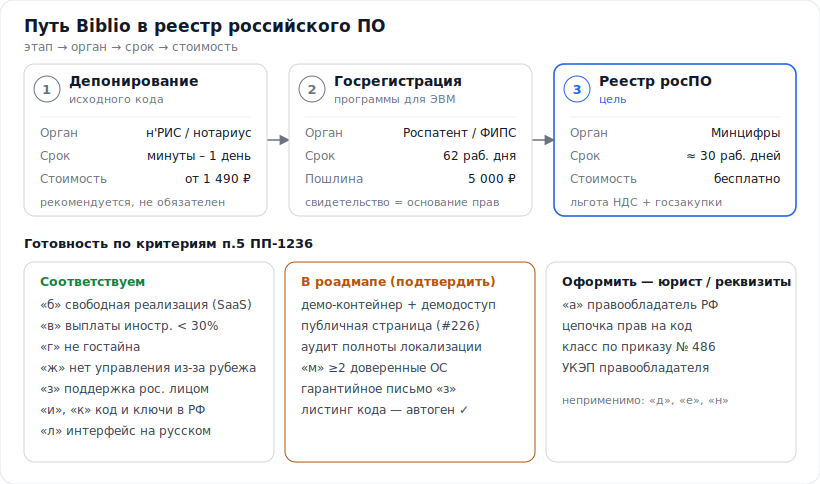

# Biblio — пакет для включения в реестр российского ПО (единый навигатор)

> Единая точка входа по легализации и государственному оформлению прав на **Biblio** (мультиарендный облачный SaaS-АБИС): депонирование → госрегистрация программы для ЭВМ → Единый реестр российского ПО (Минцифры). Здесь — визуальная карта, ссылки на все подготовленные документы, инструкции и официальные ресурсы. Дата: **2026-06-22**.

> ⚠️ **Это не юридическая консультация.** Справочно-подготовительный материал и черновики. Для финальной подачи привлечь патентного поверенного/юриста. Цифры и формулировки сверять с первоисточником на дату подачи; пометки «уточнить» не использовать как факт без проверки.

## Карта пути

## Резюме цепочки

| # | Этап | Орган / площадка | Ключевые документы | Срок | Стоимость |
|---|------|------------------|--------------------|------|-----------|
| 1 | Депонирование исходного кода | Депозитарий (н'РИС/Copytrust) или нотариус | архив/листинг + опись + хэш | минуты – 1 день | от **1 490 ₽** *(уточнить)* |
| 2 | Госрегистрация программы для ЭВМ | Роспатент / ФИПС | заявление + реферат + листинг | **62 раб. дня** | **5 000 ₽** (ст. 333.30 НК РФ) |
| 3 | Единый реестр росПО | Минцифры — reestr.digital.gov.ru | заявление + 3 документа на русском + доступ к экземпляру | **≈30 раб. дней** | **бесплатно** |

## Быстрый старт (что делать по порядку)
1. **Выбрать правообладателя** (гражданин РФ / российское ООО) и **закрепить цепочку прав** на код (юрист) — критерий «а».
2. **Этап 1:** сгенерировать листинг (`python docs/legal/tools/gen_listing.py`) и **депонировать** текущую версию (н'РИС/Copytrust).
3. **Этап 2:** подать на **госрегистрацию ПрЭВМ** (заявление + реферат + листинг, пошлина 5 000 ₽) → свидетельство (≈62 раб. дня).
4. **Параллельно:** подготовить документацию этапа 3 (шаблоны 04–06), поднять демо-контейнер + публичную страницу ([#226](https://github.com/Rivega42/biblio/issues/226)), получить УКЭП.
5. **Этап 3:** подать в **реестр** через reestr.digital.gov.ru (Госуслуги/ЕСИА, УКЭП), указав свидетельство как основание права → включение.
6. После включения — оформить **льготу по НДС** и заявлять продукт в госзакупках.

## Подготовленные документы

**Основные:**
- [REGISTRATION_GUIDE.md](REGISTRATION_GUIDE.md) — полная пошаговая инструкция по всем трём этапам.
- [DOCUMENTS_CHECKLIST.md](DOCUMENTS_CHECKLIST.md) — перечень документов по этапам со статусами.
- [REESTR_ELIGIBILITY.md](REESTR_ELIGIBILITY.md) — self-check по критериям п.5 ПП-1236.

**Шаблоны** ([templates/](templates/)) — черновики с плейсхолдерами `<ЗАПОЛНИТЬ: …>`:
- [01 — заявление о госрегистрации ПрЭВМ](templates/01_zayavlenie_gosregistraciya_PrEVM.md)
- [02 — реферат программы](templates/02_referat_programmy.md)
- [03 — заявление в реестр росПО](templates/03_zayavlenie_reestr_rosPO.md)
- [04 — описание функциональных характеристик](templates/04_opisanie_funkcionalnyh_harakteristik.md) *(наполнено)*
- [05 — руководство по установке и администрированию](templates/05_rukovodstvo_ustanovka_administrirovanie.md) *(наполнено)*
- [06 — описание процессов жизненного цикла](templates/06_opisanie_processov_zhiznennogo_cikla.md)
- [07 — сведения о правообладателе](templates/07_svedeniya_o_pravoobladatele.md)
- [08 — гарантийное письмо о поддержке в РФ](templates/08_garantijnoe_pismo_podderzhka.md)
- [09 — сопроводительное письмо](templates/09_soprovoditelnoe_pismo.md)
- [10 — опись на депонирование](templates/10_zayavka_deponirovanie.md)

**Листинг исходного кода** ([listings/](listings/)) — депонируемые материалы:
- [SOURCE_LISTING.md](listings/SOURCE_LISTING.md) — постраничный листинг (большой файл; экспортировать в PDF для подачи).
- [MANIFEST.sha256.md](listings/MANIFEST.sha256.md) — контрольные суммы файлов + общий SHA-256.
- Генератор: [tools/gen_listing.py](tools/gen_listing.py) — `python docs/legal/tools/gen_listing.py`. **Обновляется автоматически** при изменении кода (workflow [`legal-listing.yml`](../../.github/workflows/legal-listing.yml)).

## Статус готовности (кратко)
- **Соответствуем по существу:** правомерная реализация (SaaS), выплаты иностранным лицам < 30%, не гостайна, нет управления из-за рубежа, поддержка рос. лицом, **код/сборка/ключи в РФ**, **интерфейс на русском**.
- **В роадмапе** ([ROADMAP_MVP §7.5](../design/ROADMAP_MVP.md)) — подтвердить/задокументировать: демо-контейнер + публичная страница ([#226](https://github.com/Rivega42/biblio/issues/226)), аудит локализации, ≥2 доверенные ОС, гарантийное письмо.
- **Оформить (юрист/реквизиты):** правообладатель + цепочка прав (критерий «а»), класс по приказу № 486, УКЭП.
- **Неприменимо:** «д», «е» (СЗИ), «н» (гос-участие).

## Что осталось «заполнить реальными реквизитами»
Реквизиты правообладателя (ФИО/наименование, ИНН, ОГРН/ОГРНИП, адрес, структура владения), данные авторов, точные название/версия/год, УКЭП, банковские реквизиты для пошлины, адрес публичной страницы и демо-доступа, код класса по приказу № 486. Подробнее — [DOCUMENTS_CHECKLIST.md](DOCUMENTS_CHECKLIST.md).

## Официальные ресурсы

**Депонирование:** [н'РИС](https://nris.ru/) · [Copytrust](https://www.copytrust.ru/) · [Нотариат (обеспечение доказательств)](https://notariat.ru/)

**Госрегистрация ПрЭВМ (этап 2):**
- [Роспатент — госуслуга регистрации ПрЭВМ/БД](https://rospatent.gov.ru/ru/stateservices/gosudarstvennaya-registraciya-programmy-dlya-elektronnyh-vychislitelnyh-mashin-ili-bazy-dannyh-i-vydacha-svidetelstv-o-gosudarstvennoy-registracii-programmy-dlya-elektronnyh-vychislitelnyh-mashin-ili-bazy-dannyh-ih-dublikatov)
- [ФИПС — раздел заявителя (ПрЭВМ/БД)](https://new.fips.ru/to-applicants/software-and-databases/) · [подача заявки](https://new.fips.ru/podacha-zayavki/podacha-zayavki-na-registratsiyu-programmy-dlya-evm-ili-bazy-dannykh/)
- [Форма заявления](https://rospatent.gov.ru/ru/documentforms/zayavlenie-o-gosudarstvennoy-registracii-programmy-dlya-evm-ili-bazy-dannyh-licevaya-i-oborotnaya-storona) · [пошлины](https://rospatent.gov.ru/ru/documents/poshliny)
- Нормы: [ГК РФ ст. 1262](https://www.consultant.ru/document/cons_doc_LAW_64629/d0887a7ca3da6c85fbbce19815b9b1ead5e67687/) · [НК РФ ст. 333.30](https://www.consultant.ru/document/cons_doc_LAW_28165/2401c8f5ae279ddb026b3249beb2198a5b59a78f/) · [приказ Минэка № 211](https://www.consultant.ru/document/cons_doc_LAW_201372/)

**Реестр росПО (этап 3):**
- [Реестр — официальный сайт](https://reestr.digital.gov.ru/) · [услуга на Госуслугах](https://www.gosuslugi.ru/reestrpo)
- [ПП РФ № 1236 + Правила](https://www.consultant.ru/document/cons_doc_LAW_189116/) · [классификатор (приказ № 486)](https://digital.gov.ru/ru/documents/7362/) · [льгота НДС (НК ст. 149 пп.26 п.2)](https://www.consultant.ru/document/cons_doc_LAW_28165/c8ebcedc9ddce9d959d6c520c3b0d602f71e8e12/)

## Связанные внутренние документы
`docs/design/ARCHITECTURE.md` · `docs/design/ROADMAP_MVP.md` (§7.5) · `docs/design/AUDIT_REPORT_IRBIS64_compliance.md` · `deploy/README.md`
